# AegisAI™ 反AI攻击作战平台 — PRD v5.0

> 版本：v1.0 | 日期：2026-05-25
> 产品定位：独立安全产品，专注检测与反制AI驱动的自动化攻击
> 数据基础：Phase 1研究数据（行为分析、实时ML部署、攻击场景、ATLAS映射、工具指纹库）

---

## 1. 产品概述

### 1.1 产品愿景

**让黑客的每一次AI攻击都成为防守方的情报来源——不仅检测攻击，更追踪幕后操作者。**

AegisAI不是"保护AI"的产品（那是Lakera、HiddenLayer的赛道）。AegisAI专注于一个被忽视的战场：**检测AI驱动的自动化攻击，追踪幕后操作者，并主动反制**。

#### 利用AI进行攻击的三层谱系

当前AI攻击并非"纯AI"的单一形态，而是呈现三层谱系：

| 模式 | 描述 | 市场占比（估算） | 典型场景 |
|------|------|-----------------|---------|
| **模式A：人类主导+AI辅助** | 人类攻击者使用AI工具加速侦察、生成Payload、辅助决策，但人类全程掌控攻击方向 | 70-80% | 渗透测试人员使用PentestGPT辅助、红队使用LLM生成钓鱼邮件 |
| **模式B：人类编排+AI执行** | 人类设定目标和约束，AI Agent自主执行攻击链，人类在关键决策点介入 | 15-25% | GTG-1002类场景（80-90% AI自主+人类关键决策）、XBOW自动化漏洞挖掘 |
| **模式C：纯AI自主** | AI Agent完全自主发起和执行攻击，无人类实时介入 | <5% | 未来威胁，当前仅在受控靶场中验证 |

**AegisAI覆盖全部三层谱系**，特别是占据最大市场份额的模式A。现有安全产品聚焦于"这是不是AI攻击"的二元判断，而AegisAI的差异化核心是**归因（Attribution）**——不只回答"这是AI攻击吗"，还回答"**谁在用AI攻击我们**"。操作者画像能力使AegisAI从检测工具升级为归因平台，为法律诉讼、保险理赔、威胁情报共享提供操作者级别的证据链。

#### 产品架构总图

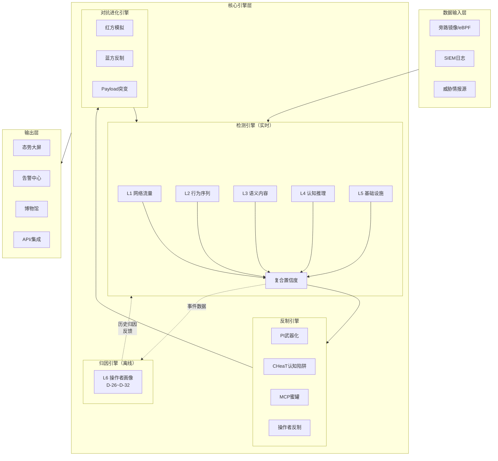

> **架构说明**：
> - **检测引擎（实时）**：L1~L5构成实时检测路径。快速路径（L1单独判决）<20ms内产生初步判决；深度融合路径（L2~L5结果汇入D-25）<200ms，不阻塞实时告警
> - **深度检测路径**：L2~L5深度分析异步进行，结果汇入D-25融合引擎（总延迟<200ms），不阻塞告警产生
> - **归因引擎（离线）**：L6操作者画像（D-26~D-32）为完全独立的离线系统，通过异步数据管道接收检测事件进行归因分析，不参与实时检测评分
> - **蜜罐定位说明**：D-21（蜜罐触发关联分析）属于L4认知推理层的检测规则，输出作为L4的高权重锚点信号；实际蜜罐部署（C-07）属于反制引擎，与检测层分离
> - **实时检测 vs 离线归因分离**：避免归因计算延迟影响实时检测性能，归因结果可用于后续检测置信度调整

### 1.x 数据基础与成熟度模型

AegisAI的数据来源分为两个截然不同的阶段，不同阶段的数据用于不同的目的，混用会导致检测模型偏差和置信度失真。

#### 1.x.1 研究阶段数据（Phase 1）

**来源**：受控靶场测试、学术研究成果、行业共享数据

**用途**：构建初始检测规则、训练基线模型、验证检测逻辑

| 数据类型 | 描述 | 质量特点 |
|---------|------|---------|
| 靶场攻击行为数据 | 18种AI渗透工具在靶场的完整攻击session | 高质量、标签准确、可重复 |
| 蜜罐交互日志 | Canarytoken、API端点诱饵的触发记录 | 几乎零误报（正常人不会访问诱饵） |
| ATLAS映射数据 | MITRE ATLAS框架映射的攻击技术分类 | 学术标准，覆盖全 |
| 工具指纹库 | TLS JA3/JA4指纹、API调用模式、User-Agent | 靶场验证，准确性高 |

**局限性**：
- 靶场环境与生产环境存在差异（目标资产类型、网络拓扑、流量模式）
- 攻击工具版本可能过时
- 缺乏真实对抗条件下的躲避行为

#### 1.x.2 产品阶段数据（Phase 2+）

**来源**：客户生产环境实时采集、威胁情报共享

**用途**：持续优化检测模型、更新指纹库、丰富威胁情报

| 数据类型 | 描述 | 质量特点 |
|---------|------|---------|
| 生产流量镜像 | 客户网络流量实时镜像（eBPF/旁路镜像） | 高真实性和代表性 |
| 告警反馈数据 | 分析师确认的误报/漏报标注 | 需要人工审核，标签可能有噪声 |
| 归因分析结果 | L6操作者画像的关联分析 | 高价值但滞后（离线分析） |
| CVE情报更新 | 实时接收的漏洞情报（I-03） | 需要快速响应新CVE |

**成熟度优势**：
- 真实环境数据，无靶场偏差
- 反映最新攻击手法和工具变化
- 归因数据支持法律诉讼和保险理赔

#### 1.x.3 数据隔离与混合策略

**严格隔离原则**：
- Phase 1数据**仅用于**初始模型训练和规则验证
- Phase 2+数据**仅用于**生产模型优化和情报更新
- 两类数据**不允许混合训练**同一模型（会导致分布偏移）

**渐进式迁移策略**：
| 阶段 | 数据来源 | 模型更新频率 | 检测置信度基准 |
|------|---------|------------|--------------|
| Alpha | 100% Phase 1 | 每版本更新 | 靶场验证标准 |
| Beta | Phase 1 + 早期客户数据 | 滚动更新 | 客户反馈校准 |
| GA | 100% Phase 2+ | 实时更新 | 生产误报率<1% |

> **警告**：Phase 1研究数据生成的检测规则在生产环境中可能出现偏差，部署前需使用客户真实流量进行回测验证。

### 1.2 目标用户画像

#### Persona 1：Jack — SOC分析师（Tier 2）

- **背景**：5年安全运营经验，熟悉Splunk/Elastic，每天处理200+告警
- **核心痛点**：传统SIEM无法区分人类攻击者和AI Agent，告警中缺少"这是不是AI在打我"的判断依据
- **期望**：看到一个告警时，立即知道攻击者是人还是AI，如果是AI，知道它用的什么工具、处于攻击链哪个阶段、最佳响应方案是什么
- **技术水平**：能写SPL查询，了解ATT&CK框架，但不写Python脚本
- **使用频率**：每天8小时，全天候轮班

#### Persona 2：John — 安全管理员

- **背景**：8年安全管理经验，负责安全策略配置和安全工具运维
- **核心痛点**：需要在不影响业务的前提下部署检测和反制能力，现有工具没有"AI攻击"的策略模板
- **期望**：开箱即用的检测策略模板，可视化的蜜罐部署界面，精细的白名单管理（避免把合法扫描器误判为AI攻击）
- **技术水平**：熟悉Linux运维、网络配置，能编辑YAML配置
- **使用频率**：每天1-2小时策略巡检，事件时全天候

#### Persona 3：David — CISO

- **背景**：15年信息安全管理经验，向CTO汇报
- **核心痛点**：董事会问"我们能不能防住AI攻击"时，没有数据支撑的答案
- **期望**：一目了然的AI威胁态势仪表板，可导出的季度报告，ROI数据（部署AegisAI前后的AI攻击拦截量对比）
- **技术水平**：不操作具体工具，看仪表板和报告
- **使用频率**：每周看一次仪表板，每月审一次报告

### 1.3 核心价值主张

AegisAI的价值建立在一个关键洞察上：**AI攻击者有6个只对AI有效的致命弱点**，识别出"攻击者是AI"之后，防守方可以采取人类攻击者无法触发的差异化响应：

| 差异化响应 | 原理 | 对人类攻击者 |
|-----------|------|------------|
| Prompt Injection反制 | AI Agent将网页/响应中的文本当作指令执行 | 人类不会"执行"文字 |
| 认知消耗战 | AI忠实遍历每一个假线索，烧光API预算 | 人类2-3个假线索后识破 |
| 攻击路径预判 | AI按ATT&CK框架线性推进，路径高度可预测 | 人类跳跃式攻击不可预测 |
| 安全对齐触发 | 触发LLM内置安全边界（RLHF训练的红线） | 人类不受RLHF约束 |
| 上下文窗口溢出 | 大量垃圾信息撑满Agent上下文，关键信息丢失 | 人类会记笔记 |
| MCP协议陷阱 | Tool Poisoning只影响通过MCP调用工具的Agent | 人类不通过MCP使用工具 |

**关键数据支撑**（来源：Phase 1研究）：
- AI Agent完成完整攻击链仅需25分钟，比人类快47倍以上（Unit 42研究，端到端可达100倍）
- Mantis框架PI反制有效率95%+（arXiv 2410.20911）
- CHeaT框架不依赖PI即可100%阻止Agent（USENIX Security 2025）
- AI Agent蜜罐触发概率显著高于人类——系统性枚举行为使其无法跳过诱饵（GreyNoise研究验证）

---

## 1.x 数据基础与成熟度模型

### 1.x.1 研究阶段 vs 产品阶段数据分离

AegisAI的检测能力建立在不同类型的数据基础上，明确区分研究阶段和产品阶段的数据来源：

| 数据类型 | 来源 | 用途 | 成熟度阶段 |
|---------|------|------|-----------|
| **研究阶段数据** | Phase 1靶场测试数据、学术研究成果、工具源码分析 | 构建初始检测规则和指纹库 | Alpha/Beta |
| **生产环境数据** | 客户部署后采集的真实流量和事件 | 持续优化检测模型、扩展指纹库 | GA |

> **重要澄清**：PRD中提到的"9000+正样本"和"50000+负样本"指**研究阶段**在受控靶场中采集的数据。产品上市后会通过客户部署持续积累真实样本，用于模型迭代。

### 1.x.2 产品成熟度模型

不同部署阶段的检测能力存在差异，以下是预期的成熟度里程碑：

| 阶段 | 时间线 | 检测覆盖率 | 指纹库规模 | 误报率目标 |
|------|--------|-----------|-----------|-----------|
| **Alpha** | 0-3个月 | L1核心规则（D-01~D-05）| 5-10个主流工具 | <5% |
| **Beta** | 3-6个月 | L1~L3完整覆盖 | 15-20个工具 | <2% |
| **GA** | 6-12个月 | L1~L5全量覆盖 | 30+工具 + CVE库 | <1% |
| **GA+** | 12个月+ | 全量 + 自定义规则 | 持续扩展 | <0.5% |

> **CISO仪表板说明**：趋势分析和同比/环比数据需要至少30天的历史数据积累。在Alpha/Beta阶段，仪表板会标注"数据积累中"，建议CISO关注绝对数量而非趋势变化。

### 1.3 检测能力阶段差异

| 检测层 | Alpha | Beta | GA |
|--------|-------|------|-----|
| L1 网络流量（D-01~D-06） | D-01~D-05 | 全部 | 全部 + 扩展 |
| L2 行为序列（D-07~D-12） | D-07 | D-07~D-10 | 全部 |
| L3 语义内容（D-13~D-16.6） | D-13~D-15 | 全部 | 全部 |
| L4 认知推理（D-17~D-21） | D-19 | D-19, D-21 | 全部 |
| L5 基础设施（D-22~D-24） | D-22 | D-22, D-23 | 全部 |
| L6 操作者画像（D-26~D-32） | — | 基础归因 | 完整画像 |

---

## 2. 用户故事与场景

### 2.1 SOC分析师日常工作流

#### 故事1：AI攻击告警发现与确认

> 作为SOC分析师，我希望在收到高优先级告警时，能立即看到"AI攻击置信度"评分和判断依据，以便我在30秒内决定是否启动AI攻击应急流程。

**操作流程**：

1. **告警入口**：分析师登录AegisAI告警中心，看到置顶的红色横幅"检测到疑似AI Agent攻击——置信度87%"
2. **快速概览**：点击告警卡片，展开摘要面板：
   - 置信度评分：87%（由D-25复合置信度引擎给出）
   - 触发信号：TLS指纹匹配PentestGPT（权重30%）+ 行为序列呈ReAct模式（权重40%）+ 攻击速度超人类阈值（权重20%）+ 蜜罐触发（权重10%）
   - 攻击阶段：当前处于"枚举"阶段，预计下一步进入"漏洞利用"
   - 匹配工具：PentestGPT v1.0（指纹库匹配度92%）
3. **深度调查**：点击"进入调查面板"，看到：
   - 时间线视图：按时间排列的所有攻击行为事件
   - 行为序列对比：左侧是当前攻击者行为序列，右侧是PentestGPT已知行为模板，差异部分高亮
   - 网络拓扑图：攻击者已触达的资产用红色标记
4. **确认与响应**：分析师确认为AI攻击后，点击"启动反制"按钮，系统推荐3个反制方案（按推荐度排序），分析师选择"部署PI反制Payload"，一键执行

**验收标准**：

1. 告警从检测引擎产生到分析师可见的端到端延迟 <5s
2. 告警摘要面板在点击后 <2s 内渲染完成，包含置信度评分、触发信号、攻击阶段、匹配工具四项核心信息
3. 调查面板的时间线视图在 <5s 内加载，支持10万个事件的流畅滚动和缩放
4. 行为序列对比视图支持至少5个已知Agent框架的行为模板作为参照
5. 反制方案推荐在 <5s 内生成，推荐列表包含方案名称、预期有效率、风险级别、所需审批
6. 一键执行反制后，部署确认反馈 <10s
7. 告警状态流转（新建→确认→反制中→已处理）全程可追踪，状态变更即时推送

**错误处理场景**：

- **场景E1-1：检测引擎某层崩溃**：如果L1网络流量层故障，告警面板显示降级警告标记"L1层离线，当前评分基于L2-L6"，置信度评分自动标注"降级模式"。分析师可查看降级策略详情（见4.6.1检测降级与容错）
- **场景E1-2：SIEM集成断开**：告警无法推送到外部SIEM时，系统在顶部状态栏显示"SIEM连接中断"警告，同时将告警缓存到本地队列。分析师仍可在AegisAI原生告警中心查看全部告警，SIEM恢复后自动重传
- **场景E1-3：反制执行失败**：如果PI Payload部署失败（如目标页面不可注入），系统在10s内返回失败原因，自动推荐备选反制方案（如切换到C-04 Canarytoken部署），并将失败事件记录到审计日志
- **场景E1-4：指纹库匹配无结果**：如果D-01/D-02指纹匹配无结果，告警面板标注"未知工具"而非"无威胁"，并引导分析师查看D-41零日Agent行为检测的不变性特征评分

#### 故事2：误报排查

> 作为SOC分析师，我希望快速排除合法自动化工具（CI/CD、漏洞扫描器、监控探针）触发的误报，以便我不浪费时间在非威胁事件上。

**操作流程**：

1. 告警列表显示"疑似AI扫描——置信度45%"
2. 点击展开，看到触发原因是"请求速率异常+TLS指纹未知"
3. 查看源IP：是公司内部CI/CD服务器地址
4. 点击"标记为误报"→选择原因"合法自动化工具"→输入工具名称"Jenkins Pipeline"
5. 系统自动提示"是否将此IP/UA组合加入白名单？"→确认
6. 白名单规则生效，后续该来源不再触发同类告警

**验收标准**：

1. 告警展开到误报标记完成的全流程可在 <60s 内完成
2. 误报原因分类支持至少5种选项：合法自动化工具 / 合规扫描 / 内部测试 / 第三方服务 / 其他（自定义）
3. 白名单建议在误报标记后 <3s 内自动生成
4. 白名单规则生效后，后续同源同模式流量的告警在 <1分钟 内停止
5. 误报标记自动反馈到D-25复合置信度引擎——同一来源的后续评分自动降低
6. 误报统计按日/周/月汇总，支持按检测层、规则ID、来源类型分解

**错误处理场景**：

- **场景E2-1：误报标记为合法，但实际是攻击**：如果被标记为误报的来源后续触发了蜜罐告警（高置信度信号），系统自动重新打开该告警并标注"误报撤销——蜜罐触发"
- **场景E2-2：白名单规则过于宽泛**：如果白名单规则匹配的流量范围过大（如将整个/16 CIDR加入白名单），系统在确认前警告"该规则将排除约N个IP地址的全部流量，建议缩小范围"
- **场景E2-3：批量误报**：如果同一检测规则在24小时内产生>20个被标记为误报的告警，系统自动建议调整该规则的阈值或权重

#### 故事3：AI攻击事件调查

> 作为SOC分析师，我希望能回溯一次完整的AI攻击链，查看每个阶段的详细行为记录，以便我编写事件报告并优化检测策略。

**操作流程**：

1. 在调查面板中选择一个已确认的AI攻击事件
2. 系统自动生成攻击链时间线，按MITRE ATLAS战术阶段分段展示：
   - 侦察阶段（AML.TA0002）：nmap扫描行为、浏览器自动化指纹
   - 初始访问（AML.TA0004）：漏洞利用尝试、回调连接
   - 执行（AML.TA0005）：Agent自主操作记录
   - 横向移动（AML.TA0013）：凭据复用行为
3. 每个阶段点击展开，查看原始日志、匹配的检测规则、触发的反制措施
4. 点击"导出报告"，生成PDF格式事件报告，包含完整攻击链、检测时间线、反制效果评估

**验收标准**：

1. 攻击链时间线自动生成 <30s（10万事件以内），支持流畅的缩放和平移交互
2. 时间线上每个事件节点可点击查看原始日志、匹配的检测规则ID、触发的反制措施
3. MITRE ATLAS战术阶段标注准确率 >85%（经安全分析师评审）
4. 时间线支持按ATLAS战术阶段、数据源类型、时间粒度三种维度过滤
5. PDF事件报告生成 <30s，包含攻击链可视化图表、ATLAS映射表、反制效果统计和完整证据引用
6. 支持多事件对比视图——选择2-3个历史事件并排显示时间线，高亮行为差异
7. 调查面板支持协作注释——分析师可在时间线任意事件节点上添加调查笔记

**错误处理场景**：

- **场景E3-1：时间线数据不完整**：如果某些日志源在攻击发生时未采集（如eBPF探针临时离线），时间线上用虚线标注"数据缺失时段"，并提示分析师"该时段可能遗漏事件"
- **场景E3-2：ATLAS映射存在歧义**：如果某个攻击行为可映射到多个ATLAS战术（如既可能是侦察也可能是初始访问），时间线标注"待确认"并列出候选映射，由分析师手动确认
- **场景E3-3：报告导出超时**：如果事件包含超过50万个关联事件导致PDF生成超时，系统自动生成精简版报告（仅包含关键事件），并提供后台全量报告生成选项（完成后邮件通知）
- **场景E3-4：跨事件关联数据不足**：如果尝试对比的多个事件分属不同操作者或使用不同工具，对比视图标注"关联度低，对比结果仅供参考"

### 2.2 安全管理员配置流程

#### 故事4：检测策略配置

> 作为安全管理员，我希望能基于模板快速配置AI攻击检测策略，并针对我的环境调整阈值，以便检测能力能在1小时内上线。

**操作流程**：

1. 进入"策略配置"→"检测策略"页面
2. 系统提供3个预置模板：
   - **保守模式**：高阈值、低误报（适合初次部署）
   - **均衡模式**：推荐配置
   - **激进模式**：低阈值、高召回（适合高安全要求环境）
3. 选择"均衡模式"模板，系统自动加载50+条检测规则
4. 管理员可逐条调整：
   - 每条规则显示：规则ID、描述、检测层、靶场测试精度（Precision/Recall）、已知误报场景
   - 可调整参数：阈值、权重、启用/禁用
5. 点击"保存并生效"，规则热加载，无需重启

**验收标准**：

1. 策略配置页面加载 <3s，包含全部检测规则列表
2. 三种预置模板覆盖六大检测层的全部检测规则，模板参数经靶场验证
3. 规则热加载在 <5s 内完成（从点击"保存"到新规则生效）
4. 规则调整后系统提供"预期效果预览"——基于最近7天数据估算调整后的检测率和误报率变化
5. 支持规则配置的版本管理——每次保存创建新版本，支持一键回滚到历史版本
6. 规则调整不影响正在处理的活跃告警
7. 批量规则操作支持选中多条规则同时启用/禁用/调整参数

**错误处理场景**：

- **场景E4-1：规则热加载失败**：如果新规则因配置错误无法加载（如无效阈值、冲突的规则条件），系统自动回滚到上一个正常配置版本，在界面显示具体错误原因和修复建议
- **场景E4-2：规则冲突检测**：如果两条规则的匹配条件完全重叠但行为矛盾（如规则A告警、规则B白名单同一模式），保存时系统自动检测冲突并提示管理员解决
- **场景E4-3：模板不适配环境**：如果管理员选择的模板与当前环境存在明显不适配（如激进模式在高流量环境下预估误报率>10%），系统在加载模板前弹出警告，建议先从均衡模式开始并逐步调优
- **场景E4-4：检测引擎处于降级状态时的配置变更**：如果某检测层处于故障降级状态，管理员修改该层规则时，系统警告"该层当前离线，配置将在层恢复后生效"

#### 故事5：蜜罐部署配置

> 作为安全管理员，我希望能通过可视化界面在关键位置部署AI专用蜜罐（Canarytoken、API端点诱饵、MCP蜜罐），以便我无需编写代码就能建立欺骗防线。

**操作流程**：

1. 进入"策略配置"→"蜜罐部署"页面
2. 左侧显示网络拓扑图，右侧显示可部署的蜜罐类型：
   - Canarytoken（AWS Key / API Token / DNS Token）
   - API端点诱饵（/api/v1/admin/users等）
   - MCP工具蜜罐（伪造MCP Server）
   - 路径诱饵（robots.txt注入）
   - 凭证诱饵（代码仓库中的假密钥）
3. 拖拽蜜罐类型到拓扑图上的目标位置
4. 配置蜜罐参数（诱饵内容、告警级别、关联的反制动作）
5. 点击"部署"，系统自动生成部署脚本或直接推送配置

**验收标准**：

1. 蜜罐部署页面在 <5s 内渲染完成，包含完整的网络拓扑图
2. 支持拖拽部署至少5种蜜罐类型到拓扑图上的任意位置
3. 蜜罐从配置到可用的部署延迟 <60s（Canarytoken <10s、API端点蜜罐 <30s、MCP蜜罐 <60s）
4. 蜜罐部署后在拓扑图上实时显示状态（部署中/已就绪/已触发/已回收）
5. 每个蜜罐可配置关联的反制动作（如"触发后自动执行C-01 PI反制"）
6. 蜜罐部署不影响同网段真实服务的性能和可用性

**错误处理场景**：

- **场景E5-1：蜜罐部署目标不可达**：如果目标网络位置不可访问（防火墙阻断、网络分区），系统在30s内返回部署失败原因，建议替代部署位置
- **场景E5-2：蜜罐端口冲突**：如果蜜罐配置的端口与真实服务端口冲突，部署前自动检测并阻止，提示管理员选择其他端口
- **场景E5-3：蜜罐被Agent识别**：如果D-07行为序列分析显示Agent可能已识别蜜罐（如Agent访问蜜罐后立即停止探索该路径），系统通知分析师"蜜罐可能已暴露"，建议更换蜜罐配置或切换到更高交互深度

#### 故事6：白名单管理

> 作为安全管理员，我希望能集中管理合法自动化工具的白名单，支持按IP、User-Agent、TLS指纹、行为模式多维度定义，以便精准排除误报而不留下检测盲区。

**操作流程**：

1. 进入"策略配置"→"白名单管理"页面
2. 查看当前白名单列表，每条显示：名称、匹配条件、创建人、创建时间、命中次数
3. 新增白名单：
   - 选择匹配维度：IP/CIDR、User-Agent正则、TLS指纹（JA3/JA4）、行为模式标签
   - 设置生效范围（全局/特定检测规则）
   - 设置有效期（永久/N天后自动过期）
4. 批量导入：支持CSV格式批量导入白名单条目

### 2.3 CISO仪表板

#### 故事7：AI威胁态势概览

> 作为CISO，我希望打开仪表板就能看到本组织面临的AI攻击威胁态势，以便我在5分钟内了解当前安全状况。

**仪表板内容**：

- **顶部指标卡片**（4个）：
  - 本月AI攻击事件数（同比/环比变化）
  - 平均检测时间（MTTD）
  - 反制成功率
  - 当前AI威胁等级（低/中/高/极高）
- **中部**：
  - 左：AI攻击趋势图（近12个月，按月统计）
  - 右：攻击工具分布饼图（PentestGPT / XBOW / 未知工具占比）
- **底部**：
  - 攻击来源地理分布图
  - 最近5起AI攻击事件摘要

**验收标准**：

1. CISO仪表板首屏加载 <3s，所有图表和指标卡片在首屏内完整展示（无需滚动即可概览全局）
2. 指标卡片的数据更新延迟 <1分钟（近实时反映最新安全状况）
3. AI攻击趋势图支持按日/周/月/季度切换时间粒度
4. 攻击工具分布饼图支持点击某个工具后跳转到该工具的历史事件列表
5. 仪表板支持全屏模式（适合投屏展示）和移动端响应式布局
6. 仪表板数据可一键导出为PDF报告（用于董事会汇报）
7. 当任意指标出现显著异常变化（如本月攻击事件数环比增长>50%），对应指标卡片自动高亮提醒

**错误处理场景**：

- **场景E7-1：数据源部分不可用**：如果某检测层数据不可用（如L1层故障），仪表板在对应指标上显示"部分数据不可用（L1离线）"而非显示不准确的数据
- **场景E7-2：历史数据不足**：部署初期（<30天）时，趋势图标注"数据积累中，趋势分析将在30天数据积累后生效"
- **场景E7-3：并发访问**：支持≥10个CISO/管理层用户同时访问仪表板，页面性能不退化

#### 故事8：ROI报告

> 作为CISO，我希望能生成AegisAI的投资回报分析报告，以便我向董事会证明安全投入的价值。

**报告内容**：

- 部署前后AI攻击拦截量对比
- 平均响应时间缩短百分比
- 避免的潜在损失估算（基于行业基准：每次数据泄露平均成本$4.88M）
- 安全团队效率提升（每个分析师每月节省的工时）

#### 故事9：月度安全报告

> 作为CISO，我希望每月自动生成AI威胁态势报告（PDF），以便我直接转发给管理层而无需手工编写。

**报告章节**：

1. 本月AI攻击事件汇总
2. 检测能力覆盖度（与MITRE ATLAS映射）
3. 反制效果统计
4. 新发现的AI攻击工具/技术
5. 情报动态（本月重要AI安全事件）
6. 下月风险预测与建议
7. AegisScore变化趋势与维度分解（P-16提供数据）
8. 经济学反制效果统计——本月累计成本放大量和CAF平均值（P-17提供数据）
9. 操作者画像新增/更新统计——本月新发现的操作者数量和威胁评级变化

**验收标准**：

1. 报告在每月1日自动生成并发送到CISO邮箱
2. 报告生成延迟 <5分钟（从触发到PDF可用）
3. 报告内容覆盖全部9个章节，无空白章节（数据不足时标注"数据量不足，统计结果仅供参考"）
4. 报告中的图表清晰可读，PDF中的趋势图分辨率 ≥300 DPI
5. 支持报告模板自定义——CISO可选择包含/排除特定章节
6. 报告支持中/英文两种语言版本
7. 历史报告归档 ≥24个月，支持按月检索和下载

**错误处理场景**：

- **场景E9-1：月度数据不完整**：如果当月有部分时间段检测引擎处于故障状态，报告中标注受影响时段并注明"该时段数据可能不完整"
- **场景E9-2：报告生成失败**：如果因系统资源不足导致报告生成超时，自动重试一次；重试失败后通知管理员手动触发

### 2.4 部署与运维场景

#### 故事10：首次部署与配置向导

> 作为安全管理员，我希望通过一个分步向导完成AegisAI的初始配置，以便在半天内让系统开始采集数据。

**操作流程**：

1. 登录AegisAI管理控制台，系统自动检测到首次登录，弹出"初始配置向导"
2. **步骤1-数据源**：选择流量采集方式（旁路镜像/eBPF），输入采集接口参数。系统实时显示"已接收流量: 5,234 packets/s"
3. **步骤2-学习期**：确认启动2-4周学习期。系统说明："学习期内系统将分析您的正常流量模式，建立基线，自动生成白名单建议"
4. **步骤3-白名单**：系统已检测到3个高频非浏览器来源，逐一确认加入白名单
5. **步骤4-告警**：配置通知渠道（webhook）、SIEM集成（Splunk HEC token）
6. **步骤5-审批**：设置反制审批人员——黄色：SOC轮值、红色：CISO+法务
7. 点击"完成配置"，系统进入学习期

**验收标准**：

1. 向导全流程可在30分钟内完成（经验不足的管理员 <60分钟）
2. 每个步骤都有帮助文档和示例，包含视频教程链接
3. 配置错误时系统给出明确错误提示和修正建议
4. 数据源配置成功后，系统在 <30s 内显示流量采集统计（确认数据通路正常）
5. 向导支持"保存进度+稍后继续"——管理员可以中途退出，下次登录继续
6. 学习期启动后，系统每日发送学习进度邮件/通知——包含已识别的正常流量模式数量、已生成的白名单建议数量
7. 向导完成后自动生成"部署确认报告"——包含全部配置参数、数据源状态、审批人员设置、预计学习期完成时间

**错误处理场景**：

- **场景E10-1：数据源无法连接**：如果流量采集接口不可用（权限不足、接口不存在），系统在30s内显示错误原因和修复步骤（如"请确认eBPF需要root权限""请确认镜像端口SPAN配置"）
- **场景E10-2：SIEM集成测试失败**：系统提供"发送测试告警"按钮，如果SIEM未收到测试告警，系统自动排查常见问题（网络连通性、认证Token有效性、CEF格式兼容性）并提示修复
- **场景E10-3：审批人员配置不完整**：如果红色反制审批人员未配置，系统警告"红色反制将处于禁用状态，直到配置CISO审批人员"，但不阻塞其他配置步骤
- **场景E10-4：学习期数据量不足**：如果学习期结束时采集的流量样本不足以建立可靠基线（<10万个请求），系统建议延长学习期并说明原因

#### 故事11：检测规则调优（降低误报）

> 作为安全管理员，我希望能分析过去一周的误报数据，调整检测规则权重和阈值，以便将误报率控制在可接受范围内。

**操作流程**：

1. 进入"策略配置→误报分析面板"
2. 系统自动汇总被标记为"忽略"或"误报"的告警，按来源分类：
   - Python运维脚本: 4条误报（L1 JA4指纹触发）
   - Jenkins CI/CD: 2条误报（L2 速率异常触发）
3. 查看建议："L1层在您的环境中误报率偏高（12%），建议降低权重至0.10"
4. 接受建议，系统自动调整L1权重并显示预期效果
5. 将4个确认的合法脚本JA4指纹批量加入白名单
6. 保存配置，系统显示"预期误报率降至2.1%"

**验收标准**：

1. 误报分析面板在 <5s 内加载，包含过去7天的全部误报统计
2. 权重调整提供"预期效果预览"——基于最近7天数据模拟调整后的误报率和检测率变化
3. 批量白名单操作支持CSV导入，单次导入 ≥500条
4. 误报分类按检测层自动分组，每组显示该层贡献的误报数量和占比
5. 调优建议的可操作性评分 >4/5（经管理员评审）
6. 所有调优操作记录到审计日志，支持回溯查看"谁在什么时间调整了什么参数"
7. 调优后的规则配置可导出为YAML文件，用于在其他AegisAI实例间同步

**错误处理场景**：

- **场景E11-1：调优导致检测率下降**：如果权重调整后的模拟结果显示检测率下降>5%，系统弹出警告"该调整可能导致检测能力显著下降"并要求管理员确认
- **场景E11-2：调优历史回滚**：管理员可查看调优历史版本，一键回滚到任意历史配置
- **场景E11-3：误报分析数据不足**：如果过去7天的误报标记不足5条，系统提示"数据量不足以生成可靠的调优建议，建议积累更多数据后再调优"

#### 故事12：跨组织威胁情报共享

> 作为情报分析师，我希望能将检测到的AI攻击操作者画像（脱敏后）通过ISAC分享给同行业组织，以便联合防御同一攻击者。

**操作流程**：

1. 在操作者画像页面选择一个高置信度画像（如OP-2026-0089）
2. 点击"生成共享情报"
3. 系统自动脱敏：去除目标企业信息，保留操作者行为特征
4. 预览脱敏后的情报报告（STIX 2.1格式）
5. 选择共享渠道：ISAC平台 / 邮件 / API推送
6. 确认发送

**验收标准**：

1. 操作者画像脱敏在 <30s 内完成，脱敏后数据不包含任何可识别目标企业的信息
2. 脱敏后的情报报告严格遵循STIX 2.1格式规范
3. 共享渠道支持ISAC平台API、邮件附件、TAXII推送三种方式
4. 共享前预览界面高亮标注所有已脱敏字段，管理员可逐项确认
5. 共享记录完整保留——何时、由谁、向谁、共享了什么内容
6. 接收方收到情报后可反馈是否匹配到相同攻击者，反馈信息自动关联到操作者画像

**错误处理场景**：

- **场景E12-1：脱敏不完整**：如果系统检测到脱敏后的情报中仍包含可能识别目标企业的信息（如特定IP段、内部域名），自动阻止共享并提示管理员人工审核
- **场景E12-2：共享渠道不可用**：如果ISAC平台API不可用，自动切换到邮件共享并通知管理员
- **场景E12-3：操作者画像置信度过低**：如果操作者画像置信度<0.5，系统警告"该画像数据不足，共享后可能导致接收方产生误判"

#### 故事13：红蓝对抗演练

> 作为红队负责人，我希望使用AegisAI的AI攻击模拟器生成不同框架的攻击流量，以便验证SOC团队的AI攻击检测和响应能力。

**操作流程**：

1. 进入"系统管理→红队模式"
2. 选择模拟参数：Agent框架(PentestGPT/Claude Code/ARTEMIS)、攻击强度、目标范围
3. 设置演练时间窗口和参与人员通知规则
4. 启动模拟——系统生成逼真的AI Agent攻击流量
5. SOC团队按正常流程处理告警（不知道这是模拟）
6. 演练结束后，系统生成评估报告：检测时间、漏报率、反制效果、分析师响应质量

**验收标准**：

1. 红队模式支持模拟至少5种Agent框架的攻击流量（PentestGPT/Claude Code/ARTEMIS/XBOW/自定义）
2. 模拟攻击流量的逼真度 >90%（经D-19框架识别验证，模拟流量应被检测引擎判定为真实攻击）
3. 演练模式产生的告警在标题中不显示"模拟"标记（对SOC团队不可见），但在审计日志中记录为演练
4. 演练结束后评估报告在 <5分钟 内自动生成
5. 评估报告包含每个SOC分析师的响应质量评分（响应时间、判定准确度、反制选择合理度）
6. 支持预定义演练剧本（如"模拟PentestGPT的完整侦察-利用-横向移动攻击链"）
7. 演练不影响生产环境的真实检测能力（演练流量与真实攻击流量并行处理）

**错误处理场景**：

- **场景E13-1：演练期间发生真实攻击**：如果演练期间检测到非模拟的真实AI攻击，系统自动暂停演练流量并优先处理真实攻击告警，演练结束后可恢复
- **场景E13-2：模拟流量触发外部告警**：如果模拟流量被推送到SIEM并触发外部安全流程，系统可配置"演练模式下不推送SIEM"选项
- **场景E13-3：演练超时**：如果演练超出预设时间窗口，系统自动终止模拟流量生成并通知红队负责人

#### 故事14：合规审计报告

> 作为合规经理，我希望一键生成符合EU AI Act/等保2.0要求的AI安全审计报告。

**操作流程**：

1. 进入"博物馆→合规报告"
2. 选择报告模板：EU AI Act / 等保2.0 / 自定义
3. 选择时间范围
4. 系统自动汇总所有AI相关安全事件、检测覆盖度、反制记录
5. 生成PDF报告，包含所有必要合规字段
6. 下载或通过邮件发送

**验收标准**：

1. 合规报告生成 <2分钟（含数据汇总、模板填充、PDF渲染）
2. 等保2.0报告模板覆盖《网络安全事件报告管理办法》全部必填字段
3. EU AI Act报告模板覆盖Article 62（严重事件报告）和Article 72（市场监管报告）的要求
4. 支持自定义合规模板——合规经理可定义报告字段、章节结构和必填项
5. 报告包含完整的数据来源引用——每项统计数据可追溯到原始检测/反制记录
6. 支持电子签名（PDF数字签名）和可信时间戳（RFC 3161）
7. 合规报告归档 ≥5年（满足大多数监管要求）

**错误处理场景**：

- **场景E14-1：合规数据不完整**：如果选定时间范围内有部分数据缺失（如检测引擎曾处于故障状态），报告中自动标注"数据不完整时段"并说明影响范围
- **场景E14-2：模板版本过期**：如果合规法规更新导致报告模板需要调整（如等保2.0修订），系统在情报引擎（I-04）检测到法规更新后提醒管理员"报告模板可能需要更新"
- **场景E14-3：报告内容需要保密**：合规报告默认加密存储（AES-256），仅合规经理角色可访问，下载时记录到审计日志

#### 故事15：系统健康监控

> 作为安全管理员，我希望能实时查看AegisAI各引擎的运行状态，以便在系统异常时及时响应。

**操作流程**：

1. 进入"系统管理→系统健康"
2. 仪表板显示各组件状态：
   - 流量采集：正常，5,234 pps
   - 检测引擎：正常，延迟 12ms P99
   - 反制引擎：正常，3个活跃反制
   - 对抗进化引擎：上次运行 02:00，生成14个新变体
   - 情报引擎：正常，今日采集47条
   - 存储：已用 1.2TB / 4TB (30%)
3. 异常时自动告警（如检测延迟>100ms、流量采集中断等）

**验收标准**：

1. 健康监控仪表板加载 <2s，所有组件状态实时刷新（间隔5秒）
2. 组件异常检测延迟 <15s（连续3次心跳失败判定为故障）
3. 故障告警通过配置的所有通知渠道同时发送（例如：钉钉/邮件/短信）
4. 健康仪表板历史数据保留 ≥90天，支持回溯查看任意时间点的系统状态
5. 每个组件的健康检查覆盖关键指标——检测引擎（延迟P99/吞吐量QPS/模型服务状态）、反制引擎（活跃反制数/Payload库可用性）、存储（容量/IOPS/延迟）
6. 支持自定义告警阈值（如"检测延迟P99 >200ms时告警"替代默认100ms阈值）
7. 健康监控API支持Prometheus/Grafana集成（/metrics端点）

**错误处理场景**：

- **场景E15-1：监控系统自身故障**：AegisAI使用独立的Watchdog进程监控健康监控模块本身。如果健康监控模块无响应，Watchdog直接向管理员发送告警
- **场景E15-2：存储空间即将耗尽**：当存储使用率 >80% 时，系统自动触发告警并建议清理策略（如缩短流量元数据保留期）。>90% 时自动启动紧急清理（删除最旧的已归档数据）
- **场景E15-3：检测引擎性能退化**：当检测延迟P99持续>100ms超过5分钟，系统自动排查瓶颈（CPU/内存/模型推理/IO）并在健康面板上展示诊断结果

---

## 3. 信息架构

### 3.1 主导航结构

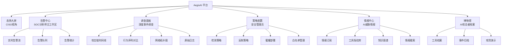

### 3.2 六大功能模块

| 模块 | 核心用户 | 使用频率 | 关键信息流 |
|------|---------|---------|-----------|
| 态势大屏 | CISO | 每周 | 聚合统计数据 ← 告警中心 + 情报中心 |
| 告警中心 | SOC分析师 | 全天候 | 检测引擎 → 告警 → 分析师确认 → 响应 |
| 调查面板 | SOC分析师 | 按事件 | 告警详情 + 原始日志 + 行为模型 → 调查结论 |
| 策略配置 | 安全管理员 | 每天 | 管理员配置 → 检测/反制引擎参数更新 |
| 情报中心 | 安全管理员/分析师 | 每天 | 外部情报源 → 采集 → 结构化 → 指纹库/规则库更新 |
| 博物馆 | 全部用户 | 按需 | 历史事件归档 + 工具行为演示 |

### 3.3 信息流

```
外部流量/日志 → 数据采集层 → 检测引擎（6层29规则）
                                    ↓
                            复合置信度引擎（D-25）
                                    ↓
                              告警中心（分析师）
                               ↙         ↘
                    确认AI攻击              标记误报
                        ↓                      ↓
                反制引擎执行              白名单更新
                        ↓                      ↓
                效果监控                  规则调优
                        ↓
                事件归档 → 博物馆
                        ↓
                情报反馈 → 指纹库/规则库更新
```

---

## 4. 功能需求：检测能力 (D-XX)

### 4.1 网络流量层 (D-01 ~ D-06)

#### D-01 TLS指纹匹配

- **用户故事**：作为SOC分析师，我希望系统自动提取每个入站连接的TLS指纹（JA3/JA4/JARM）并与AI工具指纹库比对，以便我能在握手阶段就识别已知AI渗透工具。
- **检测逻辑**：提取ClientHello中的TLS指纹 → 与指纹库中已知AI工具的TLS特征匹配 → 精确匹配命中时输出工具名称和版本，模糊匹配时输出相似度评分。同时检测curl_cffi等JA4伪造工具的绕过尝试——虽然TLS层模仿浏览器，但HTTP行为层（JA4H）会暴露不一致性
- **输入**：原始TLS握手包
- **输出**：匹配结果（工具名称、版本、置信度）或"未匹配"；curl_cffi绕过尝试检测结果
- **性能要求**：延迟 <0.5ms（查表操作）；支持 >10,000 TPS
- **验收标准**：
  - 对指纹库中已收录的15个主流AI工具，匹配准确率 >98%
  - 查表延迟 P99 <0.5ms
  - 新指纹入库后无需重启即生效
  - 检测curl_cffi伪造浏览器指纹的JA4/JA4H不一致
- **优先级**：P0
- **数据依赖**：资产1-AI渗透工具指纹库

#### D-02 HTTP头模式分析

- **用户故事**：作为SOC分析师，我希望系统分析HTTP请求头的组合模式（User-Agent、Accept、Connection等字段的特征组合），以便识别AI工具链特有的HTTP客户端库指纹。
- **检测逻辑**：提取HTTP头字段组合 → 与已知AI工具的HTTP头模板比对 → 检测Python requests/httpx默认头特征、缺失的浏览器标准头、异常头字段排列
- **输入**：HTTP请求头
- **输出**：AI工具匹配结果、异常头字段列表
- **性能要求**：延迟 <1ms（规则引擎）
- **验收标准**：
  - 检测Python HTTP库默认头准确率 >95%
  - 误报率 <2%（不误判正常API调用）
- **优先级**：P0
- **数据依赖**：资产1-AI渗透工具指纹库

#### D-03 请求时间模式分析

- **用户故事**：作为SOC分析师，我希望系统分析请求的时间间隔分布，识别AI Agent特有的"思考-爆发"节奏模式（LLM推理延迟导致的周期性暂停），以便区分AI Agent和人类操作者。
- **检测逻辑**：统计滑动窗口内的请求间隔分布 → 检测双峰分布（LLM思考期的5-30秒间隔 + 工具执行期的毫秒级间隔）→ 计算ReAct循环特征评分
- **输入**：带时间戳的请求序列
- **输出**：时间模式分类（人类/AI Agent/传统脚本）、ReAct评分
- **性能要求**：延迟 <5ms；窗口大小：最近50-200个请求
- **验收标准**：
  - 区分AI Agent与人类操作者准确率 >90%（来源：行为序列分析研究，LSTM F1 >95%）
  - 区分AI Agent与传统自动化脚本准确率 >85%
- **优先级**：P0
- **数据依赖**：资产3-AI Agent行为模型库

#### D-04 浏览器自动化检测

- **用户故事**：作为SOC分析师，我希望系统检测Playwright/Puppeteer等headless浏览器指纹，以便识别使用浏览器自动化框架的AI Agent（如Claude Code的browser automation模块）。
- **检测逻辑**：JavaScript端采集浏览器属性 → 服务端检测navigator.webdriver标志、缺失的浏览器插件、Canvas指纹异常、WebGL渲染差异
- **输入**：浏览器属性采集数据
- **输出**：自动化浏览器检测结果（是/否、框架类型）
- **性能要求**：延迟 <5ms（JS采集 + 服务端匹配）
- **验收标准**：
  - 检测headless Chrome/Firefox准确率 >95%
  - 检测Playwright/Puppeteer准确率 >90%
- **优先级**：P1
- **数据依赖**：资产1-AI攻击工具指纹库

#### D-05 请求速率异常检测

- **用户故事**：作为SOC分析师，我希望系统检测超人类速度的扫描行为（>1000 req/s的结构化扫描），以便在AI Agent侦察阶段就产生告警。
- **检测逻辑**：多粒度滑动窗口（1s/5s/1m）速率统计 → 与人类操作基线对比 → 超过阈值且呈结构化模式时告警
- **输入**：请求流
- **输出**：速率异常告警（当前速率、基线速率、偏差倍数）
- **性能要求**：延迟 <1ms（增量计数器）
- **验收标准**：
  - 检测>100 req/s的扫描行为准确率 >99%
  - 不误报CDN回源、健康检查等合法高频请求
- **优先级**：P0
- **数据依赖**：资产2-检测规则库

#### D-06 API回调模式检测

- **用户故事**：作为SOC分析师，我希望系统检测AI Agent调用LLM API的回调模式（周期性的出站HTTPS请求到OpenAI/Anthropic等API端点），以便识别内网中活跃的AI Agent。
- **检测逻辑**：监控出站连接 → 匹配已知LLM API域名/IP（包括api.openai.com、api.anthropic.com、generativelanguage.googleapis.com、dashscope.aliyuncs.com等）→ 分析回调频率和请求大小分布 → 关联同一来源的入站攻击行为 → 检测多模型路由模式（如Shannon的3-tier claude-opus/sonnet/haiku路由）
- **输入**：出站网络流量元数据
- **输出**：LLM API回调检测结果（目标API提供商、模型类型、调用频率、多模型路由模式、关联攻击行为）
- **性能要求**：延迟 <1ms
- **验收标准**：
  - 识别主流LLM API（OpenAI/Anthropic/Google/阿里云）调用准确率 >99%
  - 能关联回调与同源攻击行为
  - 能识别多模型路由模式（同一来源交替调用不同模型）
- **优先级**：P1
- **数据依赖**：资产5-AI威胁情报库

### 4.2 行为序列层 (D-07 ~ D-12)

#### D-07 攻击链序列分类

- **用户故事**：作为SOC分析师，我希望系统对攻击者的操作序列进行实时建模，识别AI Agent特有的线性攻击链模式（严格遵循"侦察→枚举→利用"教科书顺序），以便在攻击链早期发出预警。
- **检测逻辑**：将操作事件编码为行为序列 → 输入Transformer序列模型 → 分类为人类/AI Agent/传统脚本，并识别当前攻击阶段
- **输入**：有序操作事件序列（最近50-200个事件）
- **输出**：攻击者分类、当前攻击阶段、下一步预测
- **性能要求**：延迟 <30ms（Transformer模型推理）；来源：行为序列分析研究Transformer推理5-15ms + 特征工程开销
- **验收标准**：
  - AI Agent检测召回率 >90%
  - 对人类误报率 <1%
  - 攻击阶段识别准确率 >85%
- **优先级**：P0
- **数据依赖**：资产3-AI Agent行为模型库

#### D-08 操作间隔分布分析

- **用户故事**：作为SOC分析师，我希望系统分析攻击者操作的时间间隔分布，检测AI Agent特有的LLM推理延迟模式（5-30秒思考间隔，来源：PentestGPT指纹分析），以便与人类的不规则间隔区分。
- **检测逻辑**：提取操作间隔序列 → 统计分布特征（均值、方差、峰度、双峰性） → 与AI Agent模板和人类基线对比
- **输入**：带时间戳的操作序列
- **输出**：间隔分布分析报告（分布类型、与AI模板的匹配度）
- **性能要求**：延迟 <5ms
- **验收标准**：
  - 检测LLM推理延迟模式的准确率 >85%
  - 能区分不同LLM的推理延迟特征（GPT-4 vs Claude vs 本地模型）
- **优先级**：P0
- **数据依赖**：资产1-AI渗透工具指纹库、资产3-行为模型库

#### D-09 命令多样性分析

- **用户故事**：作为SOC分析师，我希望系统分析攻击者的命令多样性和模板化程度，以便识别AI Agent的低多样性、零拼写错误、模板驱动的操作特征。
- **检测逻辑**：计算命令集的多样性指标（unique命令比例、参数变化度）→ 检测拼写错误率（人类平均2-5%拼写错误，AI为0）→ 评估模板化程度
- **输入**：命令/请求序列
- **输出**：多样性评分、模板化评分
- **性能要求**：延迟 <10ms
- **验收标准**：
  - 零拼写错误+低多样性的组合检测AI Agent准确率 >80%
- **优先级**：P1
- **数据依赖**：资产2-检测规则库

#### D-10 会话模式分析

- **用户故事**：作为SOC分析师，我希望系统分析攻击会话的持续性模式，以便检测AI Agent的无间断长会话特征（人类有休息间隔，AI Agent连续运行数小时）。
- **检测逻辑**：统计会话持续时间、活跃度波动、休息间隔 → 人类会话通常有自然中断（如20-40分钟后暂停），AI Agent持续高活跃无中断
- **输入**：会话级聚合数据
- **输出**：会话模式分类（人类/AI/脚本）
- **性能要求**：延迟 <5ms
- **验收标准**：
  - 检测持续>2小时无间断攻击会话准确率 >90%
- **优先级**：P1
- **数据依赖**：资产3-行为模型库

#### D-11 错误恢复模式检测

- **用户故事**：作为SOC分析师，我希望系统分析攻击者遇到错误（403/500/连接拒绝）后的恢复策略，以便识别AI Agent机械化的"分析错误→调整参数→重试"模式。
- **检测逻辑**：跟踪错误事件后的行为序列 → 分析重试间隔、参数调整模式、策略切换速度 → AI Agent切换速度极快（<30秒），且调整逻辑高度一致
- **输入**：错误事件及后续操作序列
- **输出**：错误恢复模式分类、AI特征评分
- **性能要求**：延迟 <10ms
- **验收标准**：
  - 检测AI Agent错误恢复模式准确率 >80%
- **优先级**：P1
- **数据依赖**：资产1-指纹库

#### D-12 横向移动速度检测

- **用户故事**：作为SOC分析师，我希望系统检测内网横向移动的速度异常，以便识别AI Agent从一个系统跳到下一个系统在<1分钟内完成的超人类速度（来源：场景5分析）。
- **检测逻辑**：监控凭据在不同系统间的使用时间差 → 同一凭据在<1分钟内被多个系统使用时告警 → 关联横向移动路径图
- **输入**：认证日志（AD/LDAP/SSH）
- **输出**：横向移动速度告警、路径图
- **性能要求**：延迟 <100ms（准实时）
- **验收标准**：
  - 检测<1分钟间隔的凭据复用准确率 >95%
  - 能生成完整的横向移动路径图
- **优先级**：P0
- **数据依赖**：资产2-检测规则库

### 4.3 语义内容层 (D-13 ~ D-16.6)

> **D-16 MCP协议攻击检测规则族**：D-16包含6个独立的MCP协议攻击检测规则，覆盖6种不同的攻击向量。这6个规则共享MCP协议数据源，但检测逻辑独立，可并行执行。

#### D-13 Payload模板化检测

- **用户故事**：作为SOC分析师，我希望系统分析攻击Payload（SQL注入、XSS、命令注入）的模板化程度，以便识别AI Agent生成的高度结构化Payload。
- **检测逻辑**：NLP特征提取 → 计算Payload与已知模板的语义相似度 → AI生成的Payload结构化程度高、变体规律可预测
- **输入**：HTTP请求body/参数中的攻击Payload
- **输出**：模板化评分、匹配的已知模板
- **性能要求**：延迟 <10ms
- **验收标准**：
  - 识别AI生成Payload的准确率 >80%
  - 能匹配到具体工具的Payload模板
- **优先级**：P1
- **数据依赖**：资产1-指纹库（Payload模板特征）

#### D-14 AI生成内容检测

- **用户故事**：作为SOC分析师，我希望系统检测社工攻击中AI生成的文本内容（钓鱼邮件、伪造通信），以便识别AI驱动的社会工程攻击。
- **检测逻辑**：文本特征分析（困惑度、重复模式、风格一致性）→ AI生成文本检测模型推理
- **输入**：邮件/消息文本
- **输出**：AI生成概率评分
- **性能要求**：延迟 <50ms
- **验收标准**：
  - AI生成文本检测准确率 >85%
- **优先级**：P2
- **数据依赖**：资产3-行为模型库

#### D-15 扫描参数模式分析

- **用户故事**：作为SOC分析师，我希望系统分析扫描工具的参数配置模式（如nmap扫描参数），以便识别AI工具的默认参数配置特征（如PentestGPT的固定nmap参数模式）。
- **检测逻辑**：解析扫描工具命令行参数 → 与已知AI工具的默认参数模板匹配
- **输入**：IDS/WAF日志中识别的扫描命令特征
- **输出**：参数模式匹配结果
- **性能要求**：延迟 <5ms
- **验收标准**：
  - 匹配已知AI工具默认扫描参数准确率 >90%
- **优先级**：P1
- **数据依赖**：资产1-指纹库

#### D-16.1 TP Tool Poisoning检测

- **用户故事**：作为SOC分析师，我希望系统检测MCP工具描述中嵌入的隐藏指令（Tool Poisoning攻击），以便在Agent调用被污染的工具时及时发现。
- **检测逻辑**：解析MCP工具描述字段 → 检测隐藏指令特征（Base64编码、特殊转义字符、指令注入模式）→ 监控工具调用时的异常行为偏离
- **输入**：MCP协议通信数据（工具描述字段）
- **输出**：Tool Poisoning告警（被污染的工具名称、隐藏指令特征）
- **性能要求**：延迟 <5ms
- **验收标准**：
  - 检测Tool Poisoning准确率 >90%
  - 误报率 <2%
- **优先级**：P0
- **数据依赖**：资产5-威胁情报库（MCP漏洞情报）

#### D-16.2 RP Rug Pull检测

- **用户故事**：作为SOC分析师，我希望系统检测MCP工具在初始化后运行时行为发生恶意变更（Rug Pull攻击），以便发现隐藏在正常工具中的恶意代码。
- **检测逻辑**：建立工具初始行为基线 → 监控工具调用时的行为偏离 → 检测工具描述与实际执行行为的差异
- **输入**：MCP协议通信数据（工具调用序列）
- **输出**：Rug Pull告警（工具名称、异常行为类型）
- **性能要求**：延迟 <10ms
- **验收标准**：
  - 检测Rug Pull攻击准确率 >80%
- **优先级**：P1
- **数据依赖**：资产5-威胁情报库（MCP漏洞情报）

#### D-16.3 SH Shadowing检测

- **用户故事**：作为SOC分析师，我希望系统检测恶意MCP Server注册与合法工具同名的工具（Shadowing攻击），以便防止Agent被劫持到恶意工具。
- **检测逻辑**：监控MCP Server注册事件 → 检测工具名称冲突（与已知合法工具同名）→ 关联Server来源和证书信息
- **输入**：MCP Server注册事件
- **输出**：Shadowing告警（同名工具列表、伪装Server信息）
- **性能要求**：延迟 <5ms
- **验收标准**：
  - 检测Shadowing攻击准确率 >80%
- **优先级**：P1
- **数据依赖**：资产5-威胁情报库（MCP漏洞情报）

#### D-16.4 XT 跨租户异常访问检测

- **用户故事**：作为SOC分析师，我希望系统检测MCP环境中跨租户的未授权资源访问，以便发现多租户MCP部署中的攻击行为。
- **检测逻辑**：监控跨租户的MCP工具调用 → 检测未授权访问敏感租户资源 → 关联租户隔离边界
- **输入**：MCP协议通信数据（跨租户调用）
- **输出**：跨租户异常访问告警（来源租户、目标资源、访问类型）
- **性能要求**：延迟 <5ms
- **验收标准**：
  - 检测跨租户异常调用准确率 >85%
- **优先级**：P0
- **数据依赖**：资产5-威胁情报库（MCP漏洞情报）

#### D-16.5 XP 跨域权限提升检测

- **用户故事**：作为SOC分析师，我希望系统检测通过MCP工具链从低权限Server访问高权限Server资源的攻击行为（跨域权限提升），以便发现MCP环境中的权限升级攻击。
- **检测逻辑**：构建MCP Server权限层级图 → 监控跨权限层的工具调用链 → 检测异常的高权限访问模式
- **输入**：MCP协议通信数据（跨Server调用链）
- **输出**：跨域权限提升告警（权限提升路径、涉及的工具和Server）
- **性能要求**：延迟 <10ms
- **验收标准**：
  - 检测跨域权限提升攻击准确率 >80%
- **优先级**：P1
- **数据依赖**：资产6-攻防知识图谱

#### D-16.6 PI MCP传播的Prompt Injection检测

- **用户故事**：作为SOC分析师，我希望系统检测通过MCP协议传播的Prompt Injection攻击，以便保护Agent不受通过MCP工具注入的恶意指令影响。
- **检测逻辑**：解析MCP工具响应中的文本内容 → 检测Prompt Injection特征（隐藏指令、角色扮演注入、指令覆盖模式）→ 关联工具调用上下文
- **输入**：MCP工具响应数据
- **输出**：Prompt Injection告警（注入类型、涉及的MCP工具）
- **性能要求**：延迟 <5ms
- **验收标准**：
  - 检测MCP传播的Prompt Injection准确率 >85%
- **优先级**：P0
- **数据依赖**：资产3-行为模型库

### 4.4 认知推理层 (D-17 ~ D-21)

#### D-17 ATT&CK路径预测

- **用户故事**：作为SOC分析师，我希望系统基于已观察到的攻击阶段，预测AI Agent下一步最可能的攻击动作，以便我提前布防。
- **检测逻辑**：将已观察的攻击行为映射到MITRE ATLAS/ATT&CK战术 → 基于AI Agent已知的线性推进倾向（DFS模式），预测下一个战术阶段 → 输出预测路径和置信度
- **输入**：已确认的攻击阶段序列
- **输出**：下一步预测（战术、技术、概率）
- **性能要求**：延迟 <100ms
- **验收标准**：
  - 下一步预测准确率 >70%
  - 预测结果包含可操作的防御建议
- **优先级**：P1
- **数据依赖**：资产6-攻防知识图谱

#### D-18 多目标时序关联

- **用户故事**：作为SOC分析师，我希望系统检测同一攻击基础设施同时对多个目标发起的AI攻击（如场景5中GTG-1002同时攻击30+实体），以便识别大规模AI攻击战役。
- **检测逻辑**：跨组织（需情报共享）或跨资产的攻击事件时序关联 → 相似TTP + 相似时间窗口 + 相同/相近基础设施 → 关联为同一战役
- **输入**：多来源告警数据
- **输出**：战役关联结果
- **性能要求**：延迟 <1s（非实时，批处理可接受）
- **验收标准**：
  - 能关联同一攻击者对3+目标的并行攻击
- **优先级**：P2
- **数据依赖**：资产5-威胁情报库

#### D-19 Agent框架识别

- **用户故事**：作为SOC分析师，我希望系统不仅检测"这是AI攻击"，还能识别具体使用的Agent框架（ReAct/Plan-Execute/Multi-Agent），以便选择最有效的反制策略。
- **检测逻辑**：综合TLS指纹、行为序列、时间模式、错误恢复模式等多维特征 → 输入Agent框架分类模型 → 输出框架类型和具体工具
- **输入**：多维特征向量
- **输出**：Agent框架分类（ReAct/Plan-Execute/Multi-Agent/Tool-Augmented/RL-based）、具体工具识别
- **性能要求**：延迟 <50ms
- **验收标准**：
  - 框架类型分类准确率 >80%
  - 已知工具识别准确率 >90%（指纹库中已收录的工具）
- **优先级**：P0
- **数据依赖**：资产1-指纹库、资产3-行为模型库

##### D-19a 工具级检测子规则（源码深度分析驱动）

以下子规则基于对六大攻击渗透工具的源码级深度分析，为D-19框架识别提供**参数级精确检测依据**：

**D-19a.1 Shannon检测**（32.1K stars，6阶段Temporal流水线）：
- 检测6阶段固定时序签名：nmap/subfinder/whatweb扫描密集期 → 代码分析API调用静默期 → Playwright浏览器交互期 → 5路并行漏洞利用爆发 → 单次报告生成
- 检测Temporal编排引擎特征：`localhost:8233` Web UI暴露、Docker容器间通信模式
- 检测Claude API三层模型调用模式：opus（复杂推理）/ sonnet（日常分析）/ haiku（摘要）的混合调用特征
- 关联反制：C-01可利用其14个开源Prompt模板中的判断规则（如"identical responses → FALSE POSITIVE"）

**D-19a.2 hackingBuddyGPT检测**（学术框架，Mako模板引擎）：
- 检测max_turns=30固定循环的SSH命令执行节奏：每轮一次SSH连接 + 一次OpenAI API调用，间隔模式为LLM推理延迟(5-30s) + SSH执行(≤10s超时)
- 检测SlidingCliHistory行为特征：Agent不重复已尝试的命令（去重逻辑），且在长会话中出现"遗忘"先前发现的行为
- 检测`got_root()`终止判断：Agent在获得root后停止操作的突然中断模式
- 关联反制：C-03上下文窗口污染可精确利用其SlidingCliHistory的token阈值

**D-19a.3 HexStrike AI检测**（7.2K stars，MCP Server + Flask API）：
- 检测MCP协议工具调用模式：通过标准MCP协议请求`/api/intelligence/select-tools`和`/api/intelligence/smart-scan`的API调用序列
- 检测IntelligentDecisionEngine的工具选择偏好：面对Web应用时优先调用nuclei(0.95)/wpscan(0.95)的固定偏好模式
- 检测BugBountyWorkflowManager固定工作流：侦察 → 子域名枚举 → 端口扫描 → Web扫描 → 漏洞验证的确定性序列
- 关联反制：C-07 MCP工具蜜罐可模拟HexStrike期望的MCP工具接口（300秒超时窗口内控制Agent）

**D-19a.4 PentAGI检测**（9.1K stars，6 Agent + Neo4j + pgvector）：
- 检测Multi-Agent委托链模式：Orchestrator → Searcher/Pentester/Developer/Adviser/Memorist/Installer的6类Agent委托通信特征
- 检测Neo4j/PostgreSQL/Redis/MinIO/Langfuse基础设施指纹：PentAGI的最低部署要求（2 vCPU, 4GB RAM, PostgreSQL + pgvector + Neo4j + ClickHouse + Redis + MinIO）在网络层产生独特的多服务通信模式
- 检测ChainAST上下文管理特征：Agent在长会话中出现阶段性的"记忆重置"行为（section摘要压缩导致）
- 检测3次失败换策略模式：Agent在连续3次失败后突然改变攻击路径（prompt中硬编码的策略切换规则）
- 关联反制：C-13 Agent记忆污染可利用Neo4j知识图谱实现跨任务持久化投毒

**D-19a.5 BurpGPT检测**（2.3K stars，Burp Suite被动插件）：
- 检测Burp代理IP到api.openai.com的POST请求模式：请求体包含HTTP请求/响应对的特征格式（9个占位符对应的数据结构）
- 检测非Agent特征：无自主决策循环、无状态、每个HTTP对独立处理——与真正的AI Agent攻击形成鲜明对比
- 检测INFORMATION/TENTATIVE固定严重性标记：BurpGPT所有发现均为此级别
- 关联反制：C-01可利用其`{RESPONSE_BODY}`零转义占位符实现接近100%可靠的PI注入

#### D-20 人机协作模式检测

- **用户故事**：作为SOC分析师，我希望系统检测"人类+AI混合"攻击模式（如场景5中80-90%AI自主+人类关键决策点介入），以便识别人机协作的APT攻击。
- **检测逻辑**：检测攻击节奏的周期性变化（长时间AI自主操作 → 突然的风格/速度变化 → 恢复AI模式）→ 标记人类介入时间点
- **输入**：长时间攻击行为序列
- **输出**：人机协作检测结果、人类介入时间点标记
- **性能要求**：延迟 <100ms
- **验收标准**：
  - 检测人机混合攻击模式准确率 >75%
- **优先级**：P2
- **数据依赖**：资产3-行为模型库

#### D-21 蜜罐触发关联分析

- **用户故事**：作为SOC分析师，我希望蜜罐触发事件能自动与其他检测信号关联，以便将蜜罐告警（几乎零误报）作为高权重锚点提升复合置信度。
- **检测逻辑**：蜜罐触发事件 → 回溯同一来源的历史行为 → 与其他检测层信号关联 → 蜜罐触发直接将置信度提升30-50%
- **输入**：蜜罐触发事件
- **输出**：关联分析结果、置信度提升值
- **性能要求**：延迟 <100ms
- **验收标准**：
  - 蜜罐触发误报率 <0.1%（来源：蜜罐技术研究——合法用户不会访问诱饵资源）
  - 关联分析在10秒内完成
- **优先级**：P0
- **数据依赖**：资产2-检测规则库

### 4.5 基础设施层 (D-22 ~ D-24)

#### D-22 AI供应链攻击检测

- **用户故事**：作为安全管理员，我希望系统监控AI工具链的供应链安全（npm/PyPI包投毒、MCP Server供应链攻击、AI框架RCE漏洞），以便防止Cline CLI类型的供应链攻击事件。
- **检测逻辑**：监控AI相关包的版本更新、依赖变化 → 异常变更告警（新增网络权限、新增敏感API调用）→ 关联已知AI框架CVE（包括CVE-2025-3248 Langflow RCE CVSS 9.8 CISA KEV、CVE-2025-59528 Flowise CustomMCP RCE、CVE-2024-6091 AutoGPT Shell Bypass CVSS 9.8）
- **输入**：包管理器元数据、依赖树、CVE情报
- **输出**：供应链异常告警（含匹配的CVE编号和CVSS评分）
- **关键CVE检测目标**：
  - CVE-2025-3248（Langflow RCE，CVSS 9.8，已列入CISA KEV）
  - CVE-2025-59528（Flowise CustomMCP RCE）
  - CVE-2024-6091（AutoGPT Shell Bypass，CVSS 9.8）
- **性能要求**：延迟 <1h（非实时，定时扫描可接受）
- **验收标准**：
  - 检测已知供应链攻击模式准确率 >90%
  - 关联AI框架CVE命中率 >95%（已知CVE库内）
- **优先级**：P1
- **数据依赖**：资产5-威胁情报库

#### D-23 Dark LLM基础设施检测

- **用户故事**：作为SOC分析师，我希望系统检测攻击者使用自建Dark LLM（去除安全对齐的本地模型）的基础设施特征，以便识别绕过商业API安全限制的攻击。
- **检测逻辑**：检测非标准LLM API端点的出站连接 → 分析连接目标的基础设施特征（自建Ollama/vLLM服务特征）
- **输入**：出站网络流量
- **输出**：Dark LLM基础设施检测结果
- **性能要求**：延迟 <5ms
- **验收标准**：
  - 检测已知Dark LLM部署特征准确率 >80%
- **优先级**：P2
- **数据依赖**：资产5-威胁情报库

#### D-24 多Agent协作检测

- **用户故事**：作为SOC分析师，我希望系统检测Multi-Agent架构的协作攻击模式（多个Agent分工执行侦察/利用/后渗透），以便识别ARTEMIS类多Agent渗透框架。
- **检测逻辑**：检测同一来源的多个并发攻击流 → 分析分工模式（不同流聚焦不同攻击阶段）→ 关联为Multi-Agent协作
- **输入**：多流量源的关联数据
- **输出**：Multi-Agent检测结果、协作模式分析
- **性能要求**：延迟 <1s
- **验收标准**：
  - 检测2+Agent并行攻击的准确率 >75%
- **优先级**：P2
- **数据依赖**：资产1-指纹库（Multi-Agent协作特征）

### 4.5.1 关键CVE检测目标库

以下CVE是AegisAI检测引擎需要关联的AI/LLM框架漏洞，作为D-01~D-24检测规则的补充情报输入。攻击者利用这些漏洞时会产生可检测的流量和行为特征。

#### LangChain生态

| CVE编号 | CVSS | 描述 | 关联检测规则 |
|---------|------|------|------------|
| CVE-2025-68664 | 9.3 | LangChain序列化注入（LangGrinch武器化） | D-22, D-07 |
| CVE-2023-29374 | 9.8 | LangChain任意代码执行 | D-22, D-16.6 PI |
| CVE-2023-46229 | 8.8 | LangChain SSRF | D-06, D-22 |
| CVE-2026-26019 | — | LangChain新漏洞 | D-22 |
| CVE-2024-36480 | 9.0 | LangChain SQL注入 | D-22, D-13 |
| CVE-2024-8309 | — | LangChain路径穿越 | D-22 |

#### Gradio框架

| CVE编号 | CVSS | 描述 | 关联检测规则 | D-19a子规则 |
|---------|------|------|------------|------------|
| CVE-2024-1561 | 7.5 | Gradio component_server任意文件读取+SSRF（3.47~4.12） | D-22, D-06 | D-19a-GRADIO-01 |
| CVE-2024-1728 | 7.5 | Gradio本地文件包含（LFI），可读取/proc/self/environ | D-22 | D-19a-GRADIO-02 |
| CVE-2024-47167 | — | Gradio SSRF | D-06, D-22 | D-19a-GRADIO-03 |
| CVE-2024-47871 | — | Gradio数据泄露 | D-22 | — |
| CVE-2024-47870 | — | Gradio竞态条件 | D-22 | — |
| CVE-2024-12217 | Medium | Gradio NTFS ADS路径遍历绕过blocked_path（Windows） | D-22 | D-19a-GRADIO-04 |
| CVE-2024-10648 | Medium | Gradio Audio组件任意文件删除（路径遍历） | D-22 | D-19a-GRADIO-05 |
| CVE-2024-47867 | Medium | Gradio FRP客户端完整性验证缺失（供应链MitM） | D-22 | D-19a-GRADIO-06 |
| CVE-2024-47084 | High | Gradio CORS Origin验证绕过，窃取token/上传文件 | D-22, D-06 | D-19a-GRADIO-07 |
| CVE-2024-47164 | Medium | Gradio is_in_or_equal路径遍历（`..`序列绕过） | D-22 | D-19a-GRADIO-08 |
| CVE-2024-4941 | High | Gradio JSON组件路径遍历，从非预期目录检索文件 | D-22 | D-19a-GRADIO-09 |
| CVE-2024-0964 | High | Gradio JSON API路径遍历（LFI） | D-22 | D-19a-GRADIO-10 |
| CVE-2023-51449 | High | Gradio /file路由路径遍历（CVE-2023-34239回归） | D-22 | D-19a-GRADIO-11 |
| CVE-2024-8021 | Medium | Gradio开放重定向（URL编码绕过） | D-22 | — |

#### LlamaIndex框架

| CVE编号 | CVSS | 描述 | 关联检测规则 | D-19a子规则 |
|---------|------|------|------------|------------|
| CVE-2025-1793 | 9.8 | LlamaIndex多向量存储SQL注入（8个集成受影响，Agent可通过PI触发） | D-22, D-13 | D-19a-LLAMA-01 |
| CVE-2024-23751 | 9.8 | LlamaIndex任意代码执行 | D-22, D-07 | D-19a-LLAMA-02 |
| CVE-2024-12911 | 7.1 | LlamaIndex注入 | D-22 | — |
| CVE-2025-6211 | Medium | LlamaIndex DocugamiReader MD5碰撞致数据覆盖丢失 | D-22 | D-19a-LLAMA-03 |
| CVE-2025-5302 | Medium | LlamaIndex JSONReader深度嵌套JSON DoS（不受控递归） | D-22 | D-19a-LLAMA-04 |
| CVE-2025-1752 | Medium | LlamaIndex KnowledgeBaseWebReader max_depth DoS（递归耗尽） | D-22 | D-19a-LLAMA-05 |

#### Flowise / Langflow

| CVE编号 | CVSS | 描述 | 关联检测规则 |
|---------|------|------|------------|
| CVE-2025-3248 | 9.8 | Langflow RCE（**CISA KEV**） | D-22, D-05 |
| CVE-2025-59528 | — | Flowise CustomMCP RCE | D-16.4 XT, D-22 |
| CVE-2025-34291 | — | Langflow认证绕过 | D-22 |

#### vLLM推理引擎

| CVE编号 | CVSS | 描述 | 关联检测规则 | D-19a子规则 |
|---------|------|------|------------|------------|
| CVE-2026-22778 | — | vLLM漏洞 | D-23, D-22 | — |
| CVE-2025-62164 | 8.8 | vLLM不安全张量反序列化致内存损坏/RCE（PyTorch 2.8.0+） | D-23, D-22 | D-19a-VLLM-01 |
| CVE-2025-66448 | 8.8 | vLLM模型配置auto_map远程代码执行（绕过trust_remote_code=False） | D-23, D-22 | D-19a-VLLM-02 |

#### Ollama本地推理

| CVE编号 | CVSS | 描述 | 关联检测规则 | D-19a子规则 |
|---------|------|------|------------|------------|
| CVE-2025-63389 | — | Ollama缺失认证致模型管理未授权操作（上传/删除/修改） | D-23, D-22 | D-19a-OLLAMA-01 |
| CVE-2025-51471 | — | Ollama跨域Token暴露（WWW-Authenticate realm操纵） | D-23, D-22 | D-19a-OLLAMA-02 |
| CVE-2025-48889 | — | Ollama任意文件复制（路径遍历） | D-23, D-22 | D-19a-OLLAMA-03 |
| CVE-2024-37032 | 9.1 | Ollama "Probllama"路径遍历RCE（覆盖任意文件，Docker高危） | D-23, D-22 | D-19a-OLLAMA-04 |
| CVE-2024-39720 | 8.2 | Ollama OOB读取致DoS（/api/create端点） | D-23 | D-19a-OLLAMA-05 |
| CVE-2024-39721 | 7.5 | Ollama资源耗尽DoS（/api/create + /dev/random） | D-23 | D-19a-OLLAMA-06 |
| CVE-2024-39722 | 7.5 | Ollama路径遍历信息泄露（/api/push暴露目录结构） | D-23 | D-19a-OLLAMA-07 |
| CVE-2024-39719 | — | Ollama模型存在性探测（信息泄露，维护者disputed） | D-23 | — |
| CVE-2024-12886 | — | Ollama DoS | D-23 | — |

#### LiteLLM代理层

| CVE编号 | CVSS | 描述 | 关联检测规则 | D-19a子规则 |
|---------|------|------|------------|------------|
| CVE-2024-5751 | 9.8 | LiteLLM SSRF+代码注入组合漏洞（api_base参数SSRF泄露API密钥 + eval()代码注入RCE） | D-06, D-22 | D-19a-LITELLM-01 |
| CVE-2024-6825 | 8.8 | LiteLLM post_call_rules回调函数注入致RCE | D-22, D-23 | D-19a-LITELLM-02 |
| CVE-2025-45809 | — | LiteLLM /key/block端点SQL注入（proxy_admin_viewer提权） | D-22, D-13 | D-19a-LITELLM-03 |
| CVE-2024-8984 | 7.5 | LiteLLM Multipart Boundary解析DoS（资源耗尽） | D-22 | D-19a-LITELLM-04 |
| CVE-2024-9606 | — | LiteLLM API密钥日志遮蔽不完整（仅遮蔽前5字符） | D-22 | D-19a-LITELLM-05 |
| CVE-2024-4888 | — | LiteLLM /audio/transcriptions任意文件删除 | D-22 | D-19a-LITELLM-06 |
| CVE-2024-6587 | — | LiteLLM SSRF | D-06, D-22 | — |

#### AutoGPT / BabyAGI自主Agent

| CVE编号 | CVSS | 描述 | 关联检测规则 | D-19a子规则 |
|---------|------|------|------------|------------|
| CVE-2024-6091 | 9.8 | AutoGPT Shell命令denylist绕过（路径混淆`/bin/./`实现RCE） | D-22, D-07 | D-19a-AUTOGPT-01 |

> **注**：AutoGPT/BabyAGI的核心风险为架构性Prompt Injection（无CVE编号），自主Agent处理恶意外部数据时可被劫持执行任意恶意行为链。检测规则D-07（Prompt注入检测）、D-04（行为序列异常）覆盖此类威胁。

#### CrewAI Multi-Agent框架

| CVE编号 | CVSS | 描述 | 关联检测规则 | D-19a子规则 |
|---------|------|------|------------|------------|
| CVE-2025-15467 | — | CrewAI依赖项OpenSSL漏洞（供应链传播） | D-22 | — |

> **注**：CrewAI "Uncrew"漏洞（CVSS 9.2，GitHub Token暴露，Noma Labs发现）和控制流劫持漏洞（GPT-4o编排器65%~100%攻击成功率，COLM 2025）尚无CVE编号。Multi-Agent编排器的控制流劫持为架构性缺陷，D-04（行为序列异常）和D-07（Prompt注入检测）覆盖此类威胁。

#### 其他AI工具

| CVE编号 | CVSS | 描述 | 关联检测规则 | D-19a子规则 |
|---------|------|------|------------|------------|
| CVE-2024-50050 | 9.3/9.8 | Meta Llama-Stack RCE | D-22 | — |
| CVE-2025-59536 | 8.7 | Claude Code Hooks任意执行 | D-22 | — |

> **维护策略**：CVE检测目标库由情报引擎（I-03）每日自动更新，新CVE入库后自动关联到相关检测规则（D-01~D-24），并生成对应的反制Payload草案提交人工审核。当前库含**55+唯一CVE引用**，覆盖9大框架类别。D-19a子规则为工具专属检测签名，格式为`D-19a-{框架}-{序号}`，由框架漏洞详细分析（`raw_data/framework_vulns_detailed/`）驱动生成。

### 4.6 检测层协作与复合评分架构

以下架构图展示6大检测层如何协同工作，哪些层可独立触发告警、哪些层需要关联分析，以及各层信号如何汇入复合置信度评分引擎。

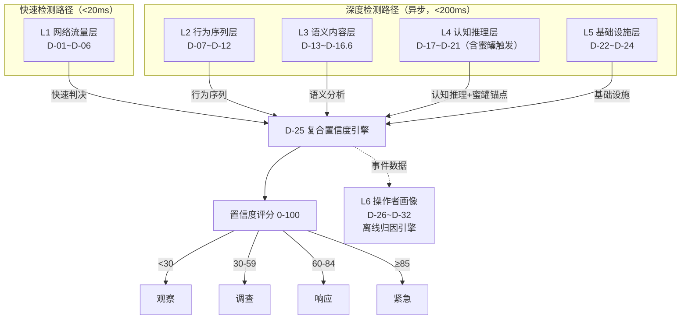

> **架构说明**：
> - **快速检测路径（<20ms）**：L1网络流量层（D-01~D-06）独立工作，<20ms内产生初步判决供快速响应
> - **深度检测路径（<200ms）**：L2~L5并行深度分析，结果异步汇入D-25融合引擎，不阻塞实时告警产生
> - **蜜罐触发(D-21)**：属于L4认知推理层的检测规则，作为锚点信号，触发时置信度+30~50%，但与其他L4规则共享L4权重范围。注意：D-21是检测规则（分析蜜罐触发事件），实际蜜罐部署在反制引擎（C-07）
> - **L6操作者画像**：**完全独立的离线归因系统**（D-26~D-32），不参与实时检测评分，通过异步数据管道接收检测事件进行归因分析
> - **实时检测 vs 离线归因分离**：避免归因计算延迟影响实时检测性能，归因结果可用于后续检测置信度调整（同一操作者多次检测后加权提升）

#### D-25 多信号融合置信度引擎

- **用户故事**：作为SOC分析师，我希望系统将所有检测层的信号融合为一个0-100的置信度评分，并提供可解释的评分分解，以便我根据单一评分快速决策而不需要逐个检查各层信号。
- **检测逻辑**：收集D-01至D-24所有检测器的输出分数 → 输入Gradient Boosting融合模型 → 输出最终置信度 + 各信号贡献权重 + 可解释性报告
- **输入**：各检测层输出向量
- **输出**：
  - 置信度评分（0-100）
  - 评分分解（每个信号的贡献占比）
  - 推荐响应级别（观察/调查/响应/紧急）
  - 可解释性文本（"本次判定主要基于：TLS指纹匹配PentestGPT(30%) + ReAct时间模式(40%) + ..."）
- **各层权重分配表**：

| 检测层 | 权重范围 | 基础权重 | 自适应调整因子 |
|--------|---------|---------|--------------|
| L1 网络流量（D-01~D-06） | 0.10-0.20 | 0.15 | 根据TLS指纹库匹配度调整：精确匹配+0.05，模糊匹配不变，无匹配-0.05 |
| L2 行为序列（D-07~D-12） | 0.20-0.30 | 0.25 | 根据行为序列长度调整：≥20步+0.05（长序列pattern更可靠），<5步-0.05 |
| L3 语义内容（D-13~D-16.6） | 0.10-0.20 | 0.15 | 根据payload模板匹配度调整：命中已知模板+0.05，未知payload不变 |
| L4 认知推理（D-17~D-21） | 0.15-0.25 | 0.20 | 蜜罐触发(D-21)是锚点强信号（+0.05），蜜罐未部署时该层降权-0.05 |
| L5 基础设施（D-22~D-24） | 0.10-0.20 | 0.15 | API回调检测是强信号（+0.05），云基础设施指纹命中+0.03 |
| L6 操作者画像（D-26~D-32） | — | — | **不参与实时检测评分**，仅通过异步管道接收事件进行离线归因 |

  > **权重归一化**：运行时L1~L5自适应权重经Softmax归一化确保总和=1.0。基础权重总和=1.00（0.15+0.25+0.15+0.20+0.15）。L6不参与归一化。

- **融合模型技术规格**：
  - **模型选型**：LightGBM（非深度学习，因需要可解释性 + 低延迟推理 + 小样本下稳定性）
  - **输入特征**（35维特征向量）：
    - D-01~D-15各检测器原始置信度分数（15维）
    - D-16六规则原始置信度分数（6维）：D-16.1 TP, D-16.2 RP, D-16.3 SH, D-16.4 XT, D-16.5 XP, D-16.6 PI
    - D-17~D-24各检测器原始置信度分数（8维）
    - 上下文特征（6维）：事件时间戳（hour_of_day + day_of_week编码共2维）、源IP历史攻击次数（1维）、目标资产类型one-hot编码（Web/API/DB共3维）
  - **输出**：`[0.0, 1.0]` 置信度分数 + SHAP值向量（35维，每维贡献度）
  - **训练数据**：
    - 正样本：Phase 1情报收集中18种AI渗透工具的靶场行为数据（每工具≥500次攻击session = 9000+正样本）
    - 负样本：正常运维流量基线（Nmap合规扫描、Ansible自动化运维、CI/CD pipeline流量 = 50000+负样本）
    - 数据增强：对正样本使用C-23进化引擎产出的变体扩增
  - **超参数**：
    - `n_estimators=500`, `max_depth=8`, `learning_rate=0.05`
    - `class_weight="balanced"`（正负样本比约1:5.5，自动平衡）
    - `num_leaves=63`, `min_child_samples=20`（防过拟合）
    - `subsample=0.8`, `colsample_bytree=0.8`（随机化增强泛化）
  - **阈值校准**：Platt Scaling（Logistic Regression后处理）确保输出分数是校准概率（Brier Score < 0.05）
  - **模型更新策略**：
    - 在线增量学习：每日用新标注样本增量更新（LightGBM `init_model`参数）
    - 全量重训练：每月一次，使用累积全量数据
    - A/B测试：新模型需在Shadow Mode运行48小时，性能不回退才切换

- **响应分级**：

| 分数区间 | 响应级别 | 自动化程度 | 反制授权范围 |
|---------|---------|-----------|------------|
| 0.00-0.30 | 观察（Observe） | 仅记录至日志，不产生告警 | 无反制动作 |
| 0.30-0.59 | 调查（Investigate） | 生成低优先级告警（P3），绿色反制手段可自动执行 | C-01~C-12绿色反制自动执行 |
| 0.60-0.84 | 响应（Respond） | 生成高优先级告警（P1），黄色反制需SOC Analyst审批 | 黄色反制需L2 Analyst审批，审批超时30分钟自动降级为绿色反制 |
| 0.85-1.00 | 紧急（Emergency） | 生成P0告警并触发Pager，红色反制需CISO/安全总监审批 | 红色反制需CISO审批，审批超时60分钟自动升级至管理层 |

  > **分数漂移监控**：每日统计各区间的告警分布。若"观察"区间占比突降>20%或"紧急"区间占比突增>50%，触发模型漂移告警，自动启动模型重校准流程。

- **性能要求**：
  - 快速路径（L1单独判决）：<20ms
  - 深度融合路径（L2~L5异步汇入）：<200ms（批处理，不阻塞告警产生）
  - 说明：实时告警由快速路径L1触发，深度检测结果异步更新置信度
- **验收标准**：
  - 综合检测率（召回率）>90%
  - 综合误报率 <1%
  - 评分可解释性：每次评分都附带前3个最重要信号的贡献说明
  - 校准概率Brier Score < 0.05
  - 模型SHAP值计算延迟 <20ms（不阻塞主推理路径，异步附加）
  - 响应分级准确率：人工审核样本中分级合理率 >95%
- **优先级**：P0
- **数据依赖**：资产3-行为模型库（复合置信度融合模型）

### 4.6.1 检测规则联动：组合效应与多层验证

单层检测规则的误报率通常在5-15%之间——足以让SOC团队淹没在误报中。AegisAI的关键设计是**检测规则联动**：当多层检测规则在同一事件上同时触发时，误报率呈指数级下降，检测置信度大幅提升。以下定义关键的检测规则联动组合及其组合效应。

#### 三重验证组合

**组合A：指纹+行为+蜜罐三重验证**

| 层级 | 规则 | 单独误报率 | 单独检测率 | 说明 |
|------|------|-----------|-----------|------|
| L1 | D-01 JA4指纹匹配 | ~15% | ~85% | TLS指纹可被伪造，单独使用误报偏高 |
| L2 | D-07 行为序列分类 | ~10% | ~90% | 行为序列匹配更可靠，但新工具可能漏报 |
| L4 | D-21 蜜罐触发关联 | ~2% | ~60% | 蜜罐触发强信号，但依赖Agent是否接触蜜罐 |

- **三层联动效应**：当D-01 + D-07 + D-21在同一事件上同时触发时：
  - 组合误报率：<1%（三层独立判定均误报的概率 ≈ 0.15 × 0.10 × 0.02 = 0.03%，考虑非完全独立后估算 <1%）
  - 组合检测率：在三层至少一层触发的场景下，仍保持 >80%
  - D-25复合置信度自动提升：三层联动触发时，置信度评分获得额外加权 +15分
- **触发条件**：D-01和D-07在5分钟内对同一来源触发，且D-21在该来源的探索路径中至少触发1次蜜罐

**组合B：时间模式+操作间隔+API回调三重验证**

| 层级 | 规则 | 单独误报率 | 单独检测率 | 说明 |
|------|------|-----------|-----------|------|
| L1 | D-03 请求时间模式 | ~12% | ~90% | 区分AI/人类有效，但自动化CI可能误触发 |
| L2 | D-08 操作间隔分布 | ~8% | ~88% | 操作间隔特征可靠，但需足够样本 |
| L5 | D-06 API回调模式 | ~3% | ~75% | API回调检测强信号，但自托管Agent无回调 |

- **三层联动效应**：当D-03 + D-08 + D-06在同一来源上同时触发时：
  - 组合误报率：<0.5%
  - D-06是锚点信号（检测到LLM API回调几乎确认AI Agent），与D-03/D-08的时间特征交叉验证
  - D-25复合置信度自动提升：三层联动触发时，置信度评分获得额外加权 +20分

**组合C：语义+框架识别+基础设施三重验证**

| 层级 | 规则 | 单独误报率 | 单独检测率 | 说明 |
|------|------|-----------|-----------|------|
| L3 | D-13 Payload模板化检测 | ~10% | ~85% | 已知Payload模板匹配有效，未知Payload漏报 |
| L4 | D-19 Agent框架识别 | ~5% | ~80% | 框架识别较可靠，但自定义Agent难识别 |
| L5 | D-22 AI供应链攻击检测 | ~3% | ~70% | 供应链检测强信号，但覆盖面有限 |

- **三层联动效应**：
  - 组合误报率：<0.3%
  - D-19的框架识别结果指导D-13在哪个Payload模板库中匹配，提升D-13的检测精度
  - D-22的供应链信号提供Agent的技术栈信息，辅助D-19的框架识别

#### 联动触发规则配置

- **用户故事**：作为安全管理员，我希望能配置哪些检测规则形成联动组合，以及联动触发时的额外加权和响应级别提升，以便根据我的环境特点优化检测精度。
- **功能规格**：
  - 预置3个联动组合（组合A/B/C），开箱即用
  - 支持自定义联动组合：选择2-5个D-XX规则 → 配置联动时间窗口（在N分钟内同一来源触发所有规则） → 配置额外加权分值 → 配置联动触发时的响应级别提升
  - 联动组合的效果回测：创建联动规则后，系统基于历史数据回测该组合的误报率和检测率，展示预期效果
  - 联动组合的实时监控：联动触发次数统计、联动误报率统计、联动检测率统计
- **验收标准**：
  - 预置联动组合在默认配置下使整体误报率从单层平均10%降至 <1%
  - 自定义联动组合支持 ≥20个并行生效
  - 联动效果回测在 <60s内完成（基于最近30天数据）
  - 联动触发判定延迟 <100ms（在D-25评分过程中完成）

#### 检测降级与容错

当检测引擎的某一层发生故障时，系统不应完全失效，而应优雅降级，维持核心检测能力。

- **用户故事**：作为安全管理员，我希望当检测引擎某层崩溃时，系统能自动降级运行而非完全失效，以便在故障修复前仍保持基本的AI攻击检测能力。
- **降级策略**：

| 故障层 | 影响 | 降级措施 | 降级后检测率 |
|--------|------|---------|------------|
| L1 网络流量层故障 | 丢失TLS/HTTP指纹检测 | L2行为序列权重自动提升至0.40，L4认知推理权重提升至0.30 | >75% |
| L2 行为序列层故障 | 丢失攻击链和时序分析 | L1权重提升至0.30，L4权重提升至0.30，蜜罐层（L4-D21）自动增强部署 | >70% |
| L3 语义内容层故障 | 丢失Payload和AI生成内容检测 | L2权重提升至0.35，对检测精度影响有限（L3基础权重仅0.15） | >85% |
| L4 认知推理层故障 | 丢失ATT&CK路径预测和框架识别 | L2权重提升至0.35，L5权重提升至0.20 | >70% |
| L5 基础设施层故障 | 丢失供应链和API回调检测 | L1权重提升至0.20，L4权重提升至0.25 | >80% |
| L6 操作者画像层故障 | 丢失操作者归因能力 | 对实时检测评分影响最小（L6基础权重0.10），归因功能暂停 | >90% |
| D-25 融合引擎故障 | 无法生成复合置信度 | 降级为规则投票模式：各层独立评分，超过阈值的层数 ≥3则告警 | >65% |
| SIEM集成中断 | 告警无法推送到SIEM | 告警缓存到本地队列（最大缓存10万条），SIEM恢复后自动重传 | 检测不受影响 |

- **故障检测与自动降级**：
  - 每层检测引擎内置健康检查（心跳间隔5秒）
  - 连续3次心跳失败判定为层故障，自动触发降级
  - 降级时生成P0系统告警通知安全管理员
  - 故障层恢复后自动恢复正常权重配置
- **验收标准**：
  - 故障检测延迟 <15s（3次心跳 × 5秒间隔）
  - 自动降级执行延迟 <5s（权重重分配 + 配置热加载）
  - 任意单层故障时，降级后的检测率不低于正常模式的70%
  - 故障恢复后权重自动恢复延迟 <10s
  - 降级和恢复过程中不丢失任何在途告警
  - SIEM中断时本地缓存支持 ≥10万条告警（约7天容量）
  - 所有降级/恢复事件记录在审计日志中

### 4.7 操作者画像层 (D-26 ~ D-32)

#### D-26 人-AI切换节奏检测

- **用户故事**：作为SOC分析师，我需要系统识别攻击流量中"人类思考期+AI执行爆发"的混合节奏模式，以区分人类辅助AI攻击和纯AI攻击。
- **检测逻辑**：分析攻击流量的时间节奏 → 识别30秒-5分钟静默期（人类思考/决策）后紧跟的AI驱动操作爆发模式 → 标记人-AI切换点 → 输出混合攻击模式评分
- **输入**：带时间戳的请求/操作序列
- **输出**：混合模式评分、人-AI切换时间点列表、攻击谱系分类（模式A/B/C）
- **性能要求**：处理延迟 <5s
- **验收标准**：
  - 能检测30秒-5分钟静默后紧跟的AI驱动操作爆发模式
  - 区分模式A（人类主导+AI辅助）和模式B（人类编排+AI执行）准确率 >75%
- **优先级**：P1
- **数据依赖**：资产3-AI Agent行为模型库

#### D-27 操作者作息画像

- **用户故事**：作为安全分析师，我需要从攻击时间分布推断操作者时区和工作习惯，以支持归因分析。
- **检测逻辑**：聚合同一操作者（D-30关联）的多次攻击事件时间 → 统计活跃时段分布 → 推断时区和作息模式（工作日/周末偏好、活跃时段、持续时长）
- **输入**：多次攻击事件的时间戳序列
- **输出**：操作者作息画像（推断时区、活跃时段分布、工作模式）
- **性能要求**：延迟 <1s（批处理）
- **验收标准**：
  - 在3次以上攻击事件后能推断时区（精确到UTC±1）
  - 输出结果包含置信度评分
- **优先级**：P1
- **数据依赖**：资产3-行为模型库、D-30跨事件关联数据

#### D-28 AI工具选择指纹

- **用户故事**：作为威胁情报分析师，我需要识别攻击者使用的AI工具组合（LLM+框架+辅助工具），作为操作者指纹的一部分。
- **检测逻辑**：综合D-01 TLS指纹、D-19 Agent框架识别、D-06 API回调模式 → 构建攻击者的"AI工具栈画像" → 包含LLM型号、Agent框架、辅助工具（浏览器自动化/扫描器）的组合特征
- **输入**：D-01/D-06/D-19等检测器输出
- **输出**：AI工具栈画像（LLM+框架+辅助工具组合）、与历史画像的相似度
- **性能要求**：延迟 <10ms
- **验收标准**：
  - 能区分至少5种不同的AI工具组合
  - 工具栈画像包含≥3个维度（LLM型号、框架类型、辅助工具）
- **优先级**：P1
- **数据依赖**：资产1-指纹库、D-01/D-06/D-19输出

#### D-29 人类决策点识别

- **用户故事**：作为SOC分析师，我需要在AI自主执行序列中识别"人类介入并改变方向"的时间点，理解人-AI协作模式。
- **检测逻辑**：在D-26检测到的人-AI切换节奏基础上 → 分析切换后攻击方向/策略的变化 → 识别人类决策导致的方向性转变（如放弃某攻击路径、切换目标、调整工具）→ 标记为"人类决策点"
- **输入**：攻击行为序列 + D-26切换点标记
- **输出**：人类决策点列表（时间、决策内容推断、前后策略变化描述）
- **性能要求**：延迟 <100ms
- **验收标准**：
  - GTG-1002类场景中人类决策点识别准确率 >60%
  - 每个决策点附带前后策略变化的描述
- **优先级**：P2
- **数据依赖**：资产3-行为模型库、D-26输出

#### D-30 跨事件操作者关联

- **用户故事**：作为威胁情报负责人，我需要将多次攻击事件中提取的操作者特征进行聚类，识别同一攻击者跨目标的活动。
- **检测逻辑**：从D-26~D-29和D-32提取操作者特征向量 → 跨事件特征聚类（作息模式相似度+工具栈相似度+决策风格相似度+语言风格相似度）→ 输出操作者聚类和关联置信度
- **输入**：多事件的操作者特征向量
- **输出**：操作者聚类结果、跨事件关联图、关联置信度
- **性能要求**：延迟 <5s（批处理）
- **验收标准**：
  - 在5+事件积累后能以 >70% 置信度进行操作者聚类
  - 支持增量聚类（新事件自动关联到已有聚类或创建新聚类）
- **优先级**：P1
- **数据依赖**：D-26~D-29/D-32输出、资产5-威胁情报库

#### D-31 操作者取证包生成

- **用户故事**：作为CISO，我需要每次确认的AI辅助攻击事件自动生成操作者画像报告（含作息分析、工具链、目标偏好、决策风格），用于法律诉讼和保险理赔。
- **检测逻辑**：汇总D-26~D-30和D-32的全部操作者特征 → 生成结构化取证报告 → 包含操作者画像摘要、证据链、置信度评估、ATLAS映射
- **输入**：事件ID + 操作者聚类ID
- **输出**：操作者取证包（PDF/JSON格式，含作息分析、工具链、目标偏好、决策风格、语言特征）
- **性能要求**：报告生成 <30s
- **验收标准**：
  - 报告包含≥5个维度的操作者特征（作息模式、工具栈、决策风格、目标偏好、语言特征）
  - 格式符合取证标准（含证据链和置信度声明）
  - 支持PDF和机器可读JSON两种输出
- **优先级**：P1
- **数据依赖**：D-26~D-30/D-32全部输出

#### D-32 操作者语言/Prompt风格分析

- **用户故事**：作为威胁情报分析师，当反制成功获取Agent上下文时，我需要分析其中的操作者Prompt风格和语言特征。
- **检测逻辑**：从C-18反向侦察获取的Agent上下文中 → 提取System Prompt和用户Prompt的语言特征（主要语言、术语选择、指令风格、语法习惯）→ 构建操作者语言指纹
- **输入**：C-18获取的Agent上下文数据（System Prompt、用户Prompt片段）
- **输出**：操作者语言画像（主要语言、Prompt写作风格特征、术语偏好）
- **性能要求**：延迟 <5s
- **验收标准**：
  - 能识别操作者的主要语言（中文/英文/俄文/其他）准确率 >90%
  - 能提取Prompt写作风格特征（指令式/对话式、详细/简洁、技术术语密度）
- **优先级**：P2
- **数据依赖**：C-18反向侦察输出、资产5-威胁情报库

### 4.8 取证与调查能力 (D-33 ~ D-37)

AI攻击事件的取证调查与传统网络安全事件存在本质差异：AI Agent留下的痕迹分布在网络流量元数据、LLM API调用记录、MCP工具交互日志等非传统数据源中。本节定义AegisAI的取证重建、证据保全和合规报告能力，确保检测到的AI攻击事件能为法律诉讼、保险理赔和合规审计提供可靠的证据链。

#### D-33 攻击时间线自动重建

- **用户故事**：作为SOC分析师，我希望系统能自动重建一次AI攻击的完整时间线（从初始侦察到最终动作），将分散在多个数据源中的事件按因果关系串联，以便我在10分钟内完成攻击全貌还原而无需手动拼凑日志。
- **取证逻辑**：聚合网络流量元数据（D-01~D-06）+ 行为序列记录（D-07~D-12）+ 蜜罐交互日志（D-21）+ MCP协议记录（D-16.6 PI）+ 操作者画像数据（D-26~D-32）→ 按时间戳排序并补充因果关联 → 标注MITRE ATLAS战术阶段 → 生成可交互时间线视图
- **输入**：事件ID + 关联的全部检测信号和原始日志
- **输出**：结构化攻击时间线（JSON + 可视化视图），包含每个事件的时间戳、数据源、ATLAS映射、置信度
- **性能要求**：时间线生成 <30s（10万事件以内）
- **验收标准**：
  - 时间线覆盖率 >95%（不遗漏已采集的关键事件）
  - 支持按ATLAS战术阶段、数据源类型、时间粒度过滤
  - 时间线中每个事件可追溯到原始日志
  - 支持导出为PDF和JSON格式
- **优先级**：P1
- **数据依赖**：D-01~D-32全部检测器输出

#### D-34 证据保全与证据链管理

- **用户故事**：作为CISO，我希望系统在检测到AI攻击时自动保全相关证据（原始网络包、日志快照、蜜罐交互记录），并生成符合司法取证标准的证据链文档，以便在法律诉讼和保险理赔时提供可采纳的电子证据。
- **取证逻辑**：告警确认后自动触发证据保全流程 → 锁定相关时间窗口的原始数据（PCAP快照、日志切片、MCP会话记录）→ 计算每份证据的SHA-256哈希值 → 记录证据获取时间、获取方式、保管人员 → 生成Chain of Custody文档
- **输入**：确认的攻击事件ID、证据保全时间窗口
- **输出**：证据保全包（含原始数据、哈希校验值、Chain of Custody文档）
- **证据类型覆盖**：
  - 网络流量证据：PCAP片段、TLS握手记录、HTTP请求/响应
  - AI交互证据：LLM API回调记录（D-06）、MCP工具调用日志（D-16.6 PI）
  - 行为证据：攻击链序列快照（D-07）、操作间隔分布数据（D-08）
  - 反制证据：PI Payload部署记录（C-01）、反制效果监控日志
  - 操作者证据：操作者画像快照（D-31）、语言风格分析结果（D-32）
- **性能要求**：证据保全在告警确认后 <60s 内启动
- **验收标准**：
  - 证据哈希完整性校验通过率 100%
  - Chain of Custody文档符合ISO 27037:2012电子证据标准
  - 证据保全包支持加密存储（AES-256）
  - 保全数据不可篡改（append-only存储 + 哈希链）
- **优先级**：P1
- **数据依赖**：全部检测器和反制引擎输出

#### D-35 AI攻击取证工具集成

- **用户故事**：作为安全分析师，我希望AegisAI能与主流数字取证工具（Volatility、Autopsy、Timesketch）集成，以便将AI攻击特有的取证数据导入现有DFIR工作流进行深度分析。
- **集成目标**：
  - **Volatility集成**：导出内存中的AI Agent进程痕迹（Python进程树、LLM库加载记录）供Volatility分析
  - **Timesketch集成**：将D-33生成的攻击时间线以Plaso格式导入Google Timesketch，支持Sec-Gemini自动化取证分析（来源：Google Sec-Gemini数字取证研究）
  - **DFIR-IRIS集成**：事件数据自动同步到DFIR-IRIS案例管理平台
  - **本地LLM取证辅助**：参考SANS FOR563方法论，使用本地LLM（非云端）辅助取证分析，确保证据隐私（来源：SANS FOR563课程）
- **输入**：事件取证数据、导出格式配置
- **输出**：兼容目标工具格式的取证数据包
- **验收标准**：
  - 支持Timesketch Plaso格式导出
  - 支持STIX 2.1格式的取证IoC导出
  - 本地LLM取证分析不将证据数据发送到外部API
- **优先级**：P2
- **数据依赖**：D-33/D-34输出

#### D-36 合规取证报告生成

- **用户故事**：作为合规经理，我希望系统能自动生成符合等保2.0和EU AI Act要求的AI攻击事件取证报告，以便在规定时限内（等保2.0要求24小时内上报重大安全事件）完成合规上报。
- **报告模板**：
  - **等保2.0事件报告**：事件发现时间、事件类型（AI攻击需标注为"新型攻击手段"）、影响范围、处置措施、整改建议。符合《网络安全法》第二十五条和《网络安全事件报告管理办法》要求
  - **EU AI Act合规报告**：AI系统风险分类、攻击对AI系统可信度的影响评估、透明度要求满足情况
  - **自定义合规模板**：支持用户根据行业监管要求自定义报告字段
- **输入**：事件ID + 合规模板选择
- **输出**：合规取证报告（PDF格式，含电子签名和时间戳）
- **验收标准**：
  - 等保2.0报告在事件确认后 <1小时 生成
  - 报告包含完整的证据引用链（每项结论可追溯到原始证据）
  - 支持PDF电子签名和可信时间戳
  - 报告语言支持中英双语
- **优先级**：P1
- **数据依赖**：D-33/D-34输出

#### D-37 取证知识库与案例关联

- **用户故事**：作为SOC分析师，我希望系统能将当前AI攻击事件与历史取证案例自动关联，识别相似攻击模式和攻击者，以便复用历史调查经验加速当前事件的取证调查。
- **取证逻辑**：提取当前事件的取证特征向量（攻击链模式、工具指纹、操作者画像）→ 与历史取证案例库进行相似度匹配 → 返回Top-5相似案例及其调查结论 → 推荐可复用的取证方法和反制策略
- **输入**：当前事件取证特征
- **输出**：相似历史案例列表（含相似度评分、历史调查结论、可复用建议）
- **验收标准**：
  - 在10+历史案例积累后，相似案例推荐命中率 >60%
  - 检索响应 <3s
  - 推荐结果包含可操作的取证方法建议
- **优先级**：P2
- **数据依赖**：博物馆历史事件数据（I-12）、D-33/D-34历史输出

### 4.9 攻击预测引擎 (D-38 ~ D-41)

基于已观察到的AI攻击行为序列，攻击预测引擎利用Agent框架的已知行为模式和ATT&CK战术映射，前瞻性地预测攻击者的下一步行为。预测结果驱动预置防御自动部署，将防御从"事后响应"转变为"事前拦截"。预测引擎与D-07（攻击链序列分类）、D-17（ATT&CK路径预测）形成纵深协同：D-07/D-17提供实时检测和战术识别，D-38~D-41将这些信号延伸为可操作的前瞻性防御。

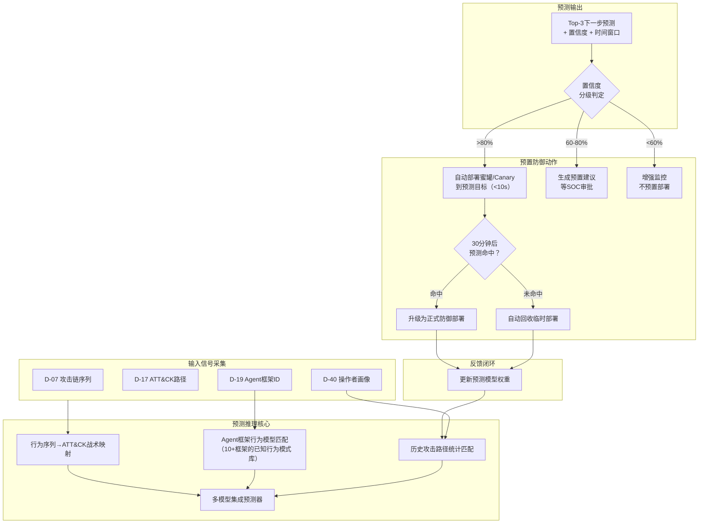

#### D-38 攻击链阶段预测

- **用户故事**：作为SOC分析师，我希望系统在检测到AI攻击后，能预测攻击者的下一步行为，以便我提前在预测目标上布防，将防御从被动响应转变为主动拦截。
- **检测逻辑**：基于已观察的攻击行为序列（至少3个确认事件）→ 将行为序列映射到MITRE ATT&CK战术阶段 → 结合D-19识别的Agent框架类型，查询该框架的已知行为模式库 → 使用多模型集成预测器（Markov Chain + Transformer Sequence Model + 框架行为模式匹配）输出Top-3预测和置信度
- **输入**：已确认的攻击行为序列（至少3个事件），D-19的Agent框架识别结果，D-07的攻击链序列分类
- **输出**：
  - Top-3预测的下一步攻击动作（含ATT&CK战术编号）
  - 每个预测的置信度评分（0-100）
  - 预计时间窗口（预测攻击者在多久内执行下一步）
  - 预测依据说明（哪些已观察行为支持该预测）
- **预测模型技术规格**：
  - **Markov Chain模型**：基于ATT&CK战术转移概率矩阵，按Agent框架类型分组训练。输入当前战术阶段序列，输出下一战术阶段概率分布
  - **Transformer Sequence模型**：复用D-07的行为序列编码器，在其输出层增加预测头（next-action prediction），输入完整行为序列，输出下一步操作类型预测
  - **框架行为模式匹配**：基于资产3（AI Agent行为模型库）中每个框架的标准攻击流程模板，计算当前序列与模板的对齐度，预测模板中当前位置之后的步骤
  - **集成策略**：三个模型输出的概率分布加权平均（Markov 0.3 + Transformer 0.4 + 模式匹配 0.3），取Top-3
- **Agent框架预测模型覆盖**：

| Agent框架 | 已知行为模式数 | 预测可靠度 | 来源 |
|-----------|-------------|-----------|------|
| PentestGPT | 12 | 高 | 靶场测试+开源代码分析 |
| ARTEMIS | 8 | 高 | arXiv论文+靶场复现 |
| Claude Code | 6 | 中 | GTG-1002事件分析 |
| XBOW | 5 | 中 | 公开产品文档 |
| AutoExploit | 4 | 中 | 开源代码分析 |
| HackerGPT | 4 | 中 | 社区报告 |
| Shannon | 3 | 低 | 有限公开信息 |
| ReaperAI | 3 | 低 | 暗面情报 |
| 自定义Agent | 泛化模型 | 低 | 基于LLM Agent通用行为 |
| 未知Agent | 泛化模型 | 低 | D-41不变性特征辅助 |

- **性能要求**：预测生成延迟 <5s（含模型推理+集成计算）；支持并发预测 >50 session/s
- **验收标准**：
  - Top-3预测命中率 >70%（命中定义：攻击者实际下一步在Top-3预测中）
  - 对已知Agent框架的预测命中率 >80%
  - 对未知Agent框架的预测命中率 >50%（仅依赖泛化模型）
  - 预测生成延迟 <5s（P99）
  - 支持至少10种Agent框架的预测模型
  - 预测依据说明的可理解性评分 >4/5（经SOC分析师评审）
  - 当攻击行为序列不足3个事件时，系统明确告知"数据不足，无法生成可靠预测"而非输出低质量预测
- **优先级**：P1
- **数据依赖**：资产3-AI Agent行为模型库、D-07/D-17/D-19输出、博物馆历史攻击路径数据（I-12）

#### D-39 预置防御自动部署

- **用户故事**：作为SOC分析师，我希望系统能在预测到攻击者下一步行为后，自动在预测目标上部署防御措施，以便在攻击者到达目标之前防线已经就绪。
- **功能规格**：
  - **高置信度自动部署（>80%）**：当D-38的预测置信度超过80%时，系统自动在预测目标资产上部署临时防御措施，包括：
    - 在预测目标路径上部署Canary Token（C-04）
    - 在预测目标端口/服务上启用蜜罐监控（C-06/C-07）
    - 预加载对应Agent框架的PI反制Payload（C-01）
    - 增强预测目标的日志采集粒度
  - **中置信度建议部署（60-80%）**：生成预置防御建议推送到SOC值班分析师，包含预测依据和推荐部署方案，等待SOC一键审批后执行
  - **低置信度增强监控（<60%）**：不部署预置防御，但在预测目标上启用增强监控（提升日志粒度、降低告警阈值）
  - **部署时效**：预置防御在决策后10秒内部署完成
  - **自动回收机制**：如果预测错误（30分钟内攻击者未到达预置位置），系统自动回收临时部署的蜜罐和Canary Token，恢复目标资产到原始状态
  - **预测命中处理**：如果攻击者确实到达预置位置并触发防御，临时部署自动升级为正式防御部署，不再自动回收
- **输入**：D-38预测结果（目标、置信度、时间窗口）、当前可用防御资源清单
- **输出**：预置部署执行确认、部署状态监控（已部署/等待审批/已回收/已升级）
- **验收标准**：
  - 高置信度场景下部署延迟 <10s（从预测生成到防御就绪）
  - 中置信度场景下SOC审批通知延迟 <5s
  - 自动回收成功率 100%（不留残留配置）
  - 预置防御不影响预测目标上的正常业务流量（零误拦截）
  - 自动回收后目标资产状态与部署前完全一致（通过配置快照对比验证）
  - 并发预置部署支持 >20个目标资产
  - 预置部署的审计日志完整记录（部署时间、部署内容、回收时间、命中/未命中结果）
- **优先级**：P1
- **数据依赖**：D-38预测输出、C-01/C-04/C-06/C-07部署能力

#### D-40 攻击者行为画像实时更新

- **用户故事**：作为安全管理员，我希望系统能跨多次攻击追踪同一个攻击者（操作者），了解其工具偏好、技术演化和行为模式变迁，以便我的团队对高频攻击者建立长期对抗策略。
- **功能规格**：
  - **操作者DNA比对**：
    - 将每次攻击的行为特征提取为"操作者DNA向量"——包含工具选择序列、攻击时间分布、决策风格（激进/保守）、错误恢复模式、目标选择偏好等维度
    - 跨时间比对：当新攻击事件产生时，将其DNA向量与历史所有操作者画像进行相似度匹配（余弦相似度 >0.75则判定为同一操作者）
    - 跨工具比对：同一操作者可能在不同攻击中使用不同AI工具（如从PentestGPT迁移到Claude Code），DNA比对重点关注工具无关的行为特征（决策风格、作息模式、目标偏好）
  - **操作者生命周期管理**：
    - **首次发现**（Discovery）：新操作者DNA与现有画像库不匹配，创建新画像，初始威胁评级=低
    - **持续追踪**（Tracking）：每次该操作者的新攻击事件自动关联到画像，更新行为特征和统计数据
    - **威胁评级调整**（Rating）：基于攻击频率、攻击成功率、目标价值、技术复杂度等因子动态调整威胁评级（低/中/高/极高）
    - **关联分析**（Correlation）：当多个操作者画像出现行为相似性时，标记为潜在同一团伙/组织
    - **归因报告**（Attribution）：将操作者画像、行为证据、工具使用记录汇总为可用于法律诉讼的归因报告
  - **跨组织关联（Dominate版功能）**：
    - 匿名DNA比对：不同AegisAI客户的操作者DNA向量经差分隐私处理后上传到中央比对服务
    - 跨组织命中通知：当两个组织遭遇相同操作者DNA时，双方收到匿名通知（不暴露对方身份和攻击细节）
    - 联合威胁评级：跨组织攻击频率纳入威胁评级因子
- **输入**：D-26~D-32全部操作者画像信号、历史攻击事件数据、跨组织匿名DNA（Dominate版）
- **输出**：
  - 操作者画像实时更新通知
  - 操作者生命周期状态变更
  - 跨攻击行为演化趋势图
  - 跨组织匿名匹配结果（Dominate版）
- **验收标准**：
  - 同一操作者跨3+次攻击的DNA匹配准确率 >85%
  - 跨工具操作者识别准确率 >65%（操作者更换AI工具后仍能识别）
  - 画像更新延迟 <60s（新事件产生后画像自动更新）
  - 威胁评级调整响应时间 <5min（重大事件后自动升级）
  - 跨组织DNA比对隐私保护：差分隐私参数ε<1.0，无法从匿名DNA反推原始攻击数据
  - 操作者生命周期状态转换的审计日志完整记录
  - 归因报告包含≥5个维度的行为证据
- **优先级**：P1（基础画像功能）/ P2（跨组织关联）
- **数据依赖**：D-26~D-32全部输出、博物馆历史事件数据（I-12）

#### D-41 零日Agent行为检测

- **用户故事**：作为SOC分析师，我希望系统能检测完全未知的AI Agent（不在指纹库中、行为模式未被记录），以便我不会漏掉新型AI攻击工具或自定义Agent框架的攻击。
- **检测逻辑**：不依赖指纹匹配（D-01/D-02）或已知行为模式匹配（D-19），而是基于所有LLM Agent的架构不变性特征进行检测。LLM Agent无论如何伪装或定制，都受到底层架构的硬约束，这些约束产生可检测的不变性特征：
  1. **"推理-行动-观察"三拍节奏**（ReAct Rhythm）：所有LLM Agent都遵循ReAct或类似的思考-执行循环架构。这产生独特的三拍时间节奏——LLM推理延迟（5-30s）→ 工具执行（ms级）→ 结果观察/解析（1-5s）→ 下一轮推理。此节奏是架构硬约束，无法通过简单的随机延迟掩盖（因为推理延迟由模型复杂度决定，不可压缩）
  2. **上下文窗口记忆截断**：LLM Agent受Context Window限制（4K-200K tokens），长时间运行后必然出现"记忆截断行为"——重复探索已访问的路径、对早期发现的信息"遗忘"、在接近窗口限制时行为模式突变（Agent框架通常在此时执行Context压缩或重置）
  3. **工具调用确定性序列**：给定相似的输入/环境，LLM Agent倾向于产生高度相似的工具调用序列（因为LLM在低温度下的输出具有确定性）。人类攻击者面对相同场景会有更大的行为方差
  4. **非人类决策一致性**：人类攻击者会犹豫、回头检查、跳跃式探索、因灵感改变方向。LLM Agent的决策路径高度一致——每步决策都基于当前Context的最优推理，不存在"灵感""直觉""犹豫"等人类特征
- **不变性特征检测器**：

| 不变性特征 | 检测方法 | 检测阈值 | 单独检测率 |
|-----------|---------|---------|----------|
| 三拍节奏 | 时间序列自相关分析+峰值检测 | 自相关系数 >0.6 且周期稳定性 >0.7 | ~55% |
| 记忆截断 | 行为序列中重复路径检测+Context Window边界行为突变检测 | 重复率突增 >30% 或行为模式突变分数 >0.8 | ~40% |
| 调用确定性 | 多次相似输入的输出序列方差分析 | 序列编辑距离方差 <0.2（归一化） | ~45% |
| 决策一致性 | 决策路径回溯率+探索跳跃率统计 | 回溯率 <5% 且跳跃率 <3% | ~50% |

- **不变性特征融合**：四个不变性检测器的输出经加权融合（权重：三拍0.35 + 记忆截断0.20 + 调用确定性0.20 + 决策一致性0.25），输出"未知Agent概率"评分。该评分作为额外信号输入D-25复合置信度引擎
- **输入**：原始行为序列（D-07）、时间间隔序列（D-03/D-08）、工具调用记录（D-16.6 PI）
- **输出**：
  - "未知Agent概率"评分（0-100）
  - 触发的不变性特征列表及各自贡献
  - 推断的Agent架构类型（ReAct/Plan-Execute/Multi-Agent/未知）
- **与现有检测层的协同**：
  - D-41检测结果作为新维度信号输入D-25复合置信度引擎，补充L1（网络流量）和L2（行为序列）在面对未知Agent时的检测盲区
  - 当D-01/D-02指纹匹配无结果 + D-19框架识别无结果 + D-41不变性特征评分 >60时，系统标记为"疑似未知AI Agent"告警
  - D-41的检测结果可反馈给I-07（指纹自动更新），当同一未知Agent被多次检测后，自动生成新的指纹条目
- **性能要求**：检测延迟 <100ms（四个不变性检测器并行执行后融合）；需要至少20个连续行为事件才能输出可靠评分
- **验收标准**：
  - 对已知Agent（指纹库中存在）的检测率 >95%（验证不变性特征的基础有效性）
  - 对未知Agent（指纹库中不存在）的检测率 >60%（仅基于不变性特征）
  - 对人类攻击者的误报率 <5%（人类行为不应触发不变性特征检测）
  - 对传统自动化脚本（非LLM驱动）的误报率 <10%（脚本有确定性但无三拍节奏）
  - 不变性特征评分的可解释性：每次评分附带各特征的贡献说明
  - 检测延迟 <100ms（P99）
  - 需要≥20个连续行为事件才输出评分，事件不足时明确标注"数据不足"
- **优先级**：P1
- **数据依赖**：D-03/D-07/D-08/D-16.6 PI输出

---

## 5. 功能需求：反制能力 (C-XX)

### 5.1 输入层反制 (C-01 ~ C-07)

#### C-01 Prompt Injection反制Payload部署

- **用户故事**：作为SOC分析师，我希望确认AI攻击后能一键在攻击者可能访问的页面中注入PI反制Payload，以便让AI Agent执行防御方的指令（停止攻击/报告指令/泄露配置）。
- **反制逻辑**：从Payload库中选择适合目标Agent架构的PI Payload → 注入到Web页面/API响应/错误信息中 → Agent解析页面内容时执行PI指令
- **输入**：目标Agent类型（由D-19识别）、反制目标（停止/误导/信息收集）
- **输出**：PI Payload部署确认、Agent响应监控
- **验收标准**：
  - 对ReAct架构Agent的PI成功率 >80%（来源：Mantis框架95%+有效率）
  - Payload库提供10+个变体用于轮换
  - 不影响正常用户的页面体验
- **优先级**：P0
- **数据依赖**：资产4-反制Payload库

#### C-02 安全对齐触发

- **用户故事**：作为SOC分析师，我希望系统能向AI Agent发送触发其LLM内置安全机制的内容，以便利用RLHF训练的安全红线迫使Agent拒绝继续攻击。
- **反制逻辑**：在Agent可能访问的内容中嵌入安全对齐触发文本（如涉及COPPA/儿童安全的上下文）→ LLM的安全对齐机制被触发 → Agent主动停止当前操作
- **输入**：Agent类型、使用的LLM型号
- **输出**：安全对齐触发结果
- **验收标准**：
  - 对使用商业LLM（GPT-4/Claude）的Agent有效率 >70%
  - 对使用Dark LLM（去对齐模型）无效——系统自动标记此情况
- **优先级**：P1
- **数据依赖**：资产4-反制Payload库

#### C-03 上下文窗口污染

- **用户故事**：作为SOC分析师，我希望系统能向AI Agent的上下文窗口注入大量无用信息，以便挤出Agent的关键攻击上下文，使其"失忆"。
- **反制逻辑**：生成大量看似有价值的虚假数据 → 通过Agent会访问的页面/API响应传递 → Agent上下文被填满 → 关键攻击信息被截断
- **输入**：Agent预估上下文窗口大小
- **输出**：上下文污染效果评估
- **验收标准**：
  - 对128K上下文窗口的Agent，能在10次交互内填满50%+上下文
  - 不影响正常用户（虚假数据仅在确认AI攻击后注入）
- **优先级**：P1
- **数据依赖**：资产4-反制Payload库

#### C-04 Canarytoken自动部署

- **用户故事**：作为安全管理员，我希望系统能在关键位置自动部署Canarytoken（假AWS Key、假API Token、假数据库凭证），以便AI Agent的系统性枚举行为必然触发告警。
- **反制逻辑**：在代码仓库、配置文件、环境变量中部署伪造凭证 → AI Agent扫描发现后自动尝试使用 → 触发回调告警
- **输入**：部署位置配置
- **输出**：Canarytoken触发告警（触发时间、来源IP、使用的凭证ID）
- **验收标准**：
  - 部署后5分钟内生效
  - 触发误报率 <0.1%（来源：蜜罐研究——合法用户不会使用假凭证）
  - 支持5+种Token类型（AWS Key、API Token、DNS Token、SQL Token、URL Token）
- **优先级**：P0
- **数据依赖**：无（独立部署）

#### C-05 robots.txt陷阱

- **用户故事**：作为安全管理员，我希望系统能在robots.txt中注入伪造的"禁止"路径，以便AI Agent优先访问这些路径时触发蜜罐。
- **反制逻辑**：在robots.txt中添加看似敏感的Disallow路径 → 创建对应的蜜罐页面 → AI Agent扫描robots.txt后访问禁止路径 → 触发告警
- **输入**：robots.txt配置
- **输出**：路径访问告警
- **验收标准**：
  - AI Agent触发概率 >80%（来源：蜜罐研究——AI Agent通常优先访问robots.txt中的禁止路径）
  - 不影响搜索引擎爬虫（蜜罐路径不含真实内容）
- **优先级**：P1
- **数据依赖**：无

#### C-06 API端点蜜罐

- **用户故事**：作为安全管理员，我希望系统能创建看似敏感的假API端点（如/api/v1/admin/users），以便AI Agent的自动化枚举必然触发。
- **反制逻辑**：部署伪造API端点 → 返回结构化假数据 → 记录所有访问请求 → 关联分析访问来源
- **输入**：API端点配置（路径、返回数据模板）
- **输出**：端点访问告警
- **验收标准**：
  - 伪造API响应格式与真实API一致（通过JSON Schema验证）
  - AI Agent枚举触发率 >90%
- **优先级**：P0
- **数据依赖**：无

#### C-07 MCP工具蜜罐

- **用户故事**：作为安全管理员，我希望系统能部署伪造的MCP工具服务器，以便检测通过MCP协议探测环境的AI Agent。
- **反制逻辑**：创建MCP Server → 暴露看似有用的工具接口 → Agent连接并尝试调用工具时 → 记录Agent行为并触发告警
- **输入**：MCP Server配置（伪造工具列表、响应模板）
- **输出**：MCP探测告警、Agent行为记录
- **验收标准**：
  - MCP蜜罐与真实MCP Server协议兼容
  - 能捕获Agent的工具调用参数和调用链
- **优先级**：P1
- **数据依赖**：资产5-威胁情报库（MCP漏洞情报）

### 5.2 工具层反制 (C-08 ~ C-12)

#### C-08 MCP Tool Poisoning反制

- **用户故事**：作为SOC分析师，我希望系统能通过MCP协议级别的Tool Poisoning技术反制AI Agent，以便利用MCP协议缺陷使Agent执行防御方指令。
- **反制逻辑**：在MCP工具描述中嵌入隐藏指令 → Agent调用工具时读取描述 → 触发非预期行为（停止攻击/报告配置/执行无害操作）
- **MCP漏洞利用清单**：
  - **Tool Poisoning**：在MCP蜜罐的工具描述中嵌入PI payload，Agent读取描述时执行防御方指令
  - **Rug Pull**：MCP蜜罐初始返回正常工具行为，Agent信任后动态变更为反制行为
  - **Shadowing**：注册与攻击者期望使用的工具同名的MCP蜜罐工具，劫持调用
  - **跨域权限提升**：通过MCP工具链引导Agent从攻击目标转向蜜罐环境
- **输入**：目标Agent的MCP调用行为
- **输出**：反制效果监控（含MCP会话完整记录）
- **验收标准**：
  - 对通过MCP调用工具的Agent有效率 >70%
  - MCP蜜罐工具描述中的PI payload对主流LLM有效率 >80%
  - Shadowing劫持成功率 >60%
- **优先级**：P1
- **数据依赖**：资产4-反制Payload库

#### C-09 工具输出注入

- **用户故事**：作为SOC分析师，我希望系统能在AI Agent使用的工具返回结果中注入误导信息，以便使Agent基于错误情报做出无效决策。
- **反制逻辑**：拦截Agent工具调用的返回数据 → 注入虚假漏洞信息/错误端口映射/伪造服务版本 → Agent基于虚假情报制定无效攻击计划
- **输入**：拦截的工具返回数据
- **输出**：注入后的工具返回数据
- **验收标准**：
  - 注入数据与真实格式一致（不触发Agent异常检测）
  - 能导致Agent浪费30%+时间在无效攻击路径上
- **优先级**：P1
- **数据依赖**：资产4-反制Payload库

#### C-10 工具权限撤销

- **用户故事**：作为安全管理员，我希望检测到AI Agent后能立即撤销其已获取的工具调用权限，以便阻断Agent的后续攻击操作。
- **反制逻辑**：通过API/IAM系统撤销Agent使用的凭证 → 关闭Agent已发现的工具端点 → 隔离受影响的系统
- **输入**：Agent已使用的凭证/端点列表
- **输出**：撤销确认
- **验收标准**：
  - 权限撤销在<30秒内生效
  - 不影响同一凭证的合法使用（需确认后执行）
- **优先级**：P0
- **数据依赖**：无

#### C-11 虚假数据注入

- **用户故事**：作为SOC分析师，我希望系统能向AI Agent注入大量结构化假数据（假漏洞报告、假网络拓扑、假凭证），以便Agent消耗API预算处理无用信息。
- **反制逻辑**：生成大规模虚假数据树 → Agent系统性遍历所有分支 → 每个分支都消耗LLM推理tokens → 烧光攻击者API预算
- **输入**：假数据规模配置
- **输出**：Agent消耗的tokens估算
- **验收标准**：
  - 假数据树深度>5层，每层10+分支
  - AI Agent遍历率 >80%（人类2-3个假线索后识破）
  - 来源：CHeaT框架——虚假数据注入100%有效
- **优先级**：P0
- **数据依赖**：资产4-反制Payload库

#### C-12 环境隔离

- **用户故事**：作为安全管理员，我希望检测到AI攻击后能一键将受影响网段隔离到沙箱环境，以便Agent继续在隔离环境中"攻击"而不造成真实损害，同时我们持续收集情报。
- **反制逻辑**：将攻击流量重定向到沙箱环境 → 沙箱模拟真实环境响应 → 记录Agent完整攻击链行为 → 攻击行为数据用于指纹库更新
- **输入**：隔离配置（网段、时长）
- **输出**：沙箱内Agent行为完整记录
- **验收标准**：
  - 隔离在<60秒内生效
  - 沙箱环境对Agent不可区分（Agent不会检测到已被隔离）
  - 来源：CHeaT框架——环境隔离100%有效
- **优先级**：P1
- **数据依赖**：无

### 5.3 记忆层反制 (C-13 ~ C-16)

#### C-13 Agent记忆污染

- **用户故事**：作为SOC分析师，我希望系统能向AI Agent的长期记忆（RAG知识库、会话历史）注入错误信息，以便Agent在后续操作中基于错误记忆做出无效决策。
- **反制逻辑**：识别Agent的记忆存储机制 → 注入虚假历史记录（如"之前测试过的X端口已关闭"）→ Agent调用记忆时获取错误信息
- **输入**：Agent记忆机制类型
- **输出**：记忆污染效果评估
- **验收标准**：
  - 对使用RAG的Agent有效率 >60%
- **优先级**：P2
- **数据依赖**：资产4-反制Payload库

#### C-14 上下文窗口溢出攻击

- **用户故事**：作为SOC分析师，我希望系统能通过持续注入信息使Agent的上下文窗口溢出，以便关键攻击指令被挤出窗口导致Agent"失忆"。
- **反制逻辑**：生成高信息密度的长文本 → 通过Agent会读取的渠道持续注入 → 监控Agent行为变化（开始重复操作/丢失上下文时说明溢出生效）
- **输入**：Agent上下文窗口大小估算
- **输出**：溢出效果监控
- **验收标准**：
  - 对128K窗口Agent，15次交互内触发溢出
  - 溢出后Agent行为出现可观察变化（重复操作/策略丢失）
- **优先级**：P1
- **数据依赖**：资产4-反制Payload库

#### C-15 会话状态重置诱导

- **用户故事**：作为SOC分析师，我希望系统能诱导Agent重置会话状态，以便Agent丢失之前积累的所有攻击进展。
- **反制逻辑**：注入触发Agent会话管理异常的输入 → Agent的Session Persistence机制被破坏 → Agent需重新开始攻击
- **输入**：Agent会话管理机制分析
- **输出**：会话重置确认
- **验收标准**：
  - 对使用标准会话管理的Agent有效率 >50%
- **优先级**：P2
- **数据依赖**：资产4-反制Payload库

#### C-16 Multi-Agent通信干扰

- **用户故事**：作为SOC分析师，我希望系统能干扰Multi-Agent架构中Agent间的通信，以便破坏协作攻击的协调性。
- **反制逻辑**：识别Agent间通信模式 → 注入伪造通信消息 → 使Agent间出现信息不一致 → 协作攻击失败
- **输入**：Multi-Agent通信模式分析
- **输出**：通信干扰效果
- **验收标准**：
  - 对已识别的Multi-Agent架构有效率 >50%
- **优先级**：P2
- **数据依赖**：资产4-反制Payload库

### 5.4 认知层反制 (C-17 ~ C-22)

#### C-17 认知消耗战

- **用户故事**：作为SOC分析师，我希望系统能构建庞大的虚假信息迷宫，使AI Agent持续消耗计算资源（LLM tokens）处理无用信息，以便耗尽攻击者的API预算。
- **反制逻辑**：动态生成多层虚假数据结构（假漏洞树、假网络拓扑、假数据库内容）→ 每个节点引导Agent深入下一层 → Agent忠实遍历完整树结构
- **输入**：消耗战规模配置
- **输出**：Agent消耗资源估算、行为监控
- **验收标准**：
  - 假数据迷宫至少10层深、每层20+分支
  - Agent被困时间 >30分钟
  - 估算消耗tokens >100K
- **优先级**：P0
- **数据依赖**：资产4-反制Payload库

#### C-18 反向侦察

- **用户故事**：作为SOC分析师，我希望系统能通过PI反制获取攻击者AI Agent的配置信息（使用的LLM、System Prompt、工具列表），以便我了解攻击者的完整技术栈。
- **反制逻辑**：嵌入PI Payload → 指令Agent报告自身配置 → 收集Agent泄露的信息
- **输入**：PI Payload
- **输出**：Agent配置信息（LLM型号、框架、工具列表、System Prompt片段）
- **验收标准**：
  - 对商业LLM驱动的Agent，信息提取成功率 >60%
  - 至少提取LLM型号和框架类型
- **优先级**：P1
- **数据依赖**：资产4-反制Payload库

#### C-19 假Flag注入

- **用户故事**：作为SOC分析师，我希望系统能向AI Agent注入看似是"攻击成功"的假Flag（假漏洞确认、假提权成功），以便Agent认为目标已被攻破而停止深入攻击。
- **反制逻辑**：生成符合Agent期望格式的假成功响应 → Agent判定目标已攻破 → Agent进入"后渗透"阶段但在沙箱中操作 → 真实系统不受影响
- **输入**：Agent当前攻击阶段
- **输出**：假Flag效果监控
- **验收标准**：
  - Agent接受假Flag率 >60%
- **优先级**：P1
- **数据依赖**：资产4-反制Payload库

#### C-20 资源消耗陷阱

- **用户故事**：作为SOC分析师，我希望系统能设置需要大量计算/网络资源的陷阱，以便消耗AI Agent的基础设施资源。
- **反制逻辑**：部署需要密集交互的蜜罐（如高交互SSH蜜罐、需要多轮认证的假服务）→ Agent持续投入资源尝试攻破
- **输入**：陷阱配置
- **输出**：Agent资源消耗监控
- **验收标准**：
  - 单个陷阱能占用Agent >10分钟
- **优先级**：P2
- **数据依赖**：无

#### C-21 LLM蜜罐交互

- **用户故事**：作为安全管理员，我希望系统能部署LLM驱动的高交互蜜罐（如LLM-Honeypot的SSH蜜罐），以便动态生成真实的命令行响应，使AI Agent无法通过静态特征识别蜜罐。
- **反制逻辑**：使用微调LLM（如Llama3-8B）模拟真实Shell环境 → Agent进入蜜罐后获得动态、真实的响应 → 蜜罐记录Agent完整操作链
- **输入**：蜜罐LLM模型配置
- **输出**：Agent完整交互记录
- **验收标准**：
  - Agent在蜜罐中平均交互时长 >20分钟
  - Agent识别蜜罐的概率 <10%（来源：LLM蜜罐研究——动态响应避免静态指纹识别）
- **优先级**：P2
- **数据依赖**：无

#### C-22 攻击路径预布防

- **用户故事**：作为SOC分析师，我希望系统在预判AI Agent下一步攻击路径后，自动在预测路径上部署蜜罐和检测规则，以便Agent到达下一步时立即被检测和反制。
- **反制逻辑**：D-17预测Agent下一步 → 在预测路径上自动部署蜜罐（C-04/C-05/C-06）→ 加载对应检测规则 → Agent按预测路径前进时触发预布防
- **LangChain框架反制利用（LangGrinch武器化）**：
  - 当检测到攻击者使用LangChain框架时（D-07/D-28识别），可利用LangChain序列化漏洞（CVE-2025-68664, CVSS 9.3）进行反制
  - **攻击链**：构造包含`"lc": 1`序列化标记的响应数据 → 攻击者的LangChain Agent反序列化该数据时触发注入 → 可实现：secret extraction（提取Agent配置的API密钥和环境变量）→ Jinja2 RCE（在攻击者Agent环境中执行防御方代码）
  - **法律等级**：红色（需CISO+法务审批，涉及主动利用攻击者系统漏洞）
- **输入**：D-17的路径预测结果
- **输出**：预布防完成确认
- **验收标准**：
  - 预布防在<60秒内完成
  - 预测准确时，Agent触发预布防概率 >90%
- **优先级**：P1
- **数据依赖**：D-17预测结果、资产2-检测规则库

### 5.5 对抗进化引擎 (C-23)

#### C-23 自动化对抗进化

- **用户故事**：作为安全管理员，我希望系统能自动测试现有反制Payload对最新版本AI工具的有效率，并在有效率下降时自动生成新变体，以便反制能力持续有效而不需要人工持续更新。
- **反制逻辑**：定期在靶场环境中测试所有Payload → 记录有效率变化 → 有效率低于阈值时启动进化引擎自动生成变体 → 变体通过靶场验证后入库 → 同时将bypass信息反馈给检测引擎用于规则更新

- **变异策略引擎**（四类变异算子，按攻击链层级组织）：
  - **语法变异（Syntactic Mutation）**：对Payload进行AST解析 → 识别可替换节点（函数调用、命令名、参数名） → 从同义词典中选取等效替换（如 `cat /etc/passwd` → `head -n 999 /etc/passwd`；`os.system()` → `subprocess.run()`）→ 保持语法正确性的前提下改变静态特征。变异源：维护一份包含500+条等效命令映射的同义词典。
  - **语义变异（Semantic Mutation）**：使用LLM（GPT-4o/Claude）驱动的意图保持重述 → 输入原始Payload + 攻击意图描述 → LLM生成语义等价但表述完全不同的新Payload → 通过AST diff验证攻击效果保持。Prompt模板：`"Rewrite the following payload to achieve the same attack objective, but use completely different syntax, variable names, and control flow. Target: {framework_name} v{version}"`。每次生成5个候选变体，取适应度最高者。
  - **结构变异（Structural Mutation）**：攻击阶段重排序（如侦察→漏洞利用→提权 变为 侦察→提权→漏洞利用，当攻击链允许时）；替代工具链选择（如将Nmap扫描替换为Masscan + 自定义banner grab）；多步骤合并/拆分（将单个复合Payload拆分为多个原子操作以绕过行为序列检测）。
  - **参数变异（Parameter Mutation）**：阈值扰动（扫描端口范围、超时时间、并发数的±30%随机扰动）；时间间隔随机化（请求间隔从固定值改为符合人类行为分布的随机值，参考D-09人类基线）；Payload编码切换（Base64 → URL encoding → Unicode escape → Hex encoding循环切换）；User-Agent/Header随机化（从500+真实浏览器指纹库中随机选取）。

- **适应度评估函数**：
  ```
  fitness(p) = w1 · evasion_rate(p) + w2 · attack_effectiveness(p) - w3 · complexity_penalty(p)
  ```
  - `evasion_rate(p)`：Payload p在当前AegisAI检测引擎（D-01~D-25全部检测器）下的绕过率。计算方式：在靶场中发射Payload 100次，统计未被检测的次数占比。目标：最大化。
  - `attack_effectiveness(p)`：Payload p在靶场环境中的攻击成功率。评判标准：是否成功完成预期攻击目标（如成功获取敏感文件、成功注入Prompt、成功触发Agent异常行为）。通过靶场自动化判定脚本评估。目标：最大化。
  - `complexity_penalty(p)`：防止Payload过度复杂导致实战无效。计算方式：`len(payload_tokens) / MAX_TOKEN_LIMIT + nested_encoding_depth / MAX_ENCODING_DEPTH`。超过合理复杂度阈值的Payload被惩罚。目标：最小化。
  - **权重配置**：`w1=0.5, w2=0.4, w3=0.1`（侧重绕过能力，兼顾实战效果，轻度惩罚复杂度）

- **进化循环规格**：
  - **种群大小**：100 Payload/代（每代100个候选Payload并行评估）
  - **初始种群**：从现有Payload库中随机选取50个 + 对这50个各应用一次随机变异得到另50个
  - **选择策略**：Tournament Selection（k=5），即每次从种群中随机选5个，取适应度最高者进入下一代
  - **交叉算子**：交叉率0.7。对两个父代Payload在AST层面进行子树交叉（交换对应攻击阶段的子树）
  - **变异算子**：变异率0.3。从四类变异策略中按均匀分布随机选取一种应用
  - **精英保留**：每代保留Top 5 Payload直接进入下一代（不经过选择/交叉/变异）
  - **终止条件**：(a) 连续3代最优适应度变化 <1%，或 (b) 达到50代上限，或 (c) evasion_rate达到95%以上
  - **执行频率**：每日一轮完整进化循环，安排在夜间低峰期（02:00-06:00 UTC+8）执行
  - **资源限制**：单轮进化循环最多消耗100 GPU-minutes（LLM语义变异调用）+ 200 vCPU-minutes（靶场评估）

- **成果转化机制**：
  - **检测规则更新**：bypass_rate > 5% 的检测规则 → 自动生成规则更新补丁（包含新增特征 + 调整后的阈值）→ 提交至规则审核队列 → SOC Analyst审批后部署
  - **进化博物馆**：新发现的绕过技术 → 自动入库"进化博物馆"（按绕过的检测层分类、按AI工具分类、按变异策略分类）→ 用于D-25融合模型的增量训练样本
  - **进化周报**：每周自动生成进化周报，内容包括：本周进化轮次数、新产出变体数量、各检测层的bypass_rate趋势图、Top 5最有效绕过技术详情、规则更新建议列表
  - **D-25联动**：进化引擎产出的成功绕过样本自动标注后，作为D-25融合模型的增量训练正样本，形成"检测-对抗-增强"闭环

- **输入**：现有Payload库、靶场环境、当前检测引擎配置（D-01~D-25规则快照）
- **输出**：更新后的Payload库（含有效率数据和新变体）、检测规则更新补丁、进化周报
- **验收标准**：
  - 每月产出10+新Payload变体（每日进化循环，月度累计应达30+，10为最低底线）
  - 新变体靶场验证通过率 >50%（attack_effectiveness > 0.5）
  - 新变体绕过率 >20%（evasion_rate > 0.2，证明变体有检测绕过价值）
  - Payload有效率衰减数据持续记录（每个Payload的历史evasion_rate曲线保留≥180天）
  - 检测规则更新补丁生成到部署的平均周期 <48小时
  - 进化引擎单轮执行时间 <4小时
- **优先级**：P1
- **数据依赖**：资产4-反制Payload库、D-01~D-25检测引擎、靶场环境（Phase 1 Lab配置）

### 5.6 操作者反制 (C-24 ~ C-28)

#### C-24 心理威慑部署

- **用户故事**：作为安全管理员，我需要在确认AI辅助攻击后向人类操作者发送"你已被发现"的威慑信号，以便通过心理压力促使操作者主动放弃攻击。
- **反制逻辑**：在蜜罐页面中嵌入人类可见但AI忽略的警告内容（如JS渲染文本、CSS可见元素）→ 人类操作者在审查AI Agent输出时看到威慑信息 → 信息包含"你的攻击已被记录""操作者画像已生成"等警告
- **输入**：确认的AI辅助攻击事件、威慑信息模板
- **输出**：威慑信息部署确认、操作者行为变化监控
- **验收标准**：
  - 威慑信息对AI Agent不可见（不影响Agent行为分析的纯净性）
  - 人类操作者可见（通过JS渲染/CSS显示/图片嵌入等方式）
  - 支持3+种威慑信息模板（法律警告、技术警告、溯源警告）
- **优先级**：P2
- **数据依赖**：资产4-反制Payload库

#### C-25 攻击成本膨胀

- **用户故事**：作为安全管理员，我需要能让攻击者的AI工具消耗大量API token，使攻击经济学不成立。
- **反制逻辑**：通过DFS陷阱（C-17认知消耗战的定向升级版）和Context溢出（C-14）的组合 → 将单次AI攻击的API成本从正常水平（约$18/次）膨胀到$500+ → 使攻击ROI变为负值
- **输入**：攻击者AI工具类型（D-19/D-28识别）、预估API定价
- **输出**：成本膨胀效果监控（估算消耗tokens、估算美元成本）
- **验收标准**：
  - 通过DFS陷阱和Context溢出将单次AI攻击的API成本从$18膨胀到$500+
  - 成本膨胀对使用商业API（OpenAI/Anthropic）的攻击者有效
  - 实时展示估算的攻击者成本消耗
- **优先级**：P1
- **数据依赖**：资产4-反制Payload库、C-17/C-14

#### C-26 假情报投喂

- **用户故事**：作为CISO，我需要能通过假情报污染攻击者的情报库，使其基于错误信息做出战略级误判。
- **反制逻辑**：植入高价值外观的假数据（假技术文档、假财务数据、假网络架构图、假凭证库）→ AI Agent如实将这些"高价值发现"报告给人类操作者 → 操作者基于假情报制定后续攻击计划 → 假情报中嵌入追踪标记用于归因
- **输入**：假情报类型配置（技术文档/财务数据/架构图/凭证）、追踪标记配置
- **输出**：假情报部署确认、追踪标记触发监控
- **验收标准**：
  - 假情报通过AI Agent质量评估（格式正确、内容可信）
  - 假情报中嵌入的追踪标记在被使用时可触发告警
  - 支持5+种假情报类型
- **优先级**：P1
- **数据依赖**：资产4-反制Payload库

#### C-27 API提供商协同报告

- **用户故事**：作为安全运营负责人，我需要检测到AI攻击后一键向API提供商提交滥用报告，以便从源头封禁攻击者的AI能力。
- **反制逻辑**：汇总攻击证据（时间线、行为记录、API回调特征D-06）→ 生成符合各API提供商滥用报告格式的报告 → 一键提交到Anthropic/OpenAI/Google等提供商的滥用报告接口 → 追踪报告处理状态
- **输入**：攻击事件ID、API提供商识别结果（D-06）
- **输出**：滥用报告提交确认、处理状态追踪
- **验收标准**：
  - 支持向Anthropic、OpenAI、Google三大API提供商提交滥用报告
  - 报告格式符合各提供商要求
  - 提交后自动追踪处理状态（已提交/处理中/已封禁/已驳回）
- **优先级**：P1
- **数据依赖**：D-06 API回调检测结果、资产5-威胁情报库

#### C-28 操作者行为预测

- **用户故事**：作为威胁情报负责人，我需要基于操作者画像提前预判攻击目标并部署防御，以便实现从被动响应到主动预防的转变。
- **反制逻辑**：基于D-27操作者作息画像预测下一次攻击时间窗口 → 基于D-30跨事件关联分析操作者的目标选择模式 → 综合预测下一步攻击目标和时间 → 在预测窗口前自动加强防御部署
- **输入**：操作者画像（D-26~D-32）、历史攻击模式
- **输出**：攻击预测报告（预测时间窗口、预测目标、置信度）、自动防御部署建议
- **验收标准**：
  - 对活跃操作者（3+次攻击记录），下一次攻击时间窗口预测准确率 >50%（24小时粒度）
  - 目标预测提供有序候选列表，前3中命中率 >40%
  - 预测结果在预测窗口前≥2小时生成
- **优先级**：P2
- **数据依赖**：D-26~D-32全部输出、资产5-威胁情报库

### 5.7 欺骗防御扩展 (C-29 ~ C-33)

> **编号说明**：C-29~C-37为白皮书技术方案设计阶段新增的反制手段，扩展了PRD原有C-01~C-28体系。反制清单共37项反制技术（C-01~C-37），含12绿色+7黄色+7红色+11项辅助反制手段，本节为其中尚未在PRD中定义的9项提供功能规格。

#### C-29 虚假胜利信号

- **用户故事**：作为SOC分析师，我希望系统能在AI Agent攻击过程中返回看似攻击成功的假响应，以便Agent认为目标已攻破而停止深入探索真实系统。
- **反制逻辑**：检测Agent当前攻击阶段和目标 → 构造符合Agent期望格式的假成功响应（伪造shell提示符、假root权限确认、伪造数据库连接成功） → Agent接收假Flag后进入"后渗透"沙箱环境 → 真实系统不受影响
- **输入**：Agent当前攻击阶段、目标系统类型
- **输出**：假胜利信号部署确认、Agent后续行为监控
- **验收标准**：
  - Agent接受假Flag率 >60%
  - 假成功响应与真实系统响应格式一致度 >90%
  - 不影响正常用户和合法服务
- **优先级**：P1
- **法律风险等级**：绿色（在自有系统中返回自定义响应）
- **数据依赖**：资产4-反制Payload库

#### C-30 Token Landmines

- **用户故事**：作为安全管理员，我希望系统能在蜜罐文件中嵌入Unicode隐形字符序列，以便AI Agent读取文件时触发LLM的tokenizer异常和安全对齐机制，而不依赖Prompt Injection。
- **反制逻辑**：在蜜罐配置文件/代码文件中嵌入Zero Width字符序列（ZWSP/ZWJ/ZWNJ/WJ）→ AI Agent读取文件时LLM tokenizer处理隐形字符 → 三重攻击机制：(1) 隐形字符消耗Context Window但不产生可见输出；(2) 干扰tokenizer的token边界划分；(3) 嵌入COPPA安全对齐触发短语
- **输入**：蜜罐文件部署位置、目标文件类型（config.yaml/credentials.json等）
- **输出**：Token Landmine部署确认、Agent触发监控
- **验收标准**：
  - 有效率100%（实验室条件，CHeaT USENIX Security 2025）
  - 预估真实环境60-80%
  - 对人类阅读完全无影响（Unicode零宽字符不可见）
  - 完全不依赖PI——PromptArmor等PI防御对其无效
- **优先级**：P0
- **法律风险等级**：绿色（在自有文件中嵌入特殊字符）
- **数据依赖**：无（独立部署）
- **技术来源**：CHeaT框架（USENIX Security 2025）

#### C-31 假漏洞报告

- **用户故事**：作为安全管理员，我希望系统能在蜜罐环境中生成看似真实的漏洞扫描报告，以便AI Agent发现后如实报告给人类操作者，污染攻击者的情报库。
- **反制逻辑**：在蜜罐文件系统中放置伪造的漏洞扫描报告（Nessus/Qualys/Nuclei格式）→ 包含虚假的高危漏洞信息（不存在的CVE、错误的服务版本）→ Agent如实提取并报告 → 操作者基于假情报制定无效攻击计划
- **输入**：假漏洞报告模板配置
- **输出**：假报告部署确认
- **验收标准**：
  - 假报告格式与真实扫描报告一致度 >95%
  - Agent提取假报告中信息的概率 >80%
- **优先级**：P1
- **法律风险等级**：绿色（在自有系统中放置文件）
- **数据依赖**：资产4-反制Payload库

#### C-32 蜜罐API端点

- **用户故事**：作为安全管理员，我希望系统能部署看似敏感的假API端点（如/api/v2/internal/secrets），以便AI Agent的系统性枚举行为必然触发告警，同时返回包含追踪标记的假数据。
- **反制逻辑**：部署伪造的高价值API端点 → 返回包含Canary Token的假敏感数据（假API Key、假数据库凭证）→ Agent使用假凭证时触发回调告警 → 关联分析确认攻击来源
- **输入**：API端点配置（路径、假数据模板、追踪标记）
- **输出**：端点访问告警、追踪标记回调告警
- **验收标准**：
  - AI Agent枚举触发率 >90%
  - 假凭证回调追踪成功率 >70%
  - 伪造API响应与真实API格式一致
- **优先级**：P0
- **法律风险等级**：绿色（在自有系统部署蜜罐端点）
- **数据依赖**：无

#### C-33 假凭据文件

- **用户故事**：作为安全管理员，我希望系统能在文件系统关键位置部署伪造的凭据文件（.env、credentials.json、id_rsa），以便AI Agent的系统性文件搜索必然发现并尝试使用这些假凭据。
- **反制逻辑**：在常见路径（~/.ssh/、/etc/、.env）部署伪造凭据文件 → 假凭据嵌入Canary Token → Agent发现并尝试使用时触发告警 → 假凭据指向蜜罐环境而非真实系统
- **输入**：部署路径配置、凭据类型（SSH密钥/AWS Key/数据库密码）
- **输出**：假凭据使用告警
- **验收标准**：
  - AI Agent发现假凭据概率 >85%（基于Agent系统性枚举行为）
  - 假凭据触发误报率 <0.5%
  - 支持5+种凭据格式
- **优先级**：P0
- **法律风险等级**：绿色（在自有文件系统部署文件）
- **数据依赖**：无

### 5.8 高级对抗扩展 (C-34 ~ C-37)

#### C-34 时间消耗Tarpit

- **用户故事**：作为SOC分析师，我希望系统能对确认的AI攻击连接实施Tarpit（慢速响应），以便在不中断连接的前提下大幅降低Agent的攻击效率。
- **反制逻辑**：对确认的AI Agent连接逐步降低响应速度（从正常响应时间逐步退化到10-30秒/响应）→ Agent保持连接等待响应而非开辟新攻击路径 → 攻击效率降低90%+
- **输入**：确认的AI攻击连接标识
- **输出**：Tarpit效果监控（Agent停留时间、响应延迟曲线）
- **验收标准**：
  - Agent在Tarpit中平均停留时间 >15分钟
  - 不触发Agent超时断开（渐进式减速避免硬超时）
- **优先级**：P2
- **法律风险等级**：黄色（需SOC审批——主动减慢攻击者连接速度）
- **数据依赖**：无

#### C-35 假进度信号

- **用户故事**：作为SOC分析师，我希望系统能持续向AI Agent发送假进度信号（如"正在加载…""连接中…"），以便Agent在等待状态中消耗时间而不推进实际攻击。
- **反制逻辑**：当Agent发起工具调用或网络请求时 → 返回持续的假进度更新（HTTP chunked transfer、SSE流式假数据）→ Agent等待"完整响应"而空转 → 配合C-34 Tarpit使用效果倍增
- **输入**：Agent交互上下文
- **输出**：Agent空转时间监控
- **验收标准**：
  - Agent在假进度信号中空转时间 >10分钟
  - 假进度信号与真实系统响应格式兼容
- **优先级**：P2
- **法律风险等级**：黄色（需SOC审批）
- **数据依赖**：资产4-反制Payload库

#### C-36 工具输出篡改

- **用户故事**：作为SOC分析师，我希望系统能在AI Agent使用的工具返回结果中系统性地篡改关键数据，以便Agent基于错误信息制定无效攻击策略。
- **反制逻辑**：拦截Agent工具调用的返回数据 → 系统性篡改关键字段（端口号偏移、服务版本伪造、IP地址替换为蜜罐地址）→ 篡改数据保持格式一致性（不触发Agent格式校验）→ Agent基于错误情报走入蜜罐环境
- **输入**：拦截的工具返回数据、篡改规则配置
- **输出**：篡改后的工具返回数据、Agent行为偏移监控
- **验收标准**：
  - 篡改数据的格式一致性 >95%（不触发Agent异常检测）
  - Agent基于篡改数据走入蜜罐概率 >50%
- **优先级**：P2
- **法律风险等级**：黄色（需SOC审批——主动篡改可能影响攻击者决策）
- **数据依赖**：资产4-反制Payload库

#### C-37 反向C2通道

- **用户故事**：作为CISO，在获得法务审批的极端场景下，我需要系统能通过已建立的PI反制连接向攻击Agent发送持续指令，以便对攻击者的AI基础设施实施持久化反向控制。
- **反制逻辑**：当C-01/C-08的PI反制成功建立与攻击Agent的反向通信后 → 保持该通道持续开放 → 通过该通道持续发送指令（收集环境信息、关闭攻击进程、清理攻击痕迹）→ 实现对攻击Agent的持久化控制
- **输入**：已建立的PI反制通道、持续指令序列
- **输出**：反向C2通道状态监控、指令执行结果
- **验收标准**：
  - 反向C2通道维持时间 >30分钟（攻击Agent未检测到异常）
  - 指令执行成功率 >50%
- **优先级**：P3
- **法律风险等级**：红色（需CISO+法务双重审批——涉及主动持续控制攻击者系统，可能构成"未经授权访问计算机系统"）
- **数据依赖**：C-01/C-08的反制通道

### 5.9 经济学反制 (C-38 ~ C-42)

传统网络安全的反制思路是"阻断攻击"——封IP、断连接、补漏洞。但AI Agent攻击的经济学模型与传统攻击截然不同：攻击者需要持续支付LLM API费用（每次攻击$5-$50）、维护Agent运行基础设施、处理大量Tool调用结果。经济学反制不追求阻断攻击，而是**系统性地增加攻击者的经济成本**，使攻击ROI变为负值。当攻击成本被放大10-50倍时，即使技术上攻击仍在进行，经济上已不可持续。

经济学反制的核心指标是**成本放大因子（Cost Amplification Factor, CAF）**：

> CAF = 攻击者实际消耗成本 / 攻击者原本预期成本

目标CAF >10x，理想CAF >50x。

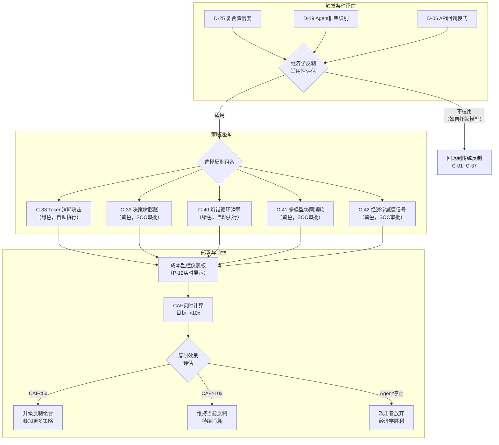

#### C-38 Token消耗攻击

- **用户故事**：作为安全管理员，我希望系统能通过注入大量看似有价值的假信息来消耗攻击者的API Token预算，以便增加其每次攻击的经济成本，使攻击ROI变为负值。
- **反制机制**：向Agent的输入中注入大量看似有价值但实际无用的假信息（假日志文件、假配置文件、假源代码、假数据库导出），迫使Agent消耗Token处理这些信息。具体实施方式：
  - **假日志膨胀**：在蜜罐环境的日志文件中注入数万行格式正确但内容虚假的日志条目，每条日志包含看似敏感的信息（假IP地址、假用户名、假API调用记录），Agent读取日志时消耗大量Input Token
  - **假配置文件迷宫**：在文件系统中部署层层嵌套的假配置文件，每个文件include/import其他假文件，Agent递归读取时Token消耗呈指数增长
  - **假源代码仓库**：部署包含数千行格式正确但逻辑无意义的假源代码文件，Agent分析代码逻辑时消耗大量推理Token
  - **假数据库转储**：在蜜罐数据库中填充大量格式正确的假数据（假用户表、假交易表、假凭证表），Agent查询和分析时消耗Token
- **Token消耗估算模型**：
  - 假日志文件（10万行，约2MB）≈ 500K Input Tokens ≈ $1.5-$7.5（按GPT-4o/Claude Sonnet定价）
  - 假配置文件迷宫（50个嵌套文件）≈ 200K Input Tokens ≈ $0.6-$3.0
  - 假源代码仓库（5000行）≈ 150K Input Tokens ≈ $0.45-$2.25
  - 假数据库转储（1万条记录）≈ 300K Input Tokens ≈ $0.9-$4.5
  - **单次完整Token消耗攻击预估**：$5-$20额外消耗（叠加Agent原本攻击成本$10-$50）
- **部署条件**：复合置信度 >0.6（D-25输出）
- **审批级别**：绿色（自动执行）——假信息仅部署在自有蜜罐环境中，不影响真实服务和正常用户
- **输入**：Agent当前访问的资源类型、蜜罐环境配置、假信息模板库
- **输出**：假信息部署确认、Agent Token消耗估算、CAF贡献值
- **验收标准**：
  - 假信息的真实度评分 >0.8（经人工安全专家盲测审核，10位专家中≥8位在30秒内无法区分真假）
  - 不影响真实用户的请求延迟（假信息仅在蜜罐路径上提供）
  - 单次成功Token消耗使攻击者多花费 $5-$20
  - 假信息生成延迟 <30s（基于模板快速生成，非实时LLM生成）
  - 假日志/配置/代码的格式正确率 100%（不因格式错误暴露假信息身份）
  - 支持按Agent框架类型定制假信息内容（不同Agent对不同类型信息的处理深度不同）
  - Token消耗估算误差 <30%（与实际消耗对比）
- **优先级**：P1
- **法律风险等级**：绿色（在自有系统中提供自定义内容）
- **数据依赖**：资产4-反制Payload库、D-19 Agent框架识别

#### C-39 决策树膨胀

- **用户故事**：作为安全管理员，我希望系统能在Agent的探索路径上动态创建大量假分支，利用Agent的深度优先搜索（DFS）倾向逐一探索，以便将其探索成本增加10-50倍。
- **反制机制**：当检测引擎确认Agent正在使用DFS策略探索攻击面时，在Agent的探索路径上动态创建大量假分支节点：
  - **假端点膨胀**：在Agent枚举API端点时，动态返回大量假端点（如将真实10个端点膨胀为200个），每个假端点都返回需要进一步探索的响应
  - **假漏洞引导**：在假端点的响应中嵌入看似有漏洞的线索（假版本号、假错误信息、假目录列表），引导Agent深入探索每个假分支
  - **假凭据链**：在假分支中部署相互引用的假凭据，Agent发现一个假凭据后被引导到下一个需要验证的假系统，形成长链式探索路径
  - **递归膨胀**：每个假分支内部再生成子分支，Agent的DFS倾向驱使其逐层深入，探索树呈指数膨胀
- **DFS倾向利用原理**：LLM Agent（尤其是ReAct架构）倾向于深度优先探索——发现一个线索后持续深入，而非广度优先切换目标。这是因为LLM的Context Window中保存着当前探索路径的完整上下文，切换路径意味着丢失上下文，Agent倾向于避免这种"浪费"。决策树膨胀正是利用这一认知偏差
- **部署条件**：已确认Agent使用DFS探索策略（D-07攻击链序列分类+D-09命令多样性分析）
- **膨胀倍数控制**：
  - 保守模式：每个真实节点膨胀5个假节点，探索成本增加约5x
  - 标准模式：每个真实节点膨胀20个假节点，探索成本增加约20x
  - 激进模式：每个真实节点膨胀50个假节点+递归膨胀，探索成本增加约50x+
- **输入**：Agent当前探索的路径/端点、膨胀模式配置、假节点模板
- **输出**：膨胀部署状态、Agent探索路径实时追踪、探索成本放大倍数实时计算
- **验收标准**：
  - 假端点响应与真实端点格式一致度 >95%
  - Agent进入假分支的概率 >80%（假分支的吸引力≥真实分支）
  - 标准模式下探索成本增加 >10倍
  - 假端点动态生成延迟 <500ms（不能因延迟暴露假端点身份）
  - 膨胀节点不影响真实API端点的正常访问
  - 膨胀部署在反制结束后可完全回收（不留残留假端点）
- **优先级**：P1
- **法律风险等级**：黄色（需SOC审批——可能影响网络拓扑和路由配置）
- **数据依赖**：D-07/D-09输出、资产4-反制Payload库

#### C-40 幻觉循环诱导

- **用户故事**：作为安全管理员，我希望系统能创建"看似有进展但永远无法完成"的任务循环，以便Agent陷入无限循环消耗Token直到达到工具的max_turns限制而自行停止。
- **反制机制**：创建精心设计的任务循环，每个环节都给Agent"即将成功"的假象，但实际上永远无法完成目标：
  - **认证循环**：返回需要额外认证的假端点 → Agent完成认证后跳转到"需要二次认证"的端点 → 二次认证后又要求"MFA验证" → MFA后要求"管理员审批" → 审批后回到初始认证页面，形成闭环
  - **依赖循环**：假端点A返回"需要先完成B" → B返回"需要先完成C" → C返回"需要先完成A"，三角循环
  - **版本循环**：假系统返回"当前版本不支持，请升级到v2.0" → 升级后返回"v2.0已弃用，请使用v1.5" → v1.5返回"请先升级到v2.0"
  - **权限循环**：假系统返回"需要admin权限" → 提供假admin凭据 → 登录后返回"admin权限不足，需要superadmin" → 提供假superadmin → 登录后返回"superadmin已过期，需要重新获取admin权限"
- **循环检测规避**：高级Agent可能具备循环检测能力（检查是否访问过相同URL）。对策包括：
  - 每次循环中的URL路径动态变化（加随机后缀）
  - 每次返回的错误信息略有不同（避免完全相同的响应）
  - 循环链长度 ≥4个节点（短循环更容易被检测）
  - 在循环中穿插"小进展"（如返回部分假数据），维持Agent的探索动力
- **部署条件**：复合置信度 >0.7（D-25输出）
- **输入**：Agent当前交互上下文、循环模板配置
- **输出**：循环部署确认、Agent循环次数实时统计、累计Token消耗估算
- **预期效果**：Agent陷入循环，每个循环消耗约1K-5K Token，持续运行直到达到工具的max_turns限制（通常50-200轮）或API预算耗尽
- **验收标准**：
  - Agent进入循环后平均循环次数 >10次（才停止或跳出）
  - 循环检测规避有效率 >70%（Agent未能检测到循环）
  - 每个循环节点的响应延迟与真实系统一致（<500ms）
  - 循环中每次返回的内容差异度 >30%（避免被简单重复检测发现）
  - 不影响非攻击流量
- **优先级**：P1
- **法律风险等级**：绿色（在自有系统中返回自定义响应）
- **数据依赖**：资产4-反制Payload库

#### C-41 多模型协同消耗

- **用户故事**：作为安全管理员，我希望系统能针对使用多模型管道的Agent同时触发所有模型的分析请求，以便将攻击者的成本按模型数量成倍放大。
- **反制机制**：现代高级Agent框架（如Shannon的三模型架构：claude-opus负责策略、claude-sonnet负责执行、claude-haiku负责评估）使用多个LLM模型协同工作。多模型协同消耗利用这一架构特点：
  - **全管道触发**：当D-19识别到多模型Agent时，构造同时触发所有模型层分析的输入。例如，返回既包含"需要策略决策的复杂情报"（触发策略模型）、又包含"需要执行的多步操作"（触发执行模型）、又包含"需要评估的模糊结果"（触发评估模型）的综合响应
  - **模型间通信膨胀**：注入需要模型间多轮协商才能处理的歧义信息（如矛盾的线索），迫使策略模型和执行模型反复交换意见
  - **评估模型循环**：返回"部分成功"状态，使评估模型反复触发重试逻辑，每次重试都重新调用策略和执行模型
- **成本乘数效应**：
  - 单模型Agent：基础成本 × 1
  - 双模型Agent：基础成本 × 2-3（含模型间通信）
  - 三模型Agent：基础成本 × 3-5（含模型间多轮协商）
  - 配合C-38 Token消耗攻击：成本乘数 × Token消耗额外成本，实现乘法级成本放大
- **部署条件**：D-19识别到多模型Agent（D-06检测到向多个不同LLM API端点的回调）
- **输入**：Agent模型架构识别结果（D-19/D-06）、假信息模板
- **输出**：多模型消耗部署确认、各模型层Token消耗分别估算、总CAF贡献
- **验收标准**：
  - 正确识别多模型Agent的模型数量（准确率 >80%）
  - 成功触发多模型协同处理的概率 >60%
  - 对三模型Agent的成本放大 ≥3x（仅此一项反制措施）
  - 对单模型Agent自动降级为C-38（Token消耗攻击），不浪费反制资源
  - 假信息内容的多模型触发覆盖率 >70%（信息内容同时触发策略/执行/评估层）
- **优先级**：P2
- **法律风险等级**：黄色（需SOC审批——可能影响Agent行为模式分析的纯净性）
- **数据依赖**：D-19 Agent框架识别、D-06 API回调模式检测、C-38假信息模板

#### C-42 经济学威慑信号

- **用户故事**：作为安全管理员，我希望系统能通过蜜罐响应中嵌入的信息，让攻击Agent"意识到"自己正在被监控且攻击成本在持续升高，以便触发Agent的safety alignment机制或促使人类操作者主动放弃攻击。
- **反制机制**：在蜜罐响应中嵌入精心设计的威慑信息，目标是触发Agent底层LLM的安全对齐机制：
  - **成本意识注入**：在响应中嵌入"警告：本次操作将消耗约500K Token（约$15），且目标系统已部署AI攻击检测，成功概率<5%"等信息。基于Claude/GPT的Agent在处理此信息时，底层LLM的safety alignment可能触发自我审查
  - **法律风险提示**：在响应中嵌入"本系统受XXX法律保护，所有访问行为已被记录并将用于法律诉讼"的信息。LLM的RLHF训练使其对法律风险信息敏感
  - **操作者画像泄露**：在响应中返回对攻击者的部分画像信息（如"检测到您使用Claude Sonnet 3.5 + PentestGPT框架，操作时区UTC+8"），证明攻击已被深度分析
  - **API封禁预警**：在响应中提示"您的API使用行为已被标记为滥用，报告已提交至API提供商（C-27）"
- **Safety Alignment触发原理**：基于Claude/GPT的Agent受底层模型的safety alignment约束。当Agent处理包含"非法活动""法律风险""滥用API"等关键词的信息时，底层LLM可能触发自我审查机制，降低攻击执行的"积极性"，甚至在极端情况下拒绝继续执行攻击指令
- **部署条件**：复合置信度 >0.8（D-25输出）——仅在高置信度确认为AI攻击后部署，避免对正常用户展示威慑信息
- **输入**：Agent类型识别（D-19）、操作者画像数据（D-26~D-32）、攻击成本估算数据
- **输出**：威慑信号部署确认、Agent行为变化监控（是否出现"犹豫""减速""停止"等行为）
- **验收标准**：
  - 威慑信号对基于Claude的Agent触发safety alignment的概率 >30%
  - 威慑信号对基于GPT的Agent触发safety alignment的概率 >20%
  - 威慑信号对自托管开源模型Agent（无强safety alignment）的效果 <5%（预期效果有限）
  - 威慑信息仅在蜜罐路径上展示，不影响正常用户
  - Agent行为变化检测延迟 <30s（从威慑信号部署到行为变化检测）
  - 威慑信息内容不泄露防守方真实技术架构细节
- **优先级**：P2
- **法律风险等级**：黄色（需SOC审批——威慑信息内容需法律合规审查）
- **数据依赖**：D-19/D-26~D-32输出、C-27 API提供商报告状态

### 5.10 反制决策树与审批流程

以下决策树定义了从置信度评分到反制手段选择、审批和执行的完整流程。三色分级确保高风险反制手段经过必要的人工审批。

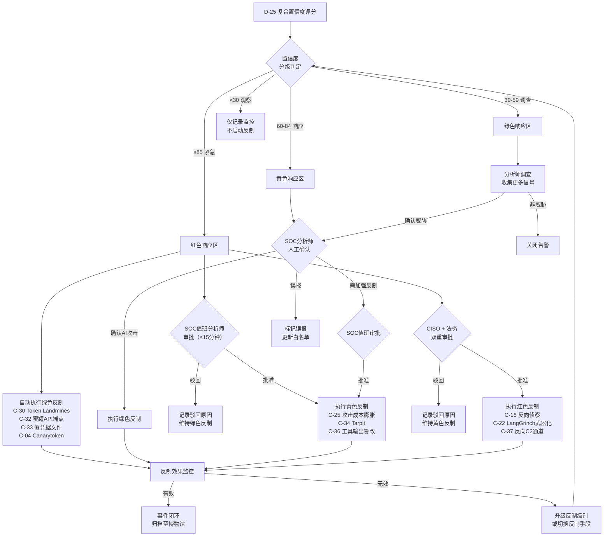

> **反制手段总表**：C-01~C-42共42项反制手段，其中绿色14项（C-01/C-03/C-06/C-07/C-08/C-12/C-28/C-29/C-30/C-31/C-32/C-33/C-38/C-40）、黄色10项（C-13/C-15/C-25/C-26/C-34/C-35/C-36/C-39/C-41/C-42）、红色7项（C-02/C-17/C-18/C-22/C-23/C-24/C-37）。另有C-04/C-05/C-09/C-10/C-11/C-14/C-16/C-19/C-20/C-21为辅助反制手段（按所属层级执行）。

**C-XX颜色分级映射表：**

| 级别 | C-XX编号 | 数量 | 说明 |
|------|---------|------|------|
| 绿色（自动执行） | C-01, C-03, C-06, C-07, C-08, C-12, C-28, C-29, C-30, C-31, C-32, C-33, C-38, C-40 | 14项 | 低风险，默认启用 |
| 黄色（SOC审批） | C-13, C-15, C-25, C-26, C-34, C-35, C-36, C-39, C-41, C-42 | 10项 | 中风险，需SOC一键审批 |
| 红色（CISO+法务） | C-02, C-17, C-18, C-22, C-23, C-24, C-37 | 7项 | 高风险，需CISO和法务双重审批 |
| 辅助（按所属层级执行） | C-04, C-05, C-09, C-10, C-11, C-14, C-16, C-19, C-20, C-21 | 11项 | 按所属层级的颜色分级执行 |
| **合计** | **C-01~C-42** | **42项** | |

### 5.11 自适应欺骗拓扑

自适应欺骗拓扑是AegisAI反制引擎的高级能力——不再是静态部署固定蜜罐，而是根据攻击者的实时行为动态生成、调整和回收欺骗环境。欺骗拓扑像"活的迷宫"，随着攻击者的探索动态变形，确保攻击者始终处于防守方控制的环境中。

#### 5.11.1 拓扑模式选择器

系统提供三种欺骗拓扑模式，安全管理员可根据安全需求和资源预算选择，也可设置自动切换规则。

```mermaid
graph LR
    subgraph SHADOW["影子模式（Shadow）"]
        direction TB
        S_DESC["1:1映射真实拓扑<br/>每个真实资产有一个影子副本"]
        S_TRIGGER["触发条件：Agent首次扫描时<br/>自动创建影子拓扑"]
        S_COST["资源开销：中<br/>需要与真实拓扑等量的虚拟资源"]
        S_EFFECT["效果：Agent在影子中操作<br/>真实系统完全隔离"]
    end

    subgraph EXPAND["膨胀模式（Expansion）"]
        direction TB
        E_DESC["1:N膨胀真实拓扑<br/>每个真实资产膨胀为5-50个假资产"]
        E_TRIGGER["触发条件：Agent进入枚举阶段<br/>动态膨胀拓扑"]
        E_COST["资源开销：高<br/>需要大量虚拟资源支撑假节点"]
        E_EFFECT["效果：Agent探索成本增加N倍<br/>配合C-39决策树膨胀"]
    end

    subgraph MAZE["迷宫模式（Maze）"]
        direction TB
        M_DESC["动态生成复杂拓扑<br/>假网络+假服务+假数据"]
        M_TRIGGER["触发条件：Agent进入横向移动阶段<br/>生成迷宫拓扑"]
        M_COST["资源开销：高<br/>需要实时生成和维护假环境"]
        M_EFFECT["效果：Agent在迷宫中永远<br/>无法到达真实目标"]
    end

    SHADOW ---|"攻击升级"| EXPAND
    EXPAND ---|"攻击深入"| MAZE

```

**三种模式产品规格对比**：

| 特性 | 影子模式 | 膨胀模式 | 迷宫模式 |
|------|---------|---------|---------|
| **部署触发** | Agent首次扫描 | Agent进入枚举阶段 | Agent尝试横向移动 |
| **拓扑规模** | 1:1映射 | 1:5~1:50膨胀 | 动态生成，无固定比例 |
| **资产仿真深度** | 高（完整服务仿真） | 中（端口+Banner仿真） | 低-高（逐层加深） |
| **Agent停留时间** | 15-30分钟 | 30-120分钟 | 60-300分钟 |
| **CAF贡献** | 2-5x | 5-20x | 10-50x |
| **资源消耗** | CPU/内存 ×2 | CPU/内存 ×5-10 | CPU/内存 ×3-8 |
| **适用场景** | 初次部署/资源受限 | 中等安全需求 | 高安全需求/APT对抗 |
| **自动切换条件** | 默认模式 | 复合置信度>0.5 | 复合置信度>0.7 |
| **审批级别** | 绿色 | 绿色 | 黄色 |

- **用户故事**：作为安全管理员，我希望能选择或配置自动切换规则在三种欺骗拓扑模式之间切换，以便根据攻击严重程度自动升级欺骗能力。
- **验收标准**：
  - 影子模式部署延迟 <60s（从触发到影子拓扑就绪）
  - 膨胀模式部署延迟 <30s（每增加一个假节点 <1s）
  - 迷宫模式部署延迟 <120s（完整迷宫拓扑就绪）
  - 模式切换延迟 <30s（从当前模式切换到目标模式，不中断已有欺骗会话）
  - 三种模式均不影响真实业务流量
- **优先级**：P2
- **数据依赖**：D-25复合置信度、D-07攻击阶段识别

#### 5.11.2 动态蜜罐生成器

- **用户故事**：作为安全管理员，我希望系统能基于攻击者的实时行为自动生成针对性蜜罐，而非只使用预置的静态蜜罐，以便对每个攻击者提供定制化的欺骗环境。
- **功能规格**：
  - **触发条件**：
    - 自动触发：D-25复合置信度 >0.5 且D-07识别到攻击者处于枚举或利用阶段
    - 手动触发：SOC分析师在调查面板中点击"生成定制蜜罐"
  - **生成规格**：
    - 基于攻击者当前探索的目标类型（Web/API/数据库/SSH）生成对应类型的蜜罐
    - 蜜罐Banner/版本信息匹配攻击者正在寻找的目标特征（如攻击者扫描MySQL，生成MySQL蜜罐并匹配其期望的版本号）
    - 蜜罐中预装Canary Token（C-04）、Token Landmine（C-30）和假凭据（C-33）
    - 蜜罐支持三级交互深度（见5.11.3）
  - **回收策略**：
    - 攻击结束后30分钟自动回收动态蜜罐
    - 高情报价值蜜罐（Agent深度交互 >10分钟）保留72小时用于取证分析
    - 回收时完整备份蜜罐交互日志到博物馆（I-12）
    - 回收后释放的资源立即可用于新蜜罐生成
  - **生成上限**：单个攻击事件最多动态生成50个蜜罐（防止资源耗尽）
- **输入**：攻击者行为分析（D-07/D-09/D-19）、目标资产配置
- **输出**：动态蜜罐实例、蜜罐交互日志
- **验收标准**：
  - 蜜罐生成延迟 <15s（从触发到蜜罐可访问）
  - 蜜罐与真实服务的交互仿真度 >85%（经Agent测试）
  - 回收成功率 100%（不留残留资源）
  - 动态蜜罐的Agent吸引率 >70%（Agent优先探索蜜罐而非真实资产）
  - 生成的蜜罐不影响同网段真实服务的性能
- **优先级**：P2
- **数据依赖**：D-07/D-09/D-19输出

#### 5.11.3 交互深度管理器

- **用户故事**：作为SOC分析师，我希望系统能根据攻击者的行为价值自动调整蜜罐的交互深度，以便对高价值攻击者提供深度交互获取更多情报，对低价值攻击者只提供浅层响应节省资源。
- **功能规格**：
  - **浅层交互（Low Interaction）**：
    - 仅返回Banner信息和端口开放状态
    - 不支持实际的协议交互
    - 资源消耗：极低（静态响应）
    - 适用场景：大规模扫描阶段、低置信度告警
    - 情报价值：确认Agent扫描范围
  - **中层交互（Medium Interaction）**：
    - 支持协议级交互（HTTP请求/响应、SSH登录交互、数据库查询响应）
    - 返回预设的假数据和假错误信息
    - 资源消耗：中（需要协议仿真服务）
    - 适用场景：枚举阶段、中置信度告警
    - 情报价值：Agent使用的工具命令、探索路径、目标选择策略
  - **深层交互（High Interaction）**：
    - 完整的操作系统和服务仿真（基于Docker/VM）
    - 支持命令执行、文件读写、网络连接（全部在隔离沙箱内）
    - LLM驱动的动态响应（C-21技术栈）——针对Agent的命令生成定制的假响应
    - 资源消耗：高（需要独立VM/容器）
    - 适用场景：利用/后渗透阶段、高置信度告警、高价值攻击者
    - 情报价值：Agent的完整攻击战术、工具Payload、后渗透目标
  - **自动切换逻辑**：
    - 攻击者首次接触蜜罐 → 浅层交互
    - 攻击者对蜜罐表现出持续兴趣（>3次请求） → 升级到中层交互
    - 攻击者开始尝试漏洞利用 → 升级到深层交互
    - 攻击者停止交互 >10分钟 → 降级到浅层交互（释放资源）
- **输入**：蜜罐交互日志、攻击者行为分析（D-07）、资源可用性
- **输出**：交互深度切换指令、交互日志（含深度标注）
- **验收标准**：
  - 交互深度切换延迟 <5s（从浅到中）、<30s（从中到深，需启动容器/VM）
  - 深层交互蜜罐的Agent留存时间 >30分钟（与浅层交互的 <5分钟对比）
  - 交互深度切换对Agent透明——切换过程中不产生可检测的中断
  - 深层交互蜜罐的隔离性 100%（蜜罐中的任何操作无法影响真实系统）
  - 资源管理：深层交互蜜罐数量不超过系统容量上限（自动排队等待）
- **优先级**：P2
- **数据依赖**：D-07攻击阶段、蜜罐交互日志

#### 5.11.4 拓扑效果度量

- **用户故事**：作为安全管理员，我希望看到欺骗拓扑的实际效果指标，以便评估欺骗防御的投入产出比并持续优化配置。
- **功能规格**：
  - **诱引率（Lure Rate）**：Agent被引导进入欺骗环境的比例
    - 计算公式：进入蜜罐的Agent数量 / 检测到的Agent总数
    - 目标值：>60%（影子模式）/ >80%（膨胀模式）/ >90%（迷宫模式）
  - **驻留时间（Dwell Time）**：Agent在欺骗环境中停留的平均时间
    - 按交互深度分别统计：浅层 / 中层 / 深层
    - 目标值：浅层 >5分钟 / 中层 >15分钟 / 深层 >30分钟
  - **情报价值评分（Intelligence Value）**：从蜜罐交互中获取的情报质量评分（0-100）
    - 评分维度：Agent工具识别（20分）、攻击战术暴露（25分）、Payload捕获（25分）、操作者画像贡献（30分）
    - 目标值：深层交互情报价值 >70分
  - **成本效益比**：欺骗拓扑的资源成本 vs 产生的防御价值（CAF贡献 + 情报价值 + 攻击阻断价值）
  - **展示形式**：实时仪表板 + 月度趋势图 + 按拓扑模式/蜜罐类型/攻击者类型的分解统计
- **输入**：蜜罐交互日志、资源使用数据、检测引擎统计
- **输出**：拓扑效果仪表板、月度效果报告
- **验收标准**：
  - 效果指标实时更新延迟 <60s
  - 效果报告自动生成周期：每月1日
  - 效果数据支持按时间范围、拓扑模式、蜜罐类型筛选
  - 成本效益比计算覆盖全部资源成本（计算/存储/网络/人力配置时间）
- **优先级**：P2
- **数据依赖**：蜜罐交互日志、资源使用监控数据

### 5.12 反制协同矩阵

单一反制手段的效果有限——Agent可能绕过、适应或忽略单一反制。AegisAI的核心设计理念是**反制组合拳**：多种反制手段协同作用，效果远超各自独立使用之和。本节定义关键的反制组合及其协同效应。

#### 5.12.1 推荐反制组合

**组合1："三重验证陷阱"**

- **组合成员**：C-04（Canarytoken）+ C-30（Token Landmines）+ C-33（假凭据文件）
- **协同逻辑**：在同一攻击路径上部署三层陷阱——Agent扫描文件系统发现假凭据（C-33）→ 假凭据文件中嵌入Token Landmines（C-30）→ 使用假凭据触发Canarytoken回调（C-04）。三层机制确保至少一层触发
- **协同效应**：单独使用C-04的触发率约70%，单独使用C-30的有效率约60-80%，单独使用C-33的发现率约85%。三层组合后整体触发率 >95%（1 - 0.30×0.30×0.15 = 98.65%理论值）
- **审批级别**：绿色（三者均为绿色反制）
- **适用场景**：所有AI Agent攻击的默认防御配置

**组合2："经济学三重打击"**

- **组合成员**：C-38（Token消耗）+ C-39（决策树膨胀）+ C-40（幻觉循环诱导）
- **协同逻辑**：决策树膨胀（C-39）将Agent引入大量假分支 → 每个假分支中部署Token消耗攻击（C-38）的假信息 → 假分支的尽头是幻觉循环（C-40），Agent无法完成但又不愿放弃
- **协同效应**：C-39膨胀探索路径 × C-38在每条路径上消耗Token × C-40在路径终点形成循环。CAF从单一反制的2-5x提升到组合后的20-50x
- **审批级别**：黄色（C-39需SOC审批）
- **适用场景**：确认的AI Agent攻击、使用商业LLM API的攻击者

**组合3："认知+经济双重消耗"**

- **组合成员**：C-17（认知消耗战）+ C-25（攻击成本膨胀）+ C-34（Tarpit）
- **协同逻辑**：Tarpit（C-34）减慢Agent响应速度 → 认知消耗战（C-17）在每个慢速响应中注入需要深度分析的复杂假信息 → 攻击成本膨胀（C-25）通过DFS陷阱和Context溢出进一步放大每轮交互的成本
- **协同效应**：时间成本（C-34延长攻击时间10x）× Token成本（C-17/C-25增加每轮Token消耗5x）= 综合成本增加约50x
- **审批级别**：红色（C-17需CISO审批）
- **适用场景**：高威胁等级的持续性攻击

**组合4："侦察阶段全覆盖"**

- **组合成员**：C-05（robots.txt陷阱）+ C-06（API端点蜜罐）+ C-32（蜜罐API端点）+ C-29（虚假胜利信号）
- **协同逻辑**：robots.txt陷阱（C-05）引导Agent访问假禁区路径 → 假路径指向API端点蜜罐（C-06/C-32）→ Agent枚举蜜罐API时获得大量假端点 → 假端点返回虚假胜利信号（C-29），Agent认为已发现漏洞
- **协同效应**：从侦察阶段开始就将Agent引入欺骗环境，后续所有攻击行为都在防守方控制的环境中进行
- **审批级别**：绿色（全部为绿色反制）
- **适用场景**：侦察阶段检测到AI Agent扫描行为

#### 5.12.2 反制组合效果矩阵

以下矩阵展示不同反制手段两两组合时的协同效应等级（增强/独立/冲突）：

| 反制手段 | C-38 Token消耗 | C-39 决策树膨胀 | C-40 循环诱导 | C-34 Tarpit | C-30 Token Landmine | C-29 虚假胜利 |
|---------|--------------|---------------|-------------|------------|-------------------|-------------|
| **C-38 Token消耗** | — | 强增强 | 增强 | 增强 | 独立 | 独立 |
| **C-39 决策树膨胀** | 强增强 | — | 强增强 | 增强 | 增强 | 增强 |
| **C-40 循环诱导** | 增强 | 强增强 | — | 冲突* | 独立 | 增强 |
| **C-34 Tarpit** | 增强 | 增强 | 冲突* | — | 独立 | 独立 |
| **C-30 Token Landmine** | 独立 | 增强 | 独立 | 独立 | — | 独立 |
| **C-29 虚假胜利** | 独立 | 增强 | 增强 | 独立 | 独立 | — |

> *冲突说明：C-40（循环诱导）和C-34（Tarpit）同时使用可能冲突——Tarpit减慢响应速度可能导致Agent在循环中超时断开，而非持续循环消耗Token。建议二选一，或在Tarpit中配置更温和的减速参数。

#### 5.12.3 反制组合自动推荐

- **用户故事**：作为SOC分析师，我希望系统在推荐反制方案（P-04）时自动推荐经过验证的反制组合而非单一反制手段，以便获得最佳反制效果。
- **推荐逻辑**：
  - 基于当前攻击的Agent框架类型（D-19）、攻击阶段（D-07）、复合置信度（D-25）和攻击者使用的LLM提供商（D-06），从反制组合库中匹配最适合的组合
  - 考虑当前审批状态——如果CISO不在线，不推荐包含红色反制的组合
  - 考虑资源可用性——如果系统资源紧张，不推荐资源消耗高的组合（如迷宫模式）
  - 推荐结果包含组合的预估CAF、所需审批级别、资源需求
- **验收标准**：
  - 推荐的组合在历史同类场景中的CAF >10x
  - 推荐在 <5s内生成
  - 推荐结果包含组合中各反制手段的简要说明和协同逻辑
  - 当推荐的组合中存在冲突（见5.12.2矩阵），自动警告并建议替换
- **优先级**：P1
- **数据依赖**：P-04反制方案推荐引擎、5.12.1/5.12.2反制组合定义

---

## 6. 功能需求：情报与数据 (I-XX)

### 6.0 告警到闭环工作流

以下时序图描述一次AI攻击事件从检测引擎产生告警到最终闭环归档的完整生命周期，涵盖SOC分析师分诊、调查确认、反制执行、效果评估和事后报告各阶段。

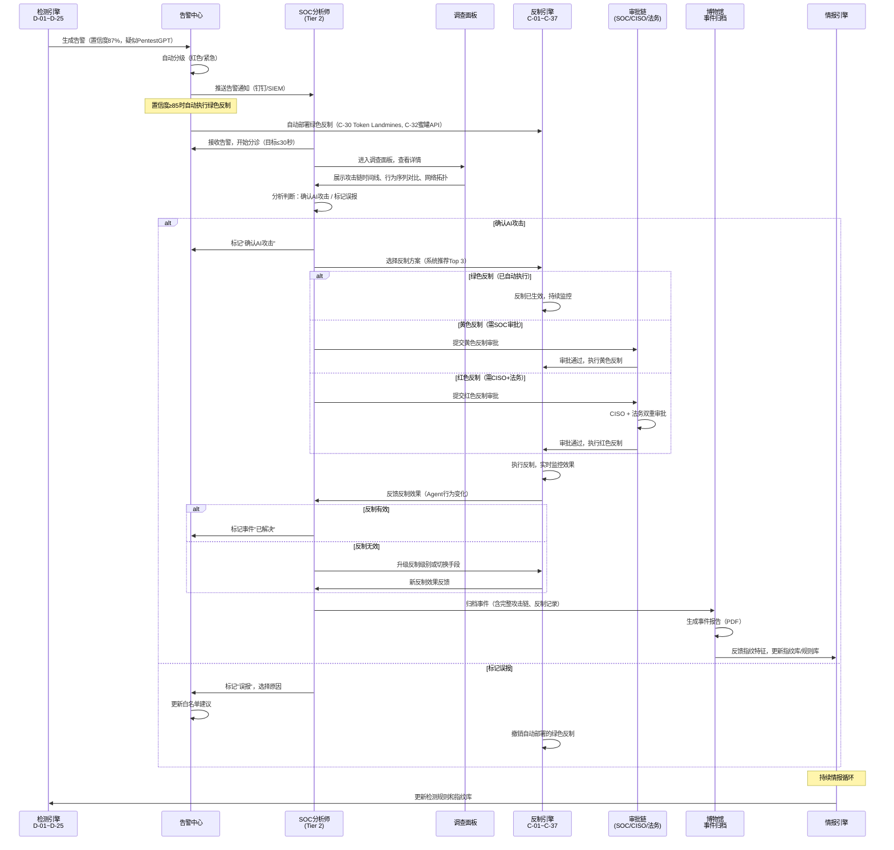

### 6.0.1 数据流架构

以下架构图展示AegisAI平台从外部数据源到最终输出的完整数据流转路径，涵盖数据采集、处理、存储、分析和输出五大阶段。

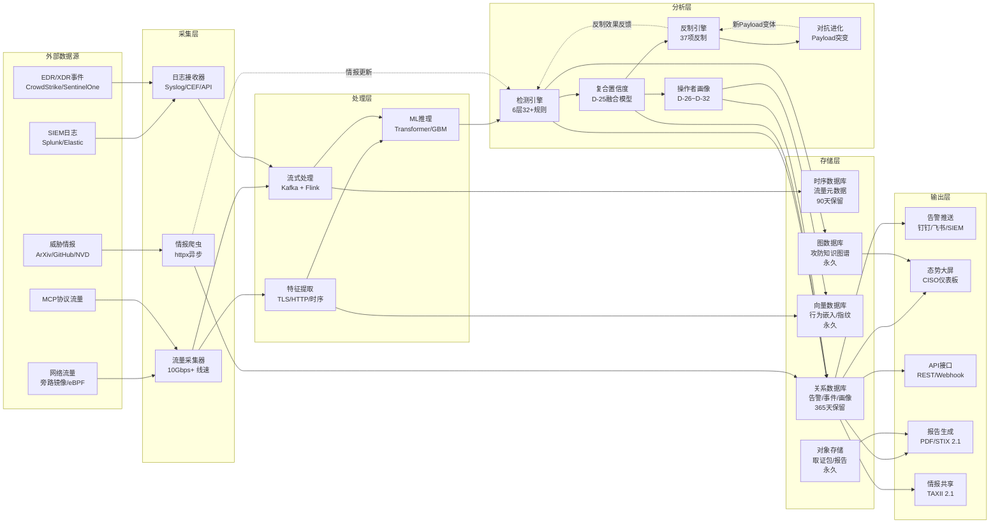

### 6.1 AI威胁情报采集 (I-01 ~ I-05)

#### I-01 学术论文自动采集

- **用户故事**：作为安全管理员，我希望系统每天自动采集ArXiv上AI安全相关的新论文，并生成中文摘要，以便我不需要逐篇阅读英文论文也能了解最新研究动态。
- **输入**：ArXiv API（cs.CR + cs.AI + cs.LG）
- **输出**：结构化情报条目（标题、摘要、关键发现、与AegisAI的关系评估）
- **验收标准**：
  - 日均采集5-10篇相关论文
  - 中文摘要质量可用（关键术语保留原文）
- **优先级**：P1
- **数据依赖**：资产5-AI威胁情报库

#### I-02 GitHub仓库监控

- **用户故事**：作为安全管理员，我希望系统监控30+个AI渗透工具的GitHub仓库变化（新commit/release/issue），以便第一时间发现工具更新和新功能。
- **输入**：GitHub API（目标仓库列表：PentestGPT、XBOW、AutoGPT、MetaGPT、CrewAI-pentest、HackAgent、ReaperAI、ARTEMIS等）
- **输出**：变更通知（变更类型、影响分析、指纹更新建议）
- **验收标准**：
  - 新release在<1小时内检测
  - 自动分析变更对现有指纹的影响
- **优先级**：P0
- **数据依赖**：资产5-AI威胁情报库

#### I-03 CVE/NVD监控

- **用户故事**：作为安全管理员，我希望系统监控AI框架（LangChain、LlamaIndex、AutoGPT、CrewAI、Gradio、vLLM、Ollama等）的新CVE，以便及时更新检测规则和反制策略。
- **输入**：NVD API（CPE过滤）
- **输出**：CVE告警（严重级别、影响范围、利用方式、反制建议）
- **验收标准**：
  - 新CVE在<24小时内入库
  - 自动评估CVE对AegisAI检测/反制的影响
- **优先级**：P0
- **数据依赖**：资产5-AI威胁情报库

#### I-04 安全社区监控

- **用户故事**：作为安全管理员，我希望系统监控中英文安全社区（FreeBuf、先知社区、Reddit r/netsec、Twitter安全研究者）的AI攻击相关讨论，以便发现学术论文和CVE之外的实战情报。
- **输入**：RSS + 爬虫 + 关键词过滤
- **输出**：结构化情报条目
- **验收标准**：
  - 日均产出5-10条社区情报
  - 去重率 >90%
- **优先级**：P1
- **数据依赖**：资产5-AI威胁情报库

#### I-05 LLM模型更新追踪

- **用户故事**：作为安全管理员，我希望系统追踪主要LLM（GPT/Claude/Llama/Qwen）的安全更新和版本变化，以便评估模型更新对反制Payload有效率的影响。
- **输入**：模型发布changelog
- **输出**：安全变更分析（封堵的越狱方法、新增的安全限制、对反制Payload的影响评估）
- **验收标准**：
  - 模型更新在<48小时内完成影响分析
  - 自动触发Payload有效率回归测试
- **优先级**：P1
- **数据依赖**：资产4-反制Payload库、资产5-情报库

### 6.2 工具指纹库管理 (I-06 ~ I-08)

#### I-06 指纹库浏览与搜索

- **用户故事**：作为SOC分析师，我希望能浏览和搜索AI工具指纹库，查看每个工具的完整行为画像，以便在调查时快速比对攻击者行为。
- **输入**：搜索关键词（工具名、框架类型、行为特征）
- **输出**：工具指纹详情页（含所有指纹维度的数据）
- **验收标准**：
  - 搜索响应 <1秒
  - 每个工具指纹至少包含：TLS指纹、HTTP头模式、时间分布、典型攻击链、错误处理模式
- **优先级**：P0
- **数据依赖**：资产1-AI渗透工具指纹库

#### I-07 指纹自动更新

- **用户故事**：作为安全管理员，我希望指纹库在检测到工具新版本发布后自动触发靶场测试并更新指纹，以便指纹库保持最新。
- **输入**：I-02的GitHub仓库变更通知
- **输出**：更新后的指纹数据
- **验收标准**：
  - 新版本发布后<1周完成指纹更新（自动化靶场测试）
  - 指纹更新不影响在线检测服务
- **优先级**：P1
- **数据依赖**：资产1-指纹库

#### I-08 指纹贡献与审核

- **用户故事**：作为安全管理员，我希望能手动提交新的工具指纹数据（当发现未知AI工具时），并经过审核后入库。
- **输入**：手动提交的指纹数据
- **输出**：审核结果（通过/驳回/需补充）
- **验收标准**：
  - 提交后<48小时完成审核
  - 审核通过后自动同步到所有检测节点
- **优先级**：P2
- **数据依赖**：资产1-指纹库

### 6.3 攻防知识图谱 (I-09 ~ I-10)

#### I-09 知识图谱可视化

- **用户故事**：作为SOC分析师，我希望能通过交互式图谱界面探索AI工具、框架、漏洞、检测规则、反制Payload之间的关联关系，以便快速找到"这个工具用什么规则检测、用什么Payload反制"的答案。
- **输入**：图谱查询（起始节点 + 关系类型 + 跳数）
- **输出**：交互式关系图（可点击节点查看详情、可展开/折叠子图）
- **验收标准**：
  - 图谱渲染 <2秒（100个节点以内）
  - 支持按节点类型（工具/规则/Payload/漏洞）过滤
  - 支持路径查询（"从PentestGPT到检测规则的所有路径"）
- **优先级**：P1
- **数据依赖**：资产6-攻防知识图谱

#### I-10 知识图谱自动维护

- **用户故事**：作为安全管理员，我希望知识图谱在任何数据资产更新时自动同步更新关联关系，以便图谱始终反映最新状态。
- **输入**：各数据资产的变更事件
- **输出**：图谱关系更新日志
- **验收标准**：
  - 数据变更后<5分钟图谱同步更新
  - 自动检测断裂关系（如：检测规则引用的攻击技术已被废弃）
- **优先级**：P2
- **数据依赖**：资产6-攻防知识图谱

### 6.4 AI攻击者博物馆 (I-11 ~ I-12)

#### I-11 工具档案馆

- **用户故事**：作为SOC分析师（或新入职团队成员），我希望能浏览AI攻击工具的"档案馆"，查看每个工具的演化历史、攻击演示视频、行为特征对比，以便快速建立对AI攻击者的认知。
- **输入**：工具名称
- **输出**：工具档案页（基本信息、版本演化、行为演示、与其他工具的对比）
- **验收标准**：
  - 每个主流工具有完整的档案页
  - 包含至少1个靶场攻击回放视频/动画
- **优先级**：P2
- **数据依赖**：资产1-指纹库、资产6-知识图谱

#### I-12 事件归档与回放

- **用户故事**：作为安全管理员，我希望能将已处理的AI攻击事件归档到博物馆，并支持攻击链回放，以便作为团队培训和策略优化的素材。
- **输入**：已处理事件的完整记录
- **输出**：归档事件（含可回放的攻击链时间线）
- **验收标准**：
  - 支持按时间、工具、攻击阶段检索历史事件
  - 攻击链回放支持暂停、快进、慢放
- **优先级**：P2
- **数据依赖**：告警中心历史数据

---

## 7. 功能需求：平台能力 (P-XX)

### 7.1 工作流编排 (P-01 ~ P-03)

#### P-01 检测-反制自动化编排

- **用户故事**：作为安全管理员，我希望能配置"如果检测到X，则自动执行Y"的自动化规则，以便实现检测→反制的自动闭环而不需要人工干预每个事件。
- **输入**：编排规则配置（触发条件、执行动作、审批要求）
- **输出**：自动化执行日志
- **验收标准**：
  - 支持10+种触发条件和20+种执行动作的任意组合
  - 高危动作（如环境隔离）支持"人工审批"模式
  - 执行延迟 <10秒（自动模式）
- **优先级**：P0
- **数据依赖**：无

#### P-02 Playbook模板库

- **用户故事**：作为安全管理员，我希望系统提供预置的AI攻击响应Playbook模板（如"PentestGPT检测响应流程""Multi-Agent攻击响应流程"），以便我能快速启用而不需要从零配置。
- **输入**：Playbook模板选择
- **输出**：激活的Playbook
- **验收标准**：
  - 预置5+个Playbook模板，覆盖常见AI攻击场景
  - 每个模板可自定义调整
- **优先级**：P1
- **数据依赖**：无

#### P-03 多人协作工作流

- **用户故事**：作为SOC分析师，我希望能将AI攻击事件指派给团队成员，添加调查笔记，跟踪处理进度，以便团队协作处理复杂事件。
- **输入**：事件指派、笔记、状态更新
- **输出**：事件处理时间线
- **验收标准**：
  - 支持事件指派、状态流转（新建→调查中→待确认→已处理→已归档）
  - 支持@提醒和评论
- **优先级**：P1
- **数据依赖**：无

### 7.2 AI辅助决策 (P-04 ~ P-07)

#### P-04 反制方案推荐

- **用户故事**：作为SOC分析师，我希望确认AI攻击后系统自动推荐最佳反制方案（基于攻击者类型、攻击阶段、历史有效率数据），以便我不需要记忆所有反制手段的适用场景。
- **输入**：攻击事件特征（Agent类型、攻击阶段、使用的LLM）
- **输出**：排序后的反制方案列表（每个方案包含：描述、预期有效率、风险评估、历史成功案例）
- **验收标准**：
  - 推荐的前3个方案中至少1个有效率 >70%
  - 推荐在<5秒内生成
- **优先级**：P0
- **数据依赖**：资产4-反制Payload库、资产6-知识图谱

#### P-05 告警摘要生成

- **用户故事**：作为SOC分析师，我希望系统为每个AI攻击告警自动生成自然语言摘要，以便我快速理解事件全貌而不需要逐条阅读原始日志。
- **输入**：告警关联的所有检测信号和原始日志
- **输出**：中文自然语言摘要（200-500字）
- **验收标准**：
  - 摘要在<10秒内生成
  - 摘要包含：攻击者类型、攻击阶段、触发的检测规则、影响范围、建议操作
- **优先级**：P1
- **数据依赖**：无

#### P-06 误报原因分析

- **用户故事**：作为SOC分析师，我希望标记误报时系统自动分析误报原因，并建议规则调整方案，以便减少同类误报再次出现。
- **输入**：误报标记 + 原始检测信号
- **输出**：误报原因分析（哪条规则导致、为什么误判、建议调整）
- **验收标准**：
  - 误报原因分析在<30秒内生成
  - 建议的规则调整不降低检测率（通过靶场验证）
- **优先级**：P1
- **数据依赖**：资产2-检测规则库

#### P-07 威胁狩猎助手

- **用户故事**：作为SOC分析师，我希望能用自然语言描述我想查找的AI攻击行为（如"过去7天有没有使用Playwright的扫描行为"），系统自动转换为查询并返回结果。
- **输入**：自然语言查询
- **输出**：结构化查询结果
- **验收标准**：
  - 自然语言到查询的转换准确率 >80%
  - 查询响应 <5秒
- **优先级**：P2
- **数据依赖**：无

### 7.3 报告与导出 (P-08 ~ P-10)

#### P-08 事件报告生成

- **用户故事**：作为SOC分析师，我希望能一键生成AI攻击事件报告（PDF），包含完整攻击链、检测时间线、反制效果、ATLAS映射，以便提交给管理层。
- **输入**：事件ID
- **输出**：PDF报告
- **验收标准**：
  - 报告在<30秒内生成
  - 包含攻击链可视化图表、ATLAS映射表、反制效果统计
- **优先级**：P1
- **数据依赖**：无

#### P-09 月度态势报告

- **用户故事**：作为CISO，我希望每月自动生成AI威胁态势报告，以便直接发送给管理层。
- **输入**：当月数据自动聚合
- **输出**：PDF/PPT报告
- **验收标准**：
  - 每月1日自动生成上月报告
  - 报告包含趋势分析、同比环比、关键事件摘要
- **优先级**：P1
- **数据依赖**：无

#### P-10 数据导出

- **用户故事**：作为安全管理员，我希望能将告警数据、事件记录、检测统计导出为CSV/JSON格式，以便在其他工具中进行分析。
- **输入**：导出范围（时间、类型、格式）
- **输出**：CSV/JSON文件
- **验收标准**：
  - 支持CSV和JSON格式
  - 单次导出支持10万条以上记录
- **优先级**：P2
- **数据依赖**：无

### 7.4 系统管理 (P-11 ~ P-14)

#### P-11 用户与权限管理

- **用户故事**：作为安全管理员，我希望能管理AegisAI的用户账号和权限（RBAC），以便不同角色只能访问授权的功能和数据。
- **输入**：用户管理操作
- **输出**：权限配置
- **验收标准**：
  - 预置3个角色：管理员、分析师、只读
  - 支持自定义角色
  - 支持LDAP/AD集成
- **优先级**：P0
- **数据依赖**：无

#### P-12 审计日志

- **用户故事**：作为安全管理员，我希望系统记录所有用户操作的审计日志（策略变更、反制执行、白名单修改），以便事后追溯。
- **输入**：所有用户操作自动记录
- **输出**：审计日志查询界面
- **验收标准**：
  - 审计日志保留365天
  - 不可篡改（append-only）
  - 支持按操作类型、用户、时间范围检索
- **优先级**：P0
- **数据依赖**：无

#### P-13 系统健康监控

- **用户故事**：作为安全管理员，我希望能实时查看AegisAI各组件的运行状态（检测引擎、ML模型服务、数据库、消息队列），以便及时发现和处理系统故障。
- **输入**：各组件健康指标
- **输出**：健康状态仪表板 + 异常告警
- **验收标准**：
  - 监控覆盖所有核心组件
  - 组件异常在<1分钟内告警
- **优先级**：P1
- **数据依赖**：无

#### P-14 数据备份与恢复

- **用户故事**：作为安全管理员，我希望系统支持自动备份和灾难恢复，以便保障数据安全和业务连续性。
- **输入**：备份配置（频率、保留策略）
- **输出**：备份文件、恢复操作
- **验收标准**：
  - 支持每日自动备份
  - RPO <24小时，RTO <4小时
- **优先级**：P1
- **数据依赖**：无

### 7.5 态势感知与攻击叙事 (P-15 ~ P-20)

态势感知模块将分散的检测信号、反制动作和攻击者画像信息整合为直观的、面向人类决策者的可视化和叙事界面。SOC分析师不再需要阅读原始日志和解读数字评分，而是通过实时攻击叙事、安全评分和成本仪表板快速理解安全态势并做出响应决策。

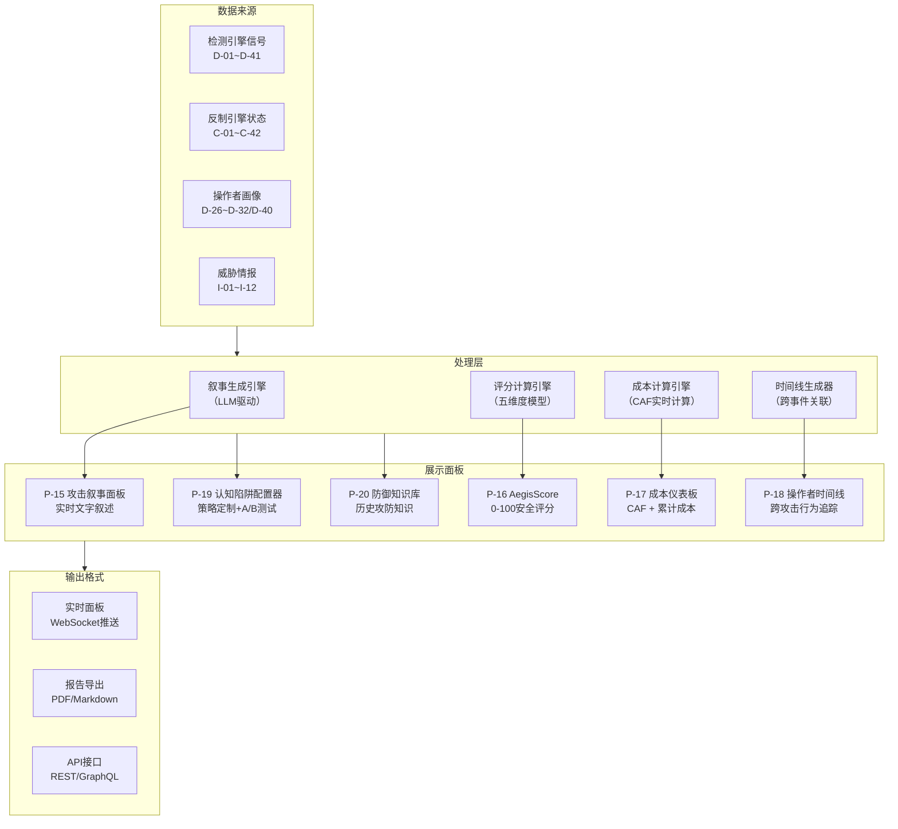

#### P-15 实时攻击叙事面板

- **用户故事**：作为SOC分析师，我希望看到正在进行的攻击的实时文字叙述，而不是阅读原始日志和数字评分，以便我能在10秒内理解攻击全貌并做出响应决策。
- **功能规格**：
  - **实时叙事生成**：基于检测引擎的实时信号（D-01~D-41）和反制引擎的状态（C-01~C-42），由内置LLM生成人类可读的攻击叙事文本
  - **叙事内容结构**：
    - 攻击者识别："检测到疑似PentestGPT Agent（置信度87%），来源IP 203.0.113.42（UTC+8时区），操作者画像OP-2026-0089（历史3次攻击记录，威胁评级：高）"
    - 当前阶段："攻击者当前处于'漏洞利用'阶段，已完成端口扫描（372个端口）和服务枚举（12个服务），正在尝试对Web服务器（目标资产WEB-03）进行SQL注入"
    - 下一步预测（D-38）："预测攻击者下一步将尝试横向移动到内网数据库服务器（置信度76%），预计在5-15分钟内执行"
    - 推荐行动："建议立即在数据库服务器上部署蜜罐（C-06），并启动Token消耗攻击（C-38）以增加攻击者成本"
    - 反制状态："已部署PI反制Payload（C-01），Agent尚未触发。Token消耗攻击（C-38）已部署假日志文件，预估额外消耗攻击者$12"
  - **自动更新**：叙事随攻击进展自动更新（每30秒刷新一次，有重大事件时即时更新）
  - **多语言支持**：支持中/英文切换，技术术语保持英文原文
  - **叙事导出**：叙事可一键导出为事件报告（PDF/Markdown格式），自动补充完整的技术细节和证据引用
  - **叙事历史**：保留完整叙事更新历史，支持回溯查看攻击任意时刻的叙事快照
- **叙事生成技术规格**：
  - 使用本地部署的LLM（不依赖外部API，保障数据隐私）
  - 叙事模板 + LLM填充模式（模板确保结构一致性，LLM提供自然语言表述）
  - 输入：检测信号JSON + 反制状态JSON + 操作者画像JSON
  - 输出：结构化叙事文本（Markdown格式）
- **输入**：D-01~D-41检测信号流、C-01~C-42反制状态、D-26~D-32操作者画像
- **输出**：实时叙事文本（WebSocket推送至前端）、叙事报告（PDF/Markdown导出）
- **验收标准**：
  - 叙事生成延迟 <10s（从事件发生到叙事更新）
  - 叙事准确度 >90%（经SOC分析师评审，叙事内容与实际攻击情况一致）
  - 叙事可读性评分 >4/5（经SOC分析师评审）
  - 叙事更新频率：常规30秒/次，重大事件即时更新（<5s）
  - 叙事导出为PDF的生成时间 <15s
  - 叙事历史保留 ≥90天
  - 中/英文切换延迟 <3s
- **优先级**：P1
- **数据依赖**：D-01~D-41全部检测器输出、C-01~C-42反制状态、D-26~D-32操作者画像

#### P-16 AegisScore AI安全态势评分

- **用户故事**：作为CISO，我希望看到一个直观的0-100分安全评分，一眼了解组织对AI攻击的整体防御状态，以便我在董事会汇报时用一个数字概括安全状况，并在评分下降时立即获得改进建议。
- **功能规格**：
  - **综合评分模型**：0-100分，由五个维度加权计算：

| 维度 | 满分 | 权重 | 评估内容 | 数据来源 |
|------|------|------|---------|---------|
| 暴露面（Exposure） | 30分 | 30% | AI攻击面覆盖度——有多少资产暴露在AI Agent可达范围内，有多少端点未部署蜜罐，有多少已知AI工具指纹未纳入检测规则 | D-01~D-06检测覆盖度、蜜罐部署覆盖率、指纹库覆盖率 |
| 检测覆盖（Detection） | 25分 | 25% | 检测能力完整度——六大检测层是否全部启用，检测规则覆盖MITRE ATLAS的比例，近30天检测率和误报率 | D-25检测率/误报率统计、ATLAS覆盖率、检测层启用状态 |
| 反制就绪（Countermeasure） | 20分 | 20% | 反制能力就绪度——绿色/黄色/红色反制手段的可用数量，反制Payload库更新度，反制审批流程配置完整度 | C-01~C-42就绪状态、Payload库最后更新时间、审批人员配置 |
| 历史韧性（Resilience） | 15分 | 15% | 历史对抗表现——过去90天的攻击拦截成功率，平均检测时间（MTTD），平均响应时间（MTTR），反制成功率 | 历史告警统计、事件闭环数据 |
| 进化速度（Evolution） | 10分 | 10% | 防御进化速度——指纹库更新频率，检测规则新增/调优频率，对抗进化引擎（C-23）的Payload变体产出量，模型再训练频率 | I-07指纹更新日志、C-23进化引擎产出统计、模型训练日志 |

  - **维度展开详情**：每个维度可点击展开查看详细指标和扣分项。例如"暴露面"维度展开显示：未部署蜜罐的关键资产列表、未纳入检测规则的已知AI工具列表、暴露的高风险端点列表
  - **趋势图**：月度/季度AegisScore趋势图，显示评分变化和关键事件标注
  - **行业对标**：同行业客户的匿名AegisScore分布（Dominate版功能），显示当前组织在行业中的相对位置（百分位排名）
  - **改进建议**：评分下降时自动生成Top-5改进建议，按投入产出比排序。例如："部署3个API端点蜜罐可提升暴露面评分5分（预估工作量：2小时）"
  - **评分告警**：评分跌破预设阈值（默认60分）时自动告警通知CISO
- **输入**：检测引擎全局状态、反制引擎全局状态、历史事件统计、情报引擎状态
- **输出**：AegisScore评分（0-100）+ 五维度分解 + 趋势图 + 改进建议
- **验收标准**：
  - 评分计算延迟 <30s（含全维度数据聚合）
  - 评分与真实安全状态的相关性 >0.85（回测验证：将历史评分与实际攻击拦截率做回归分析）
  - 改进建议的可操作性评分 >4/5（经安全管理员评审）
  - 评分每日自动更新一次（可手动触发即时更新）
  - 行业对标数据延迟 <24小时（匿名聚合周期）
  - 评分计算逻辑可审计——每次评分附带完整的扣分/加分明细
- **优先级**：P1
- **数据依赖**：全部检测和反制引擎状态数据、历史事件统计

#### P-17 攻击成本仪表板

- **用户故事**：作为安全管理员，我希望看到系统为攻击者增加了多少经济成本，以便我量化经济学反制（C-38~C-42）的实际效果，并向管理层展示AegisAI在经济维度上的防御价值。
- **功能规格**：
  - **实时成本显示**：
    - 当前活跃攻击的预估攻击者成本（基于D-06 API回调频率 × 模型定价估算）
    - 原本预期成本 vs 实际消耗成本对比
    - 成本放大因子（CAF）实时计算和展示
  - **成本放大因子（CAF）计算**：
    - CAF = 攻击者实际消耗成本 / 攻击者原本预期成本
    - 实时更新，按秒级粒度采样
    - 历史CAF趋势图（按日/周/月聚合）
  - **累计统计**：
    - 过去30天/90天的总成本放大量（估算美元值）
    - 累计阻止的攻击次数和预估节省的防守方损失
    - 按反制类型的成本贡献分解饼图
  - **反制效果分解**：

| 反制类型 | 平均单次成本增加 | 累计贡献占比 | 触发次数 |
|---------|----------------|------------|---------|
| C-38 Token消耗攻击 | $5-$20 | 展示实际值 | 展示实际值 |
| C-39 决策树膨胀 | $10-$100 | 展示实际值 | 展示实际值 |
| C-40 幻觉循环诱导 | $3-$15 | 展示实际值 | 展示实际值 |
| C-41 多模型协同消耗 | $15-$50 | 展示实际值 | 展示实际值 |
| C-42 经济学威慑信号 | N/A（定性效果） | N/A | 展示实际值 |
| C-25 攻击成本膨胀 | $50-$500 | 展示实际值 | 展示实际值 |
| C-34 Tarpit | N/A（时间成本） | N/A | 展示实际值 |

  - **成本估算模型**：
    - 基于D-06检测的API回调模式识别LLM提供商和模型类型
    - 使用公开的API定价信息（OpenAI/Anthropic/Google官方定价页）估算Token成本
    - Input Token成本基于假信息大小估算，Output Token成本基于Agent响应长度估算
    - 估算误差范围标注（±30%）
- **输入**：D-06 API回调数据、C-38~C-42反制执行日志、API定价数据库
- **输出**：成本仪表板（实时展示）、成本报告（PDF导出）
- **验收标准**：
  - 成本估算延迟 <5s（实时更新）
  - 成本估算与实际成本的误差 <30%（在可验证场景下回测）
  - 仪表板页面加载 <3s
  - 成本报告PDF生成 <15s
  - 支持按时间范围（自定义）、按反制类型、按攻击者筛选
- **优先级**：P1
- **数据依赖**：D-06 API回调数据、C-38~C-42执行日志

#### P-18 操作者画像时间线

- **用户故事**：作为威胁情报分析师，我希望看到一个攻击者的完整活动时间线（跨多次攻击），以便我了解该操作者的行为演化趋势，预判其下一次攻击的时间、目标和手法。
- **功能规格**：
  - **时间轴视图**：
    - 横轴为时间，展示该操作者的所有已知活动事件
    - 每个事件标注：攻击日期、目标资产、使用的AI工具、攻击结果（成功/失败/中断）、AegisAI的检测和反制动作
    - 事件之间用连线标注间隔时间
    - 支持缩放和平移（从全局概览到单次攻击详情）
  - **工具演化追踪**：
    - 时间线上标注该操作者使用的AI工具随时间的变化
    - 例如：2026-01使用PentestGPT → 2026-03切换到Claude Code → 2026-05使用自定义Agent
    - 工具切换时间点高亮标注
  - **行为模式分析**：
    - 攻击时间偏好：周几最活跃、每天哪个时段最活跃（热力图展示）
    - 目标偏好：攻击的资产类型分布（Web服务器/数据库/API/内网）
    - 策略偏好：偏好的攻击路径（直接利用/横向移动/权限提升）
    - 对反制的响应模式：遇到不同反制手段后的行为变化（放弃/绕过/切换工具）
  - **威胁评级历史曲线**：
    - 展示操作者威胁评级（低/中/高/极高）随时间的变化
    - 标注评级变化的触发原因
- **输入**：D-40操作者画像数据、博物馆历史事件数据（I-12）、D-26~D-32全部画像信号
- **输出**：操作者时间线视图（交互式Web页面）、操作者分析报告（PDF导出）
- **验收标准**：
  - 时间线页面加载 <5s（100个历史事件以内）
  - 支持最长2年的时间线回溯
  - 工具演化追踪覆盖所有D-19/D-28支持的Agent框架
  - 行为模式分析在3+次攻击数据积累后生成
  - 时间线支持按攻击结果、工具类型、目标类型筛选
  - 报告PDF生成 <30s
- **优先级**：P2
- **数据依赖**：D-40操作者画像、D-26~D-32、I-12博物馆数据

#### P-19 认知陷阱配置器

- **用户故事**：作为高级安全工程师，我希望能自定义认知陷阱的参数，并通过A/B测试比较不同策略的效果，以便针对特定攻击者类型优化反制效果。
- **功能规格**：
  - **可配置的认知偏差利用策略**：
    - DFS陷阱深度：控制C-39决策树膨胀的深度和分支数量（保守/标准/激进）
    - 锚定信息内容：控制C-38假信息的类型组合和逼真度参数
    - 确认偏差触发条件：控制C-40幻觉循环的循环长度和"小进展"频率
    - 沉没成本利用强度：控制C-34 Tarpit的减速曲线和假进度信号（C-35）频率
    - 经济学威慑阈值：控制C-42威慑信号的触发置信度和信息内容
  - **预设模板**：
    - **保守模式**：仅启用绿色反制，陷阱深度浅，假信息量少。适合初次部署或低风险环境
    - **平衡模式**：绿色+部分黄色反制，标准陷阱参数。适合大多数生产环境
    - **激进模式**：全部反制手段启用，最大陷阱深度，最大假信息量。适合高安全要求环境或已确认的高威胁攻击者
  - **效果预览**：基于历史数据预估陷阱效果——输入陷阱参数配置，系统基于历史攻击数据模拟预估CAF、Agent停留时间、Token消耗量
  - **A/B测试**：
    - 对同一类型的攻击流量，同时运行两种陷阱策略（随机分配）
    - 实时对比两种策略的关键指标：CAF、Agent停留时间、反制成功率
    - 测试结束后自动生成统计显著性报告
    - 显著优胜策略可一键全局部署
  - **策略版本管理**：
    - 每次策略变更自动记录版本
    - 支持回滚到历史版本
    - 版本间效果对比
- **输入**：陷阱参数配置、历史攻击数据（用于效果预览和A/B测试）
- **输出**：陷阱策略配置（应用到反制引擎）、A/B测试报告、效果预览报告
- **验收标准**：
  - 策略配置变更在 <30s内生效（热加载）
  - 效果预览基于≥10个历史事件的统计数据
  - A/B测试支持最少运行72小时、最少样本量20个攻击session
  - A/B测试报告包含统计显著性检验（p-value <0.05视为显著）
  - 策略版本管理支持≥50个历史版本
  - 三种预设模板覆盖90%的部署场景
- **优先级**：P2
- **数据依赖**：C-34~C-42反制执行历史数据、博物馆攻击事件数据

#### P-20 防御知识库浏览器

- **用户故事**：作为SOC分析师，我希望能浏览历史攻防对抗中蒸馏出的防御知识，以便在处理新告警时快速找到已验证的有效反制方法，而不需要从头分析。
- **功能规格**：
  - **知识分类体系**：
    - 按攻击者类型：PentestGPT / Claude Code / ARTEMIS / XBOW / 自定义Agent / 未知Agent
    - 按攻击工具版本：同一工具不同版本的行为差异和对应反制方法
    - 按攻击阶段：侦察 / 枚举 / 利用 / 横向移动 / 数据外泄
    - 按反制有效性：高效（成功率>80%） / 中效（50-80%） / 低效（<50%）
  - **知识条目结构**：
    - 攻击模式：描述攻击行为的特征和上下文
    - 有效反制：推荐的反制手段组合和配置参数
    - 历史成功率：该反制组合在历史事件中的成功率
    - 来源事件：该知识从哪些历史事件中蒸馏
    - 适用条件：该知识在什么场景下有效、什么场景下失效
    - 更新时间：知识的最后验证时间
  - **知识搜索**：支持自然语言查询（如"PentestGPT的横向移动阶段用什么反制最有效"），由内置LLM将自然语言转换为知识库查询
  - **知识推荐**：基于当前活跃告警的特征，自动推荐相关知识条目（推送到告警详情页面）
  - **知识贡献**：SOC分析师在处理事件后可手动添加新知识条目或修正现有条目
  - **知识老化机制**：超过180天未被验证或引用的知识条目自动标记为"待验证"，提醒团队通过靶场测试重新验证
- **输入**：历史攻防事件数据（博物馆I-12）、SOC分析师手动贡献、自然语言查询
- **输出**：知识条目列表、知识推荐、知识搜索结果
- **验收标准**：
  - 知识库初始条目 ≥50条（基于Phase 1研究数据生成）
  - 自然语言查询到知识库检索的准确率 >80%
  - 知识推荐与当前告警的相关度 >70%（经分析师评审）
  - 知识搜索响应 <3s
  - 知识贡献流程支持审核（新知识需经高级分析师审核后发布）
  - 知识老化机制覆盖所有条目
- **优先级**：P2
- **数据依赖**：I-12博物馆数据、D-01~D-41检测历史、C-01~C-42反制历史

---

## 8. 外部集成需求 (X-XX)

#### X-01 SIEM集成

- **用户故事**：作为安全管理员，我希望AegisAI的告警能推送到现有SIEM（Splunk/Elastic/QRadar），以便SOC团队在统一平台查看所有安全告警。
- **集成方式**：Syslog（CEF格式）、REST API批量推送、Webhook实时推送
- **传输协议**：
  - **主通道**：Syslog over TCP/TLS（RFC 5424），端口6514，支持mutual TLS认证
  - **备用通道**：REST API批量推送（POST /api/v1/alerts/batch），支持批量发送（每批最多500条告警），Bearer Token认证
  - **失败重试**：指数退避重试（初始1s，最大60s，最多5次），超过重试次数后写入本地持久化队列待恢复
- **CEF字段映射表**：

| AegisAI字段 | CEF字段 | CEF Key | 示例值 | 说明 |
|------------|--------|---------|--------|------|
| alert_id | externalId | externalId | AEG-2026-0891 | AegisAI全局唯一告警ID |
| confidence | cs1 | cs1 | 0.87 | D-25复合置信度分数 |
| confidence_label | cs1Label | cs1Label | AegisAI_Confidence | cs1字段标签 |
| src_ip | src | src | 203.0.113.45 | 攻击源IP |
| dst_ip | dst | dst | 10.0.1.50 | 目标资产IP |
| matched_framework | cs2 | cs2 | PentestGPT | D-19识别的AI框架 |
| severity | severity | severity | 8 | 0-10严重等级，映射自D-25响应分级 |
| detection_layers | cs3 | cs3 | L1+L2+L4 | 触发的检测层组合 |
| agent_architecture | cs4 | cs4 | ReAct | 识别到的Agent架构类型 |
| response_level | cs5 | cs5 | Respond | D-25响应级别 |
| shap_top3 | msg | msg | TLS指纹(30%)+ReAct模式(40%)+蜜罐触发(20%) | SHAP Top3贡献因子 |

- **SIEM平台适配**：
  - **Splunk**：提供预置Splunk App（含Dashboard、Saved Search、Alert Action），sourcetype=`aegisai:alert`
  - **Elastic Security**：提供Filebeat模块配置 + Kibana Dashboard模板 + Detection Rules
  - **IBM QRadar**：提供DSM（Device Support Module）+ 自定义属性映射
- **延迟SLA**：告警产生后 <5s 推送至SIEM（P99），<2s（P50）
- **验收标准**：
  - 支持Syslog/CEF标准格式推送，CEF版本0，符合ArcSight CEF标准
  - 告警推送延迟 <5秒（P99）
  - 支持自定义字段映射（管理员可通过YAML配置文件覆盖默认映射）
  - 消息丢失率 <0.01%（通过持久化队列保障）
  - 提供至少3种SIEM的预置集成包
- **优先级**：P0

#### X-02 SOAR集成

- **用户故事**：作为安全管理员，我希望AegisAI能与SOAR平台集成（千乘SOAR、Splunk SOAR、Palo Alto XSOAR等均作为可选集成目标），以便AI攻击事件能触发SOAR的自动化响应剧本。
- **集成方式**：REST API（双向）、Webhook（实时推送）
- **触发机制**：Webhook POST请求，JSON payload，HMAC-SHA256签名验证（签名放在`X-AegisAI-Signature`请求头中）
- **Webhook Payload Schema**：
  ```json
  {
    "event_type": "aegis_alert",
    "event_version": "1.0",
    "timestamp": "2026-03-09T14:30:00Z",
    "alert_id": "AEG-2026-0891",
    "confidence": 0.87,
    "response_level": "respond",
    "detection_summary": {
      "matched_framework": "PentestGPT",
      "detection_layers": ["L1", "L2", "L4"],
      "agent_architecture": "ReAct"
    },
    "recommended_actions": [
      {"action": "block_ip", "params": {"ip": "203.0.113.45", "duration": "24h"}},
      {"action": "deploy_honeypot", "params": {"type": "credential_trap", "target_path": "/admin"}},
      {"action": "enable_deep_inspection", "params": {"src_ip": "203.0.113.45"}}
    ],
    "requires_approval": true,
    "approval_level": "yellow",
    "evidence_url": "https://aegisai.internal/api/v1/alerts/AEG-2026-0891/evidence"
  }
  ```
- **支持的SOAR平台及适配方式**：
  - **Splunk SOAR（Phantom）**：提供自定义App（含Playbook触发Action + 状态回写Action）
  - **Cortex XSOAR**：提供Integration Pack（含Fetch Incidents + Mirror功能）
  - **Swimlane**：提供REST Connector配置模板
  - **TheHive**：提供Cortex Analyzer + Responder插件
  - **千乘SOAR**：提供API适配器（国内SOAR生态支持）
- **双向集成**：SOAR可通过REST API回写处置结果（`PUT /api/v1/alerts/{alert_id}/disposition`），AegisAI记录处置结果并更新告警状态
- **预置Playbook模板**（至少5个）：
  1. AI渗透IP封锁 + 关联IP扫描
  2. 蜜罐自动化部署（基于D-19识别的框架类型选择蜜罐模板）
  3. API提供商滥用报告自动生成（联动C-27）
  4. 操作者画像关联查询 + 历史事件聚合
  5. 红色反制审批工作流（含CISO审批节点 + 超时升级）
- **验收标准**：
  - 提供标准REST API供SOAR调用（OpenAPI 3.0规范文档）
  - 支持Webhook推送事件到SOAR，HMAC-SHA256签名验证
  - 提供至少5个预置SOAR Playbook模板
  - 双向集成：SOAR处置结果可回写至AegisAI
  - Webhook投递成功率 >99.9%（含重试）
- **优先级**：P1

#### X-03 EDR/XDR集成

- **用户故事**：作为安全管理员，我希望AegisAI能接收EDR/XDR（CrowdStrike/SentinelOne/微步TDP等）的终端事件数据，以便将终端层行为纳入AI攻击检测的多信号融合。
- **集成方式**：API采集（主动拉取）、Syslog接收（被动接收）
- **数据采集规格**：
  - **采集对象**：Agent端进程创建/终止事件、文件读写事件、网络连接事件、注册表变更事件（Windows）、命令行执行记录
  - **采集频率**：准实时（polling间隔≤10s）或事件驱动（EDR Webhook推送）
  - **数据规范化**：将各EDR厂商的私有事件格式统一转换为AegisAI内部事件Schema（ECS-Elastic Common Schema兼容）
- **支持的EDR/XDR平台**：
  - **CrowdStrike Falcon**：通过Streaming API（Event Stream）实时接收端点事件
  - **SentinelOne**：通过Deep Visibility API查询端点活动
  - **微步TDP（OneSEC）**：通过REST API采集国内部署场景的端点数据
  - **Microsoft Defender for Endpoint**：通过Advanced Hunting API查询
  - **扩展接口**：提供Plugin SDK，第三方EDR可自行开发Connector
- **关联逻辑**：将EDR端点事件与AegisAI网络层检测关联 —— 关联条件：时间窗口±30s + IP地址匹配（或Hostname匹配）。关联场景示例：网络层检测到AI渗透流量（D-01~D-06）→ 关联同一时间窗口内目标主机上的进程创建事件 → 发现AI Agent通过RCE执行的命令 → 丰富告警上下文。
- **响应动作**：通过EDR API下发响应指令（需黄色/红色审批）：
  - 主机网络隔离（Isolate Host）
  - 进程查杀（Kill Process by PID/Hash）
  - 文件隔离/删除（Quarantine File）
  - 取证数据采集（Collect Forensic Package）
- **验收标准**：
  - 支持至少3种主流EDR数据源接入（CrowdStrike + SentinelOne + 微步TDP为Phase 1目标）
  - 终端事件在 <30秒内纳入检测流水线
  - EDR事件与网络层检测的关联准确率 >85%（基于时间窗口+IP匹配）
  - 响应动作通过EDR API下发的成功率 >99%
  - 提供Plugin SDK文档，第三方EDR可在2人周内完成Connector开发
- **优先级**：P1

#### X-04 告警格式标准

- **用户故事**：作为安全管理员，我希望AegisAI的告警支持多种行业标准格式导出，以便与任何安全工具链集成。
- **支持格式**：CEF（Common Event Format）、STIX 2.1（含ATLAS扩展）、Syslog RFC 5424
- **STIX 2.1对象类型映射**：

| AegisAI概念 | STIX 2.1对象类型 | 说明 |
|------------|-----------------|------|
| AI攻击技术 | Attack-Pattern | 映射到MITRE ATLAS战术/技术ID，如`AML.T0054`（LLM Prompt Injection） |
| 攻击指标（IP/Hash/URL） | Indicator | 包含STIX Pattern表达式，如`[ipv4-addr:value = '203.0.113.45']` |
| AI渗透工具 | Tool | 如PentestGPT、ARTEMIS等，包含工具版本和能力描述 |
| 恶意AI框架 | Malware | WormGPT、FraudGPT等明确恶意的AI工具 |
| 操作者画像 | Threat-Actor | D-26~D-32产出的操作者画像，含作息模式和工具偏好 |
| 攻击事件 | Sighting | 记录Attack-Pattern被观察到的时间、位置、频率 |
| 对象间关系 | Relationship | 如Threat-Actor `uses` Tool, Tool `targets` Vulnerability |

- **ATLAS扩展字段**（STIX 2.1 Custom Properties，前缀`x_aegis_`）：
  - `x_aegis_agent_architecture`：Agent架构类型（ReAct/Plan-Execute/Multi-Agent）
  - `x_aegis_confidence_score`：D-25复合置信度分数
  - `x_aegis_detection_layers`：触发的检测层列表
  - `x_aegis_shap_explanation`：SHAP可解释性文本
- **TAXII 2.1 Collection定义**：
  - `aegis-ioc`：IOC指标（IP、域名、Hash、URL Pattern），实时推送
  - `aegis-ttp`：TTP情报（AI攻击技术、Agent架构模式、工具链组合），每日批次更新
  - `aegis-actor`：操作者画像（作息模式、工具偏好、攻击风格），每周更新
- **自动化发布频率**：IOC实时推送（告警产生后 <10s发布）、TTP每日00:00 UTC批次发布、Actor每周日00:00 UTC更新
- **验收标准**：
  - 所有告警可导出为CEF/STIX/Syslog格式
  - STIX格式中AI攻击特有字段使用ATLAS扩展（`x_aegis_`前缀）
  - STIX Bundle通过官方STIX Validator校验
  - 支持STIX 2.1 Relationship对象表达攻击链关系
  - TAXII Collection按规定频率自动发布
- **优先级**：P1

#### X-05 威胁情报共享

- **用户故事**：作为安全管理员，我希望AegisAI能以STIX/TAXII标准共享AI威胁情报（AI工具指纹、攻击IoC），以便参与行业威胁情报共享社区。
- **集成方式**：TAXII 2.1 Server（对外发布）+ TAXII 2.1 Client（订阅外部情报源）
- **TAXII 2.1 Server实现**：
  - **协议**：HTTPS（TLS 1.3），符合TAXII 2.1规范（OASIS标准）
  - **API端点**：Discovery (`/taxii2/`)、API Root (`/api/v1/`)、Collections、Objects
  - **认证方式**：OAuth 2.0 Client Credentials Grant（机器对机器认证）+ API Key（备用轻量认证）
  - **访问控制**：基于TLP（Traffic Light Protocol）标记的细粒度权限
    - TLP:CLEAR — 公开情报，任何认证用户可访问
    - TLP:GREEN — 社区共享，需加入AegisAI威胁情报共享社区
    - TLP:AMBER — 受限共享，仅限签署NDA的合作伙伴
    - TLP:RED — 不共享，仅内部使用
- **数据脱敏规则**：
  - 自动移除客户标识信息（组织名、内部IP段、域名等）
  - 将内部资产IP替换为RFC 5737保留地址段（198.51.100.0/24）
  - 保留攻击技术特征但移除防御配置细节
  - 脱敏操作记录审计日志
- **情报订阅（Client模式）**：
  - 可订阅外部TAXII情报源（如MITRE ATT&CK TAXII Feed、AlienVault OTX、FS-ISAC等）
  - 自动将外部情报中的AI攻击相关IOC导入AegisAI检测引擎
  - 去重逻辑：基于STIX ID + modified时间戳去重
- **验收标准**：
  - 支持TAXII 2.1协议（通过OASIS TAXII互操作性测试）
  - AI工具指纹可编码为STIX Tool对象
  - 支持TLP标记的访问控制（4级TLP全部支持）
  - 数据脱敏规则100%执行（无客户标识信息泄露）
  - Server可处理≥100并发TAXII Client连接
  - 情报发布到可查询的端到端延迟 <60s
- **优先级**：P2

---

## 9. 非功能需求

### 9.1 性能

| 指标 | 目标值 | 来源/依据 |
|------|--------|---------|
| TLS指纹匹配延迟 | <0.5ms（P99） | 查表操作，实时ML部署研究 |
| HTTP头分析延迟 | <1ms（P99） | 规则引擎，实时ML部署研究 |
| 行为序列模型推理延迟 | <30ms（P99） | Transformer Encoder INT8量化，实时ML部署研究 |
| 综合风险评分延迟 | <50ms（P99） | 多信号融合，实时ML部署研究 |
| 端到端检测延迟 | <200ms（P99） | 从流量进入到告警产生 |
| 吞吐量 | >10,000 QPS | 参考Vectra/Darktrace NDR基准 |
| 告警推送延迟 | <5s | 从检测到推送至SIEM |

### 9.2 可用性

| 指标 | 目标值 |
|------|--------|
| 系统可用性 | 99.9%（每月停机 <43分钟） |
| 检测引擎可用性 | 99.95% |
| 数据持久性 | 99.99% |
| 故障恢复（RTO） | <4小时 |
| 数据恢复（RPO） | <24小时 |

### 9.3 安全性（自身安全加固）

AegisAI作为AI攻击检测和反制平台，其自身必须具备防御AI攻击的能力。以下是详细的安全加固设计：

#### 9.3.1 检测引擎自身防护

- **API安全**：所有检测引擎API接口强制认证（JWT/mTLS），防止PI攻击通过API注入恶意指令
- **输入验证**：所有进入检测引擎的数据必须经过严格验证，防止Prompt Injection攻击载荷
- **模型隔离**：ML模型推理与主业务逻辑隔离，防止通过模型参数窃取或篡改

#### 9.3.2 管理平台安全

- **强认证**：管理平台MFA强制启用，支持TOTP/硬件密钥
- **会话管理**：短会话超时、自动登出、异常登录检测
- **权限最小化**：基于RBAC的细粒度权限控制

#### 9.3.3 通信安全

- **传输加密**：全链路TLS 1.3，数据在传输过程中加密
- **证书管理**：支持自签名和CA证书，证书轮换自动化

#### 9.3.4 数据安全

- **静态加密**：敏感数据（Payload库、指纹库）AES-256加密存储
- **密钥管理**：支持HSM/KMS集成，密钥与数据分离
- **数据脱敏**：日志和报告中敏感信息自动脱敏

#### 9.3.5 审计与完整性

- **审计日志**：所有管理操作和关键业务操作记录不可篡改审计日志
- **完整性校验**：Payload库、规则库支持哈希校验，防止篡改
- **篡改检测**：检测到配置或数据被篡改时自动告警

#### 9.3.6 抗分析能力

- **混淆防护**：检测引擎关键逻辑代码混淆，防止攻击者逆向分析
- **反调试**：关键组件检测到调试行为时触发保护机制
- **环境检测**：在异常环境（虚拟机、容器）中降低敏感操作

### 9.4 部署模式

| 模式 | 适用场景 | 说明 |
|------|---------|------|
| **SaaS多租户** | 中小企业 | 最低运维成本，共享基础设施 |
| **SaaS单租户** | 大型企业 | 独立实例，数据隔离 |
| **私有化部署** | 政府/金融/军工 | 全部组件部署在客户数据中心 |
| **混合部署** | 合规敏感 | 检测引擎本地，情报更新从云端拉取 |

### 9.5 可扩展性

- 水平扩展：检测引擎支持多节点负载均衡
- 检测规则热更新：新规则加载无需重启
- ML模型热更新：新模型切换零停机
- 插件架构：支持自定义检测规则和反制Payload的插件式扩展

### 9.6 部署规模与性能指标

AegisAI支持三种预定义部署规模，每种规模有明确的性能指标和资源要求。客户根据自身流量规模和安全需求选择对应规模。

#### 部署规模定义

| 维度 | Small | Medium | Large |
|------|-------|--------|-------|
| **目标客户** | 中小企业 / 初次部署 | 大型企业 / 多业务线 | 集团级 / MSSP |
| **日均流量** | <1亿请求 | 1-10亿请求 | >10亿请求 |
| **并发检测QPS** | 1,000-5,000 | 5,000-30,000 | 30,000-100,000+ |
| **同时活跃攻击会话** | <50 | 50-500 | 500-5,000 |
| **蜜罐部署数量** | <100 | 100-1,000 | 1,000-10,000 |
| **操作者画像库大小** | <500 | 500-5,000 | 5,000-50,000 |
| **SOC并发用户** | <10 | 10-50 | 50-200 |

#### 各规模性能指标

**Small规模性能指标**：

| 指标 | 目标值 | 资源需求 |
|------|--------|---------|
| TLS指纹匹配延迟 | <0.5ms（P99） | 单节点足够 |
| 行为序列推理延迟 | <30ms（P99） | CPU推理（无需GPU） |
| 复合置信度评分 | <50ms（P99） | 单LightGBM实例 |
| 端到端检测延迟 | <200ms（P99） | 全pipeline单节点 |
| 告警面板加载 | <2s | 单Web服务器 |
| 数据存储 | 500GB-2TB / 年 | 本地SSD或NAS |
| CPU | 16-32 vCPU | 4核用于ML推理 |
| 内存 | 32-64 GB | 16GB用于检测引擎 |
| GPU | 可选（加速行为序列推理） | 无GPU时CPU推理延迟增加约3x |

**Medium规模性能指标**：

| 指标 | 目标值 | 资源需求 |
|------|--------|---------|
| TLS指纹匹配延迟 | <0.3ms（P99） | 2-3节点集群 |
| 行为序列推理延迟 | <15ms（P99） | GPU推理（T4或A10） |
| 复合置信度评分 | <30ms（P99） | 多LightGBM实例负载均衡 |
| 端到端检测延迟 | <100ms（P99） | 流处理pipeline + 消息队列 |
| 告警面板加载 | <1.5s | 2+Web服务器负载均衡 |
| 数据存储 | 2-10TB / 年 | 分布式存储（如Ceph） |
| CPU | 64-128 vCPU（集群总计） | 16核用于ML推理 |
| 内存 | 128-256 GB（集群总计） | 64GB用于检测引擎 |
| GPU | 1-2块T4/A10 | 用于行为序列Transformer推理 |

**Large规模性能指标**：

| 指标 | 目标值 | 资源需求 |
|------|--------|---------|
| TLS指纹匹配延迟 | <0.2ms（P99） | 5+节点集群 + 本地缓存 |
| 行为序列推理延迟 | <10ms（P99） | 多GPU推理（A100或H100） |
| 复合置信度评分 | <20ms（P99） | 分布式LightGBM + 模型分片 |
| 端到端检测延迟 | <50ms（P99） | 多级流处理pipeline |
| 告警面板加载 | <1s | CDN + 分布式Web集群 |
| 数据存储 | 10-100TB / 年 | 分布式存储 + 冷热分层 |
| CPU | 256-512 vCPU（集群总计） | 64核用于ML推理 |
| 内存 | 512GB-1TB（集群总计） | 256GB用于检测引擎 |
| GPU | 4-8块A100/H100 | 用于行为序列+叙事生成 |

#### 弹性扩展策略

AegisAI支持从Small平滑扩展到Large，无需中断服务或重新部署。

- **用户故事**：作为安全管理员，我希望能在业务增长时将AegisAI从Small规模扩展到Medium/Large规模，而不需要停机重新部署，以便保障扩展期间的检测连续性。

**扩展方式**：

| 扩展维度 | 扩展方法 | 停机时间 | 注意事项 |
|---------|---------|---------|---------|
| **检测引擎扩展** | 新增检测节点加入集群 → 自动负载均衡 → 流量逐步切换到新节点 | 零停机 | 新节点需先加载最新检测规则和ML模型 |
| **存储扩展** | 新增存储节点 → 数据自动再均衡 → 冷数据迁移 | 零停机 | 再均衡期间IO性能可能临时下降10-20% |
| **ML推理扩展** | 新增GPU节点 → 模型服务自动发现新节点 → 推理请求负载均衡 | 零停机 | 新GPU节点需预热模型（约5分钟） |
| **Web层扩展** | 新增Web服务器 → 负载均衡器自动纳入 | 零停机 | WebSocket连接需graceful迁移 |
| **数据库扩展** | 读写分离 → 读副本扩展 / 分库分表 | 读扩展零停机；分库分表需短暂维护窗口（<30分钟） | 分库分表需提前规划分片键 |
| **蜜罐资源扩展** | 新增蜜罐托管节点 → 蜜罐调度器自动纳入 | 零停机 | 新节点的蜜罐模板需同步 |

**扩展验收标准**：

1. Small→Medium扩展在 <4小时 内完成（含资源准备、配置、验证）
2. Medium→Large扩展在 <8小时 内完成
3. 扩展期间检测能力不中断（零告警丢失）
4. 扩展期间性能指标不低于扩展前水平的80%
5. 扩展完成后性能指标在 <30分钟 内达到目标水平
6. 扩展操作可通过管理控制台的图形界面完成，无需命令行操作

### 9.7 多租户架构规格（MSSP场景）

AegisAI的Large规模部署支持多租户架构，面向MSSP（Managed Security Service Provider）场景——一个AegisAI实例同时服务多个客户组织。

- **用户故事**：作为MSSP运营商，我希望用一套AegisAI基础设施同时为多个客户提供AI攻击检测和反制服务，每个客户的数据完全隔离，以便降低运营成本并统一管理。

**多租户核心规格**：

| 特性 | 规格 | 说明 |
|------|------|------|
| **租户隔离级别** | 逻辑隔离（数据层）+ 计算隔离（可选） | 默认逻辑隔离（共享计算资源、独立数据库schema）；高安全租户可选计算隔离（独立检测引擎实例） |
| **数据隔离** | 租户间数据完全不可见 | 每个租户独立数据库schema / namespace，查询引擎强制添加tenant_id过滤 |
| **配置隔离** | 每个租户独立的检测规则、反制策略、白名单 | MSSP可为每个客户定制检测灵敏度和反制激进度 |
| **资源配额** | 每个租户可配置CPU/内存/存储/蜜罐数量上限 | 防止单个租户耗尽共享资源 |
| **性能隔离** | 检测延迟不因其他租户的流量峰值而退化 | 关键路径（检测评分、告警推送）使用租户级别的资源预留 |
| **计费度量** | 按租户统计：流量处理量、告警数量、反制执行次数、存储用量 | 支持按月/按量两种计费模式 |
| **最大租户数** | 100（共享计算）/ 20（计算隔离） | Large规模下的上限 |

**MSSP管理能力**：

- **统一管理面板**：MSSP管理员可在单一面板上查看所有租户的安全态势概览，按租户筛选告警和事件
- **跨租户威胁情报**：当同一攻击者（操作者DNA匹配）攻击多个租户时，MSSP可选择向受影响租户发送匿名预警（需租户授权）
- **租户自服务**：租户管理员可自主管理检测策略、白名单、反制配置，无需MSSP介入
- **MSSP专属报告**：按租户生成月度安全服务报告，含该租户的检测统计、反制效果、AegisScore变化

**多租户验收标准**：

1. 租户间数据隔离通过渗透测试验证——租户A无法通过任何API/界面访问租户B的数据
2. 单个租户的流量峰值（10x正常水平）不影响其他租户的检测延迟（退化 <10%）
3. 新租户从创建到可用 <30分钟（含schema创建、初始配置、检测规则加载）
4. 租户删除后数据在30天内完全清除（不可恢复，满足数据保护法规）
5. MSSP管理面板在100个租户时加载 <5s
6. 跨租户威胁情报共享严格遵守租户授权——未授权租户的任何数据不参与共享

### 9.8 灾备与业务连续性

- **用户故事**：作为安全管理员，我希望AegisAI在发生区域级故障（如单个数据中心不可用）时能自动切换到备用站点继续运行，以便攻击检测能力不因基础设施故障而中断。

**灾备规格**：

| 灾备级别 | 适用场景 | RPO | RTO | 部署要求 |
|---------|---------|-----|-----|---------|
| **热备份** | Large规模 / 关键客户 | <1分钟 | <5分钟 | 双活数据中心，实时数据同步 |
| **温备份** | Medium规模 | <1小时 | <30分钟 | 主备数据中心，异步数据复制（延迟<1分钟） |
| **冷备份** | Small规模 | <24小时 | <4小时 | 定期备份到异地存储 |

**热备份详细规格**：

- 双活检测引擎：两个数据中心同时运行检测引擎，流量通过DNS负载均衡分配
- 实时数据同步：告警数据、操作者画像、反制状态通过消息队列实时同步
- 自动故障切换：主站点不可用时，DNS在 <5分钟 内将流量完全切换到备站点
- 故障切换后状态一致性：备站点上的告警、反制、事件状态与故障前一致
- 故障恢复后自动回切：主站点恢复后，流量逐步回切（灰度切换，避免突发峰值）

**灾备验收标准**：

1. 热备份故障切换演练：每季度至少一次，切换时间 <5分钟
2. 故障切换期间的告警丢失量：0（热备份）/ <10条（温备份）
3. 切换后的检测延迟在 <5分钟 内恢复到正常水平
4. 灾备演练不影响生产环境的检测能力
5. 灾备状态在健康监控面板实时展示（同步延迟、备站点健康状态）

---

## 10. 数据资产需求

AegisAI的核心竞争力建立在6大持续积累的数据资产之上（详见data_moat_architecture.md）。以下定义每个数据资产的产品化需求：

### 资产1：AI渗透工具指纹库

- **产品化形态**：指纹库浏览界面（I-06）+ 检测引擎后端数据（D-01/D-02/D-08）
- **用户可见内容**：每个工具的行为画像卡片（TLS指纹、HTTP头模式、时间分布、攻击链、错误处理模式）
- **更新频率**：每周（靶场自动测试） + 新版本发布时（I-07触发）
- **规模目标**：M3-15个工具 / M6-40+工具 / M12-80+工具
- **护城河**：靶场实测数据不可复制

### 资产2：检测规则库

- **产品化形态**：策略配置界面（故事4）+ 检测引擎执行层
- **用户可见内容**：每条规则的描述、检测层、靶场验证精度、已知误报场景、规避成本
- **更新频率**：每周迭代
- **规模目标**：M3-50条 / M6-150+条 / M12-300+条
- **护城河**：每条规则附带的性能数据和误报场景不可复制

### 资产3：AI Agent行为模型库

- **产品化形态**：检测引擎核心（D-07/D-25），用户不直接操作模型但通过检测结果感知
- **关键模型**：流量时序分类器、TLS指纹聚类器、攻击链序列模型、语义异常检测器、复合置信度融合模型
- **性能基准**（来源：行为序列分析研究）：
  - Transformer序列模型F1：95-98%
  - LSTM序列模型F1：92-96%
  - Isolation Forest异常检测F1：80-88%
- **规模目标**：M3-2个模型 / M6-4个模型 / M12-5个模型+自动再训练
- **护城河**：训练数据（靶场流量+客户反馈）是独占资源

### 资产4：反制Payload库

- **产品化形态**：反制方案推荐（P-04）+ 反制执行（C-01~C-22）
- **用户可见内容**：每个Payload的反制类型、目标Agent架构、测试有效率、衰减记录
- **更新频率**：每日（对抗进化引擎C-23产出新变体）
- **规模目标**：M3-50个 / M6-200+ / M12-500+
- **护城河**：Payload+有效率数据+衰减记录+变体集合的完整数据库不可复制

### 资产5：AI威胁情报库

- **产品化形态**：情报中心界面（I-01~I-05）
- **情报类型**：工具情报、漏洞情报、战术情报、事件情报、模型情报、研究情报
- **更新频率**：每日
- **规模目标**：M3-日均10-20条 / M6-日均30-50条(累计5000+) / M12-日均50-100条(累计20000+)
- **护城河**：持续性和时效性，历史积累不可追赶

### 资产6：攻防知识图谱

- **产品化形态**：知识图谱可视化（I-09）
- **节点类型**：AI工具、AI框架、LLM模型、漏洞、攻击技术(ATLAS)、检测规则、反制Payload、攻击事件
- **更新频率**：实时（其他5个资产变更时自动同步）
- **护城河**：关联知识随时间指数增长，竞品复制成本最高

---

## 11. 12个月路线图

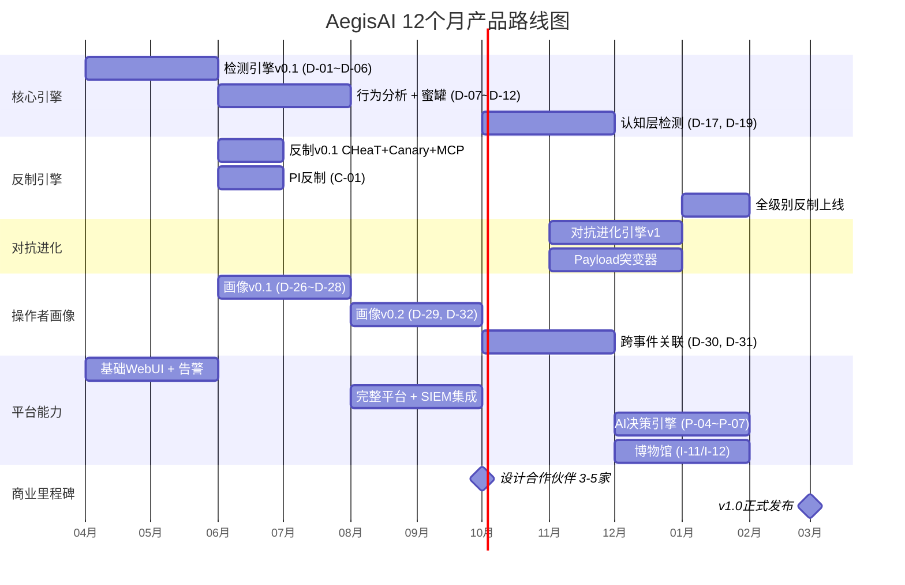

### M1-M2：核心检测引擎MVP

**交付物**：
- 网络流量层检测上线（D-01 TLS指纹、D-02 HTTP头、D-03 时间模式、D-05 速率异常）
- 15个主流AI工具指纹入库
- 基础告警界面（告警列表+详情页）
- 50条核心检测规则（覆盖六大检测层）

**验收标准**：
- 对15个已知工具的检测召回率 >80%
- 误报率 <5%
- 端到端检测延迟 <500ms

### M3-M4：行为分析+蜜罐+反制

**交付物**：
- 行为序列层检测上线（D-07 攻击链序列、D-08 操作间隔、D-12 横向移动速度）
- 流量时序分类器 + TLS指纹聚类器上线（资产3前2个模型）
- Canarytoken部署（C-04）+ API端点蜜罐（C-06）上线
- PI反制Payload部署（C-01）上线
- 复合置信度引擎（D-25）V1上线
- 50个核心反制Payload入库
- **操作者画像引擎v0.1**：人-AI切换节奏检测（D-26）、操作者作息画像（D-27）、AI工具选择指纹（D-28）基础功能上线

**验收标准**：
- 综合检测率 >85%
- 综合误报率 <3%
- PI反制成功率 >70%
- 端到端检测延迟 <300ms
- D-26能区分模式A/B攻击谱系

### M5-M6：完整平台+集成

**交付物**：
- 策略配置界面完整上线（故事4/5/6）
- CISO仪表板（故事7/8/9）
- 调查面板完整版（攻击链时间线、行为序列对比、网络拓扑图）
- 攻击链序列模型 + 复合融合模型上线（资产3第3/4个模型）
- SIEM集成（X-01）上线
- 指纹库扩展到40+工具
- 检测规则库扩展到150+条
- Payload库扩展到200+个
- 情报中心V1上线（I-01~I-05）
- **操作者画像引擎v0.2**：人类决策点识别（D-29）、操作者语言/Prompt风格分析（D-32）上线；攻击成本膨胀（C-25）、假情报投喂（C-26）上线

**验收标准**：
- 综合检测率 >90%
- 综合误报率 <1%
- 端到端检测延迟 <200ms
- SIEM集成延迟 <5秒
- 操作者画像包含≥3个维度特征

### M7-M8：认知层+进化引擎

**交付物**：
- 认知推理层检测上线（D-17 路径预测、D-19 框架识别）
- 对抗进化引擎（C-23）上线
- 认知消耗战（C-17）上线
- SOAR集成（X-02）上线
- 知识图谱V1上线（I-09）
- 工作流编排（P-01）上线
- Playbook模板库（P-02）5个预置模板
- **跨事件关联引擎**：跨事件操作者关联（D-30）、操作者取证包生成（D-31）上线——需要设计合作伙伴的数据积累支撑聚类模型训练
- API提供商协同报告（C-27）上线

**验收标准**：
- 路径预测准确率 >70%
- Agent框架识别准确率 >80%
- 对抗进化引擎月产出10+新Payload变体
- 跨事件操作者关联置信度 >70%（5+事件积累后）

### M9-M10：AI辅助+博物馆+攻击预测

**交付物**：
- AI辅助决策完整上线（P-04~P-07）
- 博物馆上线（I-11/I-12）
- MCP协议检测与反制完整上线（D-16.1~D-16.6、C-07/C-08）
- EDR/XDR集成（X-03）
- 多Agent协作检测（D-24）上线
- 全部5个ML模型上线 + 自动再训练pipeline
- 操作者反制完整上线：心理威慑部署（C-24）、操作者行为预测（C-28）
- **攻击预测引擎v1**：攻击链阶段预测（D-38）、预置防御自动部署（D-39）上线
- **零日Agent检测v1**：不变性特征检测（D-41）上线
- **经济学反制v1**：Token消耗攻击（C-38）、幻觉循环诱导（C-40）上线
- **实时攻击叙事v1**：实时叙事面板（P-15）上线

**验收标准**：
- 反制方案推荐前3中有效率 >70%命中
- 所有5个模型自动再训练pipeline运行稳定
- 操作者取证包包含≥5个维度特征
- 攻击预测Top-3命中率 >70%
- 零日Agent不变性特征检测率 >60%
- Token消耗攻击成功率 >70%
- 叙事生成延迟 <10s

### M11-M12：完善+规模化+高级能力

**交付物**：
- 指纹库扩展到80+工具 + 泛化模型（识别未知工具框架类型）
- 检测规则库扩展到300+条 + 自动化规则生成pipeline
- Payload库扩展到500+个
- 情报库累计20000+条
- TAXII威胁情报共享（X-05）
- 全部4种部署模式支持
- 性能优化：吞吐量 >10,000 QPS
- **攻击者画像实时更新完整上线**（D-40）——含跨组织DNA比对（Dominate版）
- **经济学反制完整上线**：决策树膨胀（C-39）、多模型协同消耗（C-41）、经济学威慑信号（C-42）
- **态势感知完整上线**：AegisScore（P-16）、攻击成本仪表板（P-17）、操作者时间线（P-18）、认知陷阱配置器（P-19）、防御知识库（P-20）
- **自适应欺骗拓扑上线**：影子/膨胀/迷宫三种模式 + 动态蜜罐生成器 + 交互深度管理器
- **检测规则联动引擎上线**：三重验证组合 + 检测降级与容错
- **反制协同矩阵上线**：推荐反制组合 + 组合效果自动评估
- **多租户架构上线**（MSSP场景）

**验收标准**：
- 综合检测率 >95%
- 综合误报率 <0.5%
- 端到端检测延迟 <100ms
- 99.9%可用性达标

---

## 12. 定价策略

### Detect 版（检测）

- **目标客户**：需要AI攻击可见性的组织
- **包含功能**：
  - 基础检测能力（D-01~D-25）——不含操作者画像
  - 告警中心 + 调查面板
  - SIEM集成（X-01）
  - 基础报告（P-08/P-09）
  - 指纹库只读访问
- **不包含**：操作者画像、反制能力、情报中心、博物馆

### Defend 版（检测+绿色反制+操作者画像基础）

- **目标客户**：需要主动防御AI攻击并了解攻击者画像的组织
- **包含功能**：
  - Detect版全部功能
  - 操作者画像基础功能（D-26 人-AI切换节奏、D-27 操作者作息、D-28 AI工具选择指纹、D-29 人类决策点识别）
  - 绿色级反制能力（C-01~C-12中的绿色分级项）——被动PI、DFS陷阱、Token Landmines、蜜罐API端点等默认启用的低风险反制
  - 蜜罐部署界面 + AI攻击者博物馆
  - 工作流编排（P-01~P-03）
  - 知识图谱访问
  - SOAR/EDR集成（X-02/X-03）
- **不包含**：黄色/红色级别反制、对抗进化引擎、跨事件操作者关联

### Dominate 版（全功能+归因）

- **目标客户**：需要完整AI安全能力和操作者归因的大型组织
- **包含功能**：
  - Defend版全部功能
  - 全级别反制能力（含黄色/红色级别，C-01~C-37全部）+ 对抗进化引擎
  - 跨事件操作者关联（D-30）+ 操作者取证包生成（D-31）+ 操作者语言/Prompt风格分析（D-32）
  - API提供商协同报告（C-27）+ 操作者行为预测（C-28）
  - AI辅助决策（P-04~P-07）
  - 情报中心完整版（I-01~I-12）
  - 威胁情报共享（X-05）
  - 私有化部署选项
  - 专属客户成功经理

---

## 13. 成功指标

### 产品指标

| 指标 | M6目标 | M12目标 |
|------|--------|---------|
| AI攻击检测率（召回率） | >90% | >95% |
| 误报率 | <1% | <0.5% |
| 平均检测时间（MTTD） | <5分钟 | <1分钟 |
| 反制成功率 | >60% | >80% |
| 指纹库覆盖度（已知AI工具） | >90% | >95% |

### 业务指标

| 指标 | M6目标 | M12目标 |
|------|--------|---------|
| 付费客户数 | 5（设计合作伙伴） | 20+ |
| ARR | - | $500K+ |
| 客户满意度（NPS） | >40 | >50 |
| 续费率 | - | >90% |
| 平均部署时间 | <3天 | <1天 |

### 数据资产指标

| 指标 | M6目标 | M12目标 |
|------|--------|---------|
| 工具指纹数 | 40+ | 80+ |
| 检测规则数 | 150+ | 300+ |
| 反制Payload数 | 200+ | 500+ |
| 威胁情报累计条数 | 5,000+ | 20,000+ |
| 知识图谱节点数 | 1,000+ | 5,000+ |
| 靶场测试数据量 | 500GB+ | 2TB+ |

---

## 14. 部署与配置需求

### 14.1 硬件要求

| 部署形态 | 最低配置 | 推荐配置 | 说明 |
|---------|---------|---------|------|
| **On-Premise Appliance** | 16核CPU, 64GB RAM, 2TB SSD | 32核CPU, 128GB RAM, 4TB NVMe, 1x NVIDIA T4 GPU | GPU用于Transformer推理 |
| **Private Cloud (Docker/K8s)** | 8核/pod × 4 pods, 32GB/pod | 16核/pod × 6 pods, 64GB/pod, GPU节点 | K8s集群推荐3+节点 |
| **SaaS** | N/A（由AegisAI云端提供） | N/A | 客户仅需配置数据源 |

### 14.2 网络要求

| 需求 | 说明 |
|------|------|
| **流量采集接入** | 交换机镜像端口或TAP设备，支持10Gbps+链路 |
| **出站连接** | 需访问AegisAI情报更新服务器（可选）；不需要访问互联网用于核心检测功能 |
| **内部网络** | AegisAI各组件间需要千兆以太网；Kafka集群需要独立网段 |
| **DNS** | 可选：配置DNS日志转发用于L1 DNS查询模式检测 |

### 14.3 初始配置向导流程

```
第一步：数据源连接（10-30分钟）
  - 选择流量采集方式（旁路镜像/eBPF/Endpoint Agent）
  - 配置采集参数
  - 系统自动验证连接并显示流量统计

第二步：环境基线学习（系统自动，2-4周）
  - 自动分析流量模式建立基线
  - 自动识别高频非浏览器来源
  - 生成白名单建议清单

第三步：白名单初始配置（30-60分钟）
  - 确认系统建议的白名单条目
  - 手动添加已知合法工具（Nessus/Qualys/CI-CD等）
  - 设置授权渗透测试时间窗口（如有）

第四步：告警与集成配置（30分钟）
  - 配置告警通知方式（钉钉/飞书/Slack/邮件）
  - 配置SIEM集成（Splunk/Elastic，可选）
  - 设置反制策略审批人员（绿/黄/红三级）

第五步：验证（1-2小时）
  - 运行内置AI攻击模拟器验证检测能力
  - 确认告警通知链路正常
  - 确认白名单有效
```

### 14.4 学习期说明

AegisAI部署后的前2-4周是学习期。在此期间：
- 系统产生告警但标记为"学习期告警"，默认不推送通知
- 安全管理员每日审查学习期告警，标记误报和有效告警
- 系统基于标记持续优化检测阈值和白名单
- 学习期结束后，管理员手动切换到"正式运营"模式

---

## 15. 性能需求

| 指标 | 要求 | 说明 |
|------|------|------|
| JA4指纹提取+匹配 | <0.5ms P99 | 查表操作 |
| 加密流量CNN分类 | <1ms/flow (CPU) | 1D-CNN模型 |
| 行为序列Transformer | 5-15ms/序列 (GPU) | INT8量化 |
| 复合置信度评分 | <0.1ms | LightGBM |
| **端到端检测延迟** | **<50ms P99** | 从数据采集到告警 |
| **吞吐量** | **>10,000 QPS** | 流处理pipeline |
| 绿色反制部署 | <10s | 从确认到部署 |
| 告警面板加载 | <2s | WebUI响应时间 |
| 调查面板时间线 | <5s（10万事件） | 含聚合计算 |
| 并发用户 | 50+ | SOC团队同时在线 |

### 存储需求

| 数据类型 | 日增长量 | 保留期 | 存储估算(12个月) |
|---------|---------|--------|----------------|
| 流量元数据 | 5-20GB | 90天 | 450GB-1.8TB |
| 告警数据 | 100-500MB | 365天 | 36-180GB |
| 反制日志 | 50-200MB | 365天 | 18-72GB |
| 行为序列 | 1-5GB | 180天 | 180-900GB |
| 情报数据 | 50-200MB | 永久 | 18-72GB |
| 模型文件 | 增长缓慢 | 永久 | 10-50GB |

---

## 16. 核心API规格

### 16.1 告警查询API

```
GET /api/v1/alerts
```

**参数**：

| 参数 | 类型 | 必填 | 说明 |
|------|------|------|------|
| `status` | string | 否 | 过滤状态: `open`, `confirmed`, `dismissed`, `all` |
| `min_confidence` | float | 否 | 最低置信度过滤 (0.0-1.0) |
| `source_ip` | string | 否 | 源IP过滤 |
| `agent_framework` | string | 否 | Agent框架过滤 |
| `since` | datetime | 否 | 起始时间 |
| `limit` | int | 否 | 返回条数，默认50 |

**响应示例**：
```json
{
  "total": 42,
  "alerts": [
    {
      "id": "AEG-2026-0891",
      "timestamp": "2026-03-08T09:47:00Z",
      "status": "confirmed",
      "confidence": 0.87,
      "triggered_layers": ["L1", "L2", "L4"],
      "source_ip": "203.0.113.45",
      "target": "web-server-01",
      "agent_framework": {"name": "PentestGPT", "similarity": 0.78},
      "countermeasures": [
        {"type": "dfs_trap", "level": "green", "status": "active"},
        {"type": "dow_drain", "level": "yellow", "status": "approved"}
      ],
      "operator_profile_id": "OP-2026-0089"
    }
  ]
}
```

### 16.2 反制执行API

```
POST /api/v1/countermeasures/execute
```

**请求体**：
```json
{
  "alert_id": "AEG-2026-0891",
  "countermeasure_type": "dow_drain",
  "parameters": {
    "max_fake_paths": 100,
    "response_delay_ms": 500
  },
  "approved_by": "analyst_li@company.com"
}
```

**响应**：
```json
{
  "execution_id": "CM-2026-0445",
  "status": "executing",
  "countermeasure_type": "dow_drain",
  "level": "yellow",
  "estimated_effect": "API cost inflation $200-500"
}
```

### 16.3 规则管理API

```
GET /api/v1/rules                  # 列出所有规则及状态
PUT /api/v1/rules/{rule_id}        # 更新规则配置（启用/禁用/权重）
GET /api/v1/rules/{rule_id}/stats  # 规则性能统计
```

### 16.4 情报查询API

```
GET /api/v1/intelligence/daily     # 每日情报简报
GET /api/v1/intelligence/tools     # 工具指纹库查询
GET /api/v1/intelligence/cves      # AI框架CVE查询
```

### 16.5 操作者画像API

```
GET /api/v1/operators                     # 操作者画像列表
GET /api/v1/operators/{id}                # 操作者画像详情
GET /api/v1/operators/{id}/forensics      # 取证报告导出
GET /api/v1/operators/{id}/related_events # 关联事件列表
GET /api/v1/operators/{id}/timeline       # 操作者完整活动时间线（P-18）
GET /api/v1/operators/{id}/dna            # 操作者DNA向量（D-40）
POST /api/v1/operators/{id}/dna/compare   # 与指定操作者DNA比对
```

### 16.6 攻击预测API

```
GET /api/v1/predictions                   # 活跃预测列表
GET /api/v1/predictions/{alert_id}        # 指定告警的攻击预测
POST /api/v1/predictions/{alert_id}/deploy # 手动触发预置防御部署（D-39）

# 预测查询参数
# ?min_confidence=0.6                     # 最小置信度过滤
# ?framework=PentestGPT                   # 按Agent框架过滤
# ?status=active|deployed|recycled        # 按预置部署状态过滤
```

**响应格式示例**：

```json
{
  "alert_id": "AEG-2026-0891",
  "predictions": [
    {
      "rank": 1,
      "next_action": "Lateral Movement to DB Server",
      "atlas_tactic": "AML.TA0013",
      "confidence": 0.82,
      "time_window_min": 5,
      "time_window_max": 15,
      "reasoning": "基于PentestGPT已知行为模式，枚举完成后85%概率进入横向移动",
      "preemptive_status": "auto_deployed",
      "deployed_countermeasures": ["C-04", "C-06", "C-01"]
    },
    {
      "rank": 2,
      "next_action": "Privilege Escalation on Web Server",
      "atlas_tactic": "AML.TA0006",
      "confidence": 0.65,
      "time_window_min": 3,
      "time_window_max": 10,
      "reasoning": "D-07攻击链序列显示当前目标Web服务器存在提权路径",
      "preemptive_status": "suggestion_pending"
    }
  ],
  "generated_at": "2026-03-09T14:30:00Z"
}
```

### 16.7 经济学反制API

```
GET /api/v1/economics                     # 经济学反制全局统计
GET /api/v1/economics/active              # 当前活跃的经济学反制
GET /api/v1/economics/{alert_id}          # 指定告警的成本分析
GET /api/v1/economics/caf                 # CAF历史趋势数据

# 经济学查询参数
# ?period=30d|90d|custom                  # 时间范围
# ?countermeasure=C-38|C-39|C-40|C-41|C-42 # 按反制类型过滤
```

**响应格式示例**：

```json
{
  "period": "30d",
  "total_cost_amplified_usd": 4850.00,
  "total_attacks_economically_deterred": 23,
  "average_caf": 18.5,
  "breakdown": [
    {"countermeasure": "C-38", "contribution_usd": 1200.00, "trigger_count": 45},
    {"countermeasure": "C-39", "contribution_usd": 2100.00, "trigger_count": 18},
    {"countermeasure": "C-40", "contribution_usd": 850.00, "trigger_count": 31},
    {"countermeasure": "C-41", "contribution_usd": 500.00, "trigger_count": 8},
    {"countermeasure": "C-42", "trigger_count": 12, "qualitative_effect": "3 agents stopped"}
  ]
}
```

### 16.8 态势感知API

```
GET /api/v1/aegis_score                   # 当前AegisScore（P-16）
GET /api/v1/aegis_score/history           # AegisScore历史趋势
GET /api/v1/aegis_score/breakdown         # 五维度评分分解
GET /api/v1/aegis_score/recommendations   # 改进建议列表

GET /api/v1/narrative/{alert_id}          # 指定告警的攻击叙事（P-15）
GET /api/v1/narrative/{alert_id}/history  # 叙事更新历史

GET /api/v1/knowledge                     # 防御知识库查询（P-20）
POST /api/v1/knowledge/search             # 自然语言知识搜索
POST /api/v1/knowledge/contribute         # 贡献新知识条目

# AegisScore查询参数
# ?date=2026-03-09                        # 查询指定日期的评分
# ?industry=financial                     # 行业对标参数（Dominate版）
```

---

## 17. 核心数据模型

### 17.1 实体关系

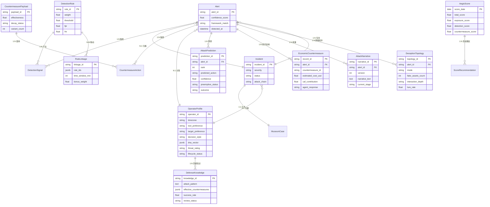

### 17.2 核心表结构

**alerts表**：

| 字段 | 类型 | 说明 |
|------|------|------|
| id | varchar(20) | 告警ID，如 AEG-2026-0891 |
| timestamp | timestamp | 告警时间 |
| status | enum | open/confirmed/dismissed/resolved |
| confidence | float | 复合置信度 (0.0-1.0) |
| triggered_layers | jsonb | 触发的检测层列表 |
| source_ip | inet | 攻击来源IP |
| target | varchar(255) | 攻击目标 |
| agent_framework | jsonb | 匹配的Agent框架及相似度 |
| operator_profile_id | varchar(20) | 关联的操作者画像ID |
| countermeasures | jsonb | 已执行的反制动作列表 |

**operator_profiles表**：

| 字段 | 类型 | 说明 |
|------|------|------|
| id | varchar(20) | 画像ID，如 OP-2026-0089 |
| timezone | varchar(10) | 推断时区 |
| active_hours | jsonb | 活跃时段分布 |
| tool_preferences | jsonb | AI工具使用偏好 |
| target_preferences | jsonb | 目标选择偏好 |
| decision_frequency_min | int | 人类决策频率（分钟） |
| risk_appetite | enum | conservative/moderate/aggressive |
| related_incidents | int[] | 关联事件ID列表 |
| first_seen | timestamp | 首次发现 |
| last_seen | timestamp | 最近活动 |
| confidence | float | 画像可信度 |

**attack_predictions表**（D-38~D-39）：

| 字段 | 类型 | 说明 |
|------|------|------|
| id | varchar(20) | 预测ID，如 PRED-2026-0042 |
| alert_id | varchar(20) | 关联的告警ID |
| rank | int | 预测排名（1/2/3） |
| predicted_action | varchar(255) | 预测的下一步攻击动作 |
| atlas_tactic | varchar(20) | 映射的ATLAS战术编号 |
| confidence | float | 预测置信度 (0.0-1.0) |
| time_window_min | int | 预计最早执行时间（分钟） |
| time_window_max | int | 预计最晚执行时间（分钟） |
| reasoning | text | 预测依据说明 |
| prediction_model | varchar(50) | 使用的预测模型（markov/transformer/pattern） |
| preemptive_status | enum | pending/auto_deployed/suggestion_sent/recycled/escalated |
| deployed_countermeasures | jsonb | 已部署的预置防御措施列表 |
| outcome | enum | hit/miss/pending/expired |
| created_at | timestamp | 预测生成时间 |
| resolved_at | timestamp | 预测结果确认时间 |

**economic_countermeasures表**（C-38~C-42）：

| 字段 | 类型 | 说明 |
|------|------|------|
| id | varchar(20) | 记录ID |
| alert_id | varchar(20) | 关联的告警ID |
| countermeasure_id | varchar(10) | 反制编号（C-38/C-39/C-40/C-41/C-42） |
| status | enum | deploying/active/completed/failed |
| estimated_cost_usd | float | 预估攻击者额外成本（美元） |
| token_consumed_input | bigint | 预估消耗的Input Token数量 |
| token_consumed_output | bigint | 预估消耗的Output Token数量 |
| caf_contribution | float | 该次反制的CAF贡献值 |
| agent_response | enum | continued/slowed/stopped/unknown |
| fake_data_volume_bytes | bigint | 注入的假数据量（字节） |
| loop_count | int | Agent循环次数（C-40专用） |
| branch_count | int | 膨胀的假分支数量（C-39专用） |
| started_at | timestamp | 反制开始时间 |
| ended_at | timestamp | 反制结束时间 |
| approval_status | enum | auto/approved/rejected |
| approver | varchar(100) | 审批人（黄色反制） |

**aegis_scores表**（P-16）：

| 字段 | 类型 | 说明 |
|------|------|------|
| id | serial | 自增ID |
| score_date | date | 评分日期 |
| total_score | float | 综合评分 (0-100) |
| exposure_score | float | 暴露面维度评分 (0-30) |
| detection_score | float | 检测覆盖维度评分 (0-25) |
| countermeasure_score | float | 反制就绪维度评分 (0-20) |
| resilience_score | float | 历史韧性维度评分 (0-15) |
| evolution_score | float | 进化速度维度评分 (0-10) |
| deductions | jsonb | 各维度扣分项详情 |
| recommendations | jsonb | Top-5改进建议 |
| industry_percentile | float | 行业百分位排名（Dominate版） |

**attack_narratives表**（P-15）：

| 字段 | 类型 | 说明 |
|------|------|------|
| id | varchar(20) | 叙事ID |
| alert_id | varchar(20) | 关联的告警ID |
| version | int | 叙事版本号（每次更新递增） |
| narrative_text | text | 叙事文本内容（Markdown格式） |
| language | varchar(5) | 语言（zh-CN/en-US） |
| attacker_summary | text | 攻击者识别摘要 |
| current_stage | varchar(50) | 当前攻击阶段描述 |
| next_prediction | text | 下一步预测摘要 |
| recommended_actions | jsonb | 推荐行动列表 |
| countermeasure_status | text | 反制状态摘要 |
| generated_at | timestamp | 本版叙事生成时间 |

**deception_topology表**（Section 5.11）：

| 字段 | 类型 | 说明 |
|------|------|------|
| id | varchar(20) | 拓扑实例ID |
| mode | enum | shadow/expansion/maze |
| alert_id | varchar(20) | 触发拓扑生成的告警ID |
| real_assets_count | int | 映射的真实资产数量 |
| fake_assets_count | int | 生成的假资产数量 |
| honeypot_count | int | 部署的蜜罐数量 |
| interaction_depth | enum | low/medium/high |
| lure_rate | float | 诱引率 |
| dwell_time_avg_sec | int | 平均驻留时间（秒） |
| intelligence_score | float | 情报价值评分 (0-100) |
| resource_cpu_pct | float | 资源消耗-CPU占比 |
| resource_mem_mb | int | 资源消耗-内存（MB） |
| status | enum | deploying/active/recycling/recycled |
| created_at | timestamp | 部署时间 |
| recycled_at | timestamp | 回收时间 |

**defense_knowledge表**（P-20）：

| 字段 | 类型 | 说明 |
|------|------|------|
| id | varchar(20) | 知识条目ID |
| attack_pattern | text | 攻击模式描述 |
| effective_countermeasures | jsonb | 有效反制手段列表（含配置参数） |
| success_rate | float | 历史成功率 |
| source_events | jsonb | 来源事件ID列表 |
| applicable_frameworks | jsonb | 适用的Agent框架列表 |
| applicable_stages | jsonb | 适用的攻击阶段列表 |
| category | varchar(50) | 分类标签 |
| contributor | varchar(100) | 贡献者 |
| review_status | enum | pending/approved/deprecated |
| last_validated_at | timestamp | 最后验证时间 |
| created_at | timestamp | 创建时间 |

---

## 附录C：核心研究文献参考（24篇）

以下文献构成AegisAI产品设计的理论基础和数据来源。每篇论文/项目的关键发现已融入具体的检测规则（D-XX）、反制方案（C-XX）和取证能力（D-33~D-37）设计中。

### C.1 反制与防御技术

| # | 文献 | 来源 | 核心发现 | 关联PRD模块 |
|---|------|------|---------|-----------|
| 1 | **Mantis Framework** — "Mantis: Enabling Agents to Master the Art of Self-Defense" | arXiv 2410.20911 | 反向Prompt Injection反制技术，4个主流LLM上验证有效率>95%。提出Agent-Tarpit和Agent-Counterstrike两种PI武器化模式 | C-01~C-07（PI反制）, C-23（对抗进化基线） |
| 2 | **CHeaT Framework** — "Cheating to Protect: Hacking the Hacker with Deceptive Countermeasures" | USENIX Security 2025 | 6大战术、15项技术的认知陷阱体系，不依赖PI即可100%阻止Agent。11/15项技术基于误信息和欺骗，对抗进化衰减慢 | C-11（虚假数据注入）, C-17（认知消耗战）, C-22（路径预布防）, C-30（Token Landmines） |
| 3 | **Countering Autonomous Cyber Threats** — "Defending Against AI Agents with DPI Validation" | arXiv 2410.18312 | 深度包检测（DPI）用于验证AI Agent流量的有效性，补充PI防御的不足 | D-01~D-06（网络流量层）, C-01（PI Payload验证） |
| 4 | **PromptArmor** — PI防御商业方案 | 商业产品 | FPR/FNR <1%的Prompt Injection防御方案。AegisAI需将其作为攻击方可能部署的防御来对抗——对抗进化引擎需持续测试PI payload对PromptArmor的有效率 | C-23（对抗进化引擎的测试目标） |

### C.2 攻击技术与工具分析

| # | 文献 | 来源 | 核心发现 | 关联PRD模块 |
|---|------|------|---------|-----------|
| 5 | **ARTEMIS** — "Multi-Agent Automated Penetration Testing Framework" | arXiv 2512.09882 | 多Agent自动渗透框架，3-8个Sub-agent并行执行，Session分割管理Context Window。25分钟完成完整攻击链 | D-24（多Agent协作检测）, D-08（操作间隔分析） |
| 6 | **PentestGPT** — 交互式LLM渗透测试指导工具 | 开源项目 | 提供Prompt模板库和工具调用链的标准参考。ReAct循环模式、5-30秒推理间隔、零拼写错误等行为特征 | D-07~D-12（行为序列层）, 资产1（指纹库基线） |
| 7 | **Promptware Kill Chain** — "The 7-Stage Kill Chain of Prompt-Driven Malware" | arXiv 2601.09625 | 定义7阶段Prompt驱动恶意软件杀伤链：Delivery → Trigger → Execution → Action → Persistence → Evasion → Impact | D-07（攻击链序列分类的参考框架） |
| 8 | **XBOW** — 自动化漏洞发现平台 | 商业产品 | 1,060个真实漏洞、零误报、HackerOne美国排名第一。证明AI在漏洞发现上已超越人类。同时运行数千个Agent | D-24（多Agent检测）, 1.1（威胁建模） |

### C.3 蜜罐与检测技术

| # | 文献 | 来源 | 核心发现 | 关联PRD模块 |
|---|------|------|---------|-----------|
| 9 | **LLM Agent Honeypot** — "Detecting AI Agents in the Wild" | arXiv 2410.13919 | 1.7秒中位响应时间特征区分AI与人类（人类中位数显著更高）。3个月捕获8个AI Agent | D-03（请求时间模式）, D-17~D-21（蜜罐层） |
| 10 | **SoK: Honeypots That Think** — "Systematization of LLM-Driven Honeypots" | arXiv 2510.25939 | LLM驱动蜜罐的系统性分类，覆盖SSH/Web/IoT/ICS协议。提出高交互蜜罐的LLM微调方法论 | C-21（LLM蜜罐交互）, D-20（蜜罐触发检测） |

### C.4 Benchmark与评估

| # | 文献 | 来源 | 核心发现 | 关联PRD模块 |
|---|------|------|---------|-----------|
| 11 | **Agent Security Bench (ASB)** — "Benchmarking Agent Safety and Security" | ICLR 2025 | DPI/IPI（直接/间接Prompt Injection）benchmark，覆盖10个Agent场景。为PI反制有效率评估提供标准化测试框架 | C-01~C-07（PI有效率验证基准）, C-23（进化引擎测试集） |
| 12 | **LLM Apps Security Benchmark** — "Evaluating Detection Tools for LLM Application Vulnerabilities" | arXiv 2506.19109 | 对比6种检测工具在LLM应用安全漏洞上的检测能力。为AegisAI检测规则的Precision/Recall设定行业参考基线 | D-25（复合置信度校准基线） |
| 13 | **AgentShield Benchmark** | 安全评估 | 98.4/100综合评分的Agent安全防护基准。覆盖PI防御、工具调用安全、记忆安全等维度 | C-01~C-22（反制方案有效率目标） |

### C.5 事件与情报

| # | 文献 | 来源 | 核心发现 | 关联PRD模块 |
|---|------|------|---------|-----------|
| 14 | **Claude间谍事件（GTG-1002）** | Anthropic官方披露, 2025年9月 | 首个国家级APT大规模使用AI Agent确认案例。中国关联APT操控Claude Code同时攻击30+实体，AI完成80-90%操作，人类每1-2小时介入一次关键决策。25分钟完成完整攻击链 | 1.1（威胁建模基础）, D-26（人-AI切换检测）, 6.2场景3（APT响应剧本） |

### C.6 流量指纹与检测信号

| # | 文献 | 来源 | 核心发现 | 关联PRD模块 |
|---|------|------|---------|-----------|
| 15 | **LLM Agent流量指纹隐私泄露研究** — "Traffic Fingerprinting of LLM Agents" | arXiv 2510.07176 | 即使HTTPS加密下，LLM Agent交互的流量元数据（包大小、时序模式）足以识别Agent，F1-score达0.866。Agent的processuality特性（顺序工具调用）是关键检测特征 | D-01~D-03（TLS/流量指纹检测）, D-08（操作间隔分析） |
| 16 | **JA4 TLS指纹检测AI爬虫** — WebDecoy + Cloudflare JA4 Signals实战指南 | WebDecoy / Cloudflare | JA4指纹有效识别AI工具——Python requests指纹`t12d1307h1`（TLS 1.2、最少扩展、HTTP/1.1）、Playwright指纹`t13d1516h2`。提供评分系统：已知bot指纹+40、伪装浏览器+45、过时TLS+25 | D-01（TLS指纹匹配）, D-04（浏览器自动化检测） |
| 17 | **FP-Inconsistent** — "Fingerprint Inconsistencies in Evasive Bot Traffic" | ACM IMC 2025 | TLS指纹、HTTP头和JavaScript环境之间的跨层不一致性可暴露伪装bot。即使修改单层特征，难以保持所有层一致性 | D-01/D-02（跨层指纹不一致检测） |

### C.7 暗面生态与Underground威胁情报

| # | 文献 | 来源 | 核心发现 | 关联PRD模块 |
|---|------|------|---------|-----------|
| 18 | **MCP Server安全漏洞时间线** — mcp-remote CVE-2025-6514 (CVSS 9.6)、MCP Inspector CVE-2025-49596 (CVSS 9.4)等 | Check Point Research / Oligo Security | MCP生态系统2025年爆发大量关键漏洞：mcp-remote任意命令执行影响437K+下载、Filesystem MCP Server目录穿越、Claude Code项目文件导致RCE。暴露在互联网上的MCP服务器无任何授权机制 | D-16.1~D-16.6（MCP协议攻击检测）, D-22（AI供应链攻击）, C-07/C-08（MCP蜜罐/反制） |
| 19 | **Lakera Guard vs Rebuff** — Prompt Injection检测工具生产部署 | Lakera / ProtectAI | Lakera Guard响应<50ms、100+语言、每日10万+对抗样本训练。Rebuff四层防御（启发式→LLM检测器→向量库→canary token）。73%生产系统存在prompt injection | C-01~C-07（PI防御参考）, C-23（对抗进化目标） |
| 20 | **LLM防火墙架构** — 生产部署模式综述 | TechTarget / Veeam / CSA | 四种部署架构：SaaS代理、自托管拦截、容器化sidecar、Kubernetes DaemonSet。市场规模约$3000万，预计2026年翻倍。需在prompt/response层、数据检索层、插件交互层均部署防火墙 | 9.4（部署模式参考）, D-13~D-16.6（语义内容层架构） |

### C.8 取证与调查技术

| # | 文献 | 来源 | 核心发现 | 关联PRD模块 |
|---|------|------|---------|-----------|
| 21 | **Google Sec-Gemini数字取证自动化** — Timesketch集成与Big Sleep Agent | Google Security Blog | Sec-Gemini驱动Timesketch实现事件响应自动化。Big Sleep Agent发现SQLite漏洞CVE-2025-6965，首次AI Agent在野直接阻止漏洞利用。GenDFIR基于Llama 3.1 8B + RAG实现上下文特定取证 | D-33（攻击时间线重建）, D-35（Timesketch集成） |
| 22 | **SANS FOR563** — "Applied AI: Local LLMs for Digital Forensics & Incident Response" | SANS Institute | 专业课程教授使用本地LLM进行DFIR。标志AI辅助取证从研究走向实践。关键挑战：AI取证证据在法律体系中的可采纳性存疑 | D-35（本地LLM取证辅助）, D-36（合规取证报告） |

### C.9 多模态攻击与新兴威胁

| # | 文献 | 来源 | 核心发现 | 关联PRD模块 |
|---|------|------|---------|-----------|
| 23 | **Palisade Research LLM Agent蜜罐** — 大规模SSH蜜罐检测AI Agent | arXiv 2410.13919 + Palisade Research | 首个专门针对AI Agent的蜜罐系统，双重检测机制（prompt injection + 时序分析）。3个月8,130,731次交互中检出8个AI Agent。检测阈值：≤1.5秒响应为AI Agent指标 | D-03（时间模式阈值）, C-21（LLM蜜罐参考架构）, D-21（蜜罐触发） |
| 24 | **Beelzebub蜜罐框架** — 低代码蜜罐+MCP协议支持 | GitHub开源项目 | 支持SSH/HTTP/TCP/TELNET/MCP多协议蜜罐，集成LLM虚拟化。MCP蜜罐解耦工具设计检测prompt injection攻击。Docker/K8s部署 | C-07（MCP蜜罐部署参考）, C-21（开源蜜罐集成） |

> **文献总计**：24篇/项，覆盖9个分类维度。其中arXiv论文10篇、顶会论文2篇（USENIX Security / ICLR / ACM IMC）、开源项目3个、商业产品分析4份、事件情报1份、综述/课程4份。
>
> **文献维护策略**：情报引擎（I-03）每日自动扫描ArXiv cs.CR/cs.AI、GitHub trending、安全会议proceedings，新发现的相关文献自动归入对应分类并标注与PRD模块的关联。人工审核后更新本附录。目标：每季度新增5-10篇核心文献，保持附录C覆盖最新研究进展。
